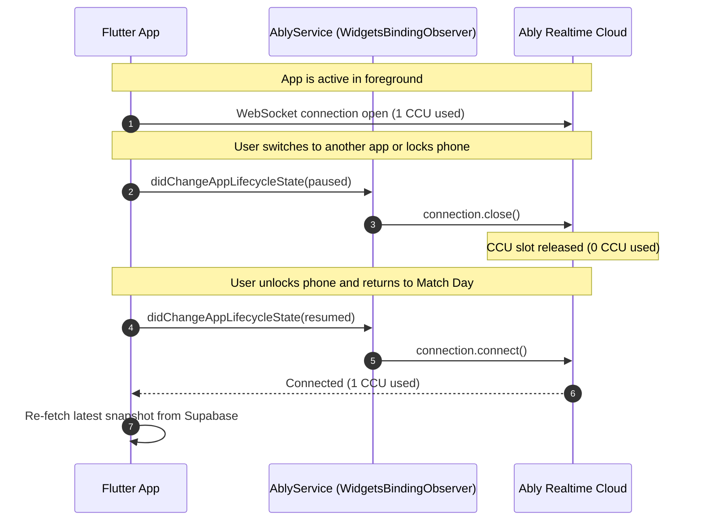
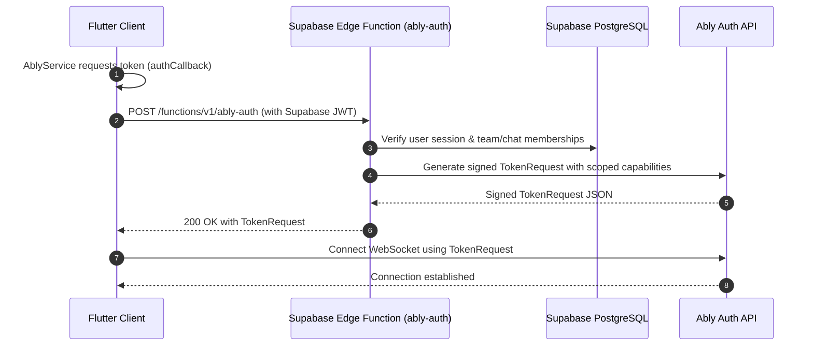

# Match Day — Real-Time Architecture Specification

Match Day uses a hybrid real-time architecture: **Ably Realtime** handles high-concurrency client-to-client communication, live match updates, and chat, while **Supabase Realtime / Postgres** handles durable database state.

This document details channel taxonomy, lifecycle policies, authentication, and connection budgeting.

---

## 1. Why Ably Over Supabase Realtime for Client Events

| Requirement | Ably Realtime | Supabase Realtime | Architectural Choice |
|---|---|---|---|
| **High-Frequency Ball Broadcast** | Optimized pub/sub message broker; minimal database overhead | Tied to Postgres WAL replication; heavy WAL churn | **Ably** |
| **Active Match Viewers (Presence)** | Built-in Presence API with automatic disconnect reap | Ephemeral presence available, but tied to DB connection pool | **Ably** |
| **Instant Chat Messaging** | Sub-second latency; client-to-client broadcast via channels | Table-based streaming creates continuous DB reads | **Ably** |
| **Free-Tier Economics** | 200 CCU budget; connection lifecycle control | Cap on concurrent Postgres connections & realtime quotas | **Ably** |
| **Authoritative State Changes** | Ephemeral only (not a database) | Native PostgreSQL tables and publication management | **Supabase** |

---

## 2. Channel Taxonomy & Naming Conventions

All Ably channels must adhere to standard prefixed namespaces:

```text
chat:<chat_id>      # 1-to-1 or team conversation thread
match:<match_id>    # Live match viewer broadcast
user:<user_id>      # Direct personal push / trigger channel
```

### Channel Rules:
- **`chat:<chat_id>`**:
  - Events: `new_message`, `message_read`, `typing`
  - Presence: Chat participants currently viewing the thread
  - Lifetime: Attached when user enters `MessageThreadScreen`; detached on pop.
- **`match:<match_id>`**:
  - Events: `ball_recorded`, `over_completed`, `innings_break`, `match_completed`
  - Presence: Live match audience / viewer count
  - Lifetime: Attached when user enters `PavilionMatchDetailScreen` or `ScoringScreen`; detached on pop.
- **`user:<user_id>`**:
  - Events: `team_invite_received`, `challenge_received`
  - Lifetime: Attached while session is active; detached on sign-out.

---

## 3. CCU Budget & Lifecycle Observer

Match Day operates under a **200 Concurrent Connection Unit (CCU)** budget. To prevent hitting this limit with idle devices:



### Key Lifecycle Principles:
1. **Pause on Background**: When the operating system moves Match Day to the background (`AppLifecycleState.paused`), `AblyService` calls `_realtime?.connection.close()`.
2. **Resume on Foreground**: When the app returns (`AppLifecycleState.resumed`), `_realtime?.connection.connect()` is invoked.
3. **Explicit Channel Detach**: Whenever a UI screen unmounts, it invokes `releaseChannel(channelName)` to clean up listeners and detach the channel on Ably.

---

## 4. Token Authentication Protocol

Clients never store permanent Ably API keys. Authentication uses the Ably Token Request pattern signed by a Supabase Edge Function:



### Capability Scoping:
- Users may only publish to `chat:<id>` if they are active members of that chat.
- Any authenticated user may subscribe to `match:<id>` for public matches.
- Only authorized scorers or match officials may publish to `match:<id>`.

---

## 5. Reconnection & Data Reconciliation

Real-time delivery over mobile networks is inherently subject to drops and temporary latency spikes:
1. **Idempotency**: All `ball_recorded` and `new_message` events contain a UUID generated by the sender. Receiving a duplicate event must not cause duplicate entries in UI or state.
2. **Reconciliation**: When an Ably connection is restored after a network outage, the feature repository queries Supabase for any deliveries or messages created since the last received timestamp, merging them into state before re-engaging the live stream.
