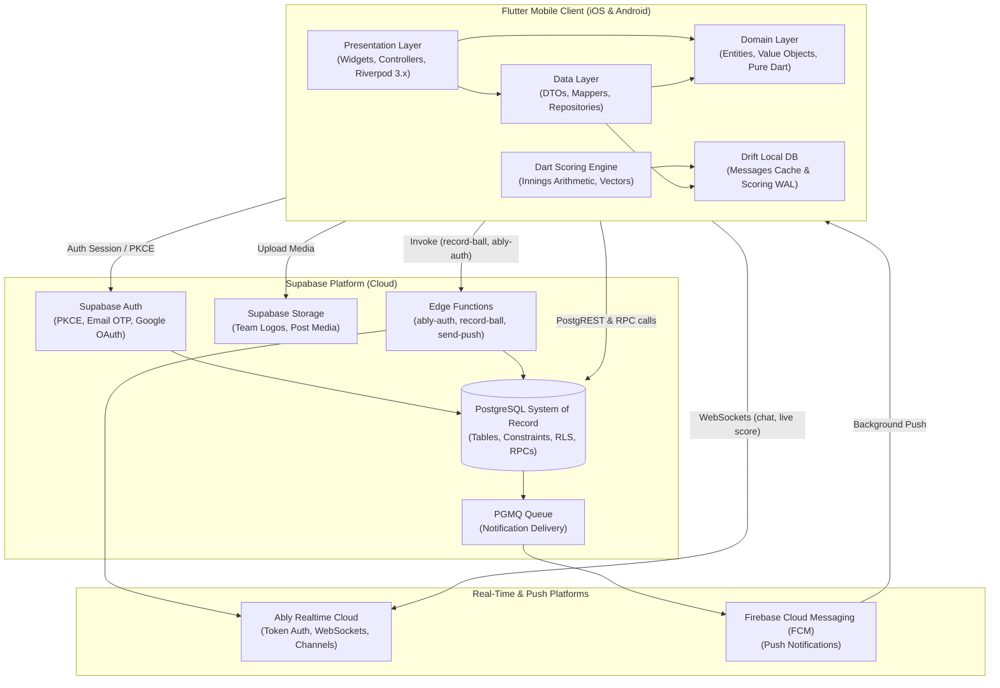

# Match Day — System Overview & Architecture Topology

Match Day is a production-grade cricket management and live-scoring mobile application for amateur clubs, players, and tournament organizers.

This document describes the high-level system topology, architectural layers, and external service boundaries.

---

## 1. High-Level Architecture Topology

---

## 2. Core Subsystems and Roles

### 2.1 Flutter Mobile Client
- **Framework**: Flutter (Dart >= 3.7).
- **Architecture**: Strict Clean Architecture (Presentation, pure Dart Domain, Data).
- **State Management & DI**: Riverpod 3.x with codegen (`@riverpod`, `@Riverpod(keepAlive: true)`).
- **Routing**: `go_router` with refresh listenable wired to auth and onboarding status streams.
- **Local Storage (Scoped)**: Drift SQLite database scoped strictly to:
  1. `messages` read-through cache (`messages_chats`, `messages_messages`, `messages_drafts`).
  2. `matches` live-scoring write-ahead log (`ScoringOps`, `ScoringSnapshots`).
  3. Multi-step form drafts (`WizardDrafts`).

### 2.2 Supabase Platform
- **PostgreSQL**: Authoritative relational system of record for accounts, profiles, teams, tournament brackets, match history, and chat messages.
- **Row-Level Security (RLS)**: Enforces access control at the database level for every table using `auth.uid()`.
- **Database Functions & RPC**: Encapsulate multi-row transactions (team invitations, player assignments, tournament fixtures).
- **Edge Functions (Deno / TypeScript)**:
  - `ably-auth`: Authenticates client sessions and signs Ably token requests with scoped capabilities.
  - `record-ball`: Ingests queued ball deliveries, enforces idempotency, updates match totals, and emits real-time events.
  - `send-push`: Dispatches FCM notifications triggered by background queues.
  - `delete-account`: Coordinates user account deletion and team ownership succession.

### 2.3 Ably Realtime
- **Purpose**: Low-latency, high-frequency bidirectional real-time communication.
- **Responsibilities**:
  - Distributing instant messages to chat participants (`chat:<id>`).
  - Broadcasting ball-by-ball score updates to live viewers (`match:<id>`).
  - Presence tracking (active viewers on a match, typing indicators in chat).
- **Resource Constraints**: Operates under a 200 CCU budget; client pauses connection when backgrounded.

### 2.4 Firebase Cloud Messaging (FCM)
- Delivers push notifications when the client is closed or backgrounded.
- Handled via `firebase_messaging` with tokens stored in the Supabase `push_tokens` table.

---

## 3. Communication Protocols

| Concern | Protocol / Channel | Authoritative Source | Notes |
|---|---|---|---|
| **Auth** | HTTPS / PKCE | Supabase Auth | Native Google OAuth + Email OTP |
| **Relational Data** | HTTPS / PostgREST | PostgreSQL | Filtered by RLS; returns JSON |
| **Complex Workflows** | HTTPS / Supabase RPC | PostgreSQL Functions | Atomic multi-row mutations |
| **Live Scoring Writes** | HTTPS / Edge Function | Local Scoring Engine -> Postgres | Single writer append-only WAL |
| **Live Scoring Reads** | WebSockets / Ably | Ably (`match:<id>`) | High-frequency ball broadcast |
| **Chat Messages** | WebSockets (Ably) + HTTPS (Supabase) | PostgreSQL | Ably broadcasts; Postgres persists |
| **Push Notifications** | FCM Push Protocol | PostgreSQL Queue | Dispatched via Edge Function |
