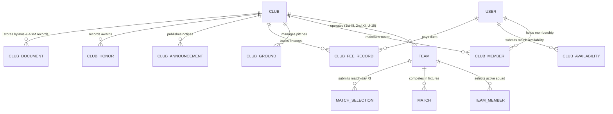

# matchday — Dedicated Club System: Comprehensive Product & Architecture Specification

> **Document Type:** Master Product Requirements Document (PRD) & Technical Architecture Specification  
> **Status:** Approved Specification / Pre-Implementation Blueprint  
> **Target System:** Matchday Mobile Platform (Flutter · Riverpod · Supabase Clean Architecture)  
> **Domain Focus:** Amateur, Grassroots, Semi-Professional & Academy Cricket  
> **Authentic Benchmarks:** ECB Play-Cricket & Clubmark, Cricket Australia Community Club Standards, Pitchero Sports CRM, CricHeroes Enterprise, CricClubs, Spond/Teamo Dues & Availability Systems  
> **Snapshot Date:** 2026-08-21  

---

## Table of Contents

1. [Strategic Vision & Problem Statement](#1-strategic-vision--problem-statement)
2. [Authentic Domain Benchmarks & Standards](#2-authentic-domain-benchmarks--standards)
3. [Domain Hierarchy & Core Entities](#3-domain-hierarchy--core-entities)
4. [Exhaustive Functional Modules](#4-exhaustive-functional-modules)
   * [Module 1: Institutional Identity, Branding & Governance](#module-1-institutional-identity-branding--governance)
   * [Module 2: Member Management, CRM & Player Registry](#module-2-member-management-crm--player-registry)
   * [Module 3: Multi-Tier Squads, Team Hierarchy & Support Staff](#module-3-multi-tier-squads-team-hierarchy--support-staff)
   * [Module 4: Player Availability, Selection Engine & Matchday Briefings](#module-4-player-availability-selection-engine--matchday-briefings)
   * [Module 5: Fixtures, Tournaments, Friendly Matchmaking & Live Scoring](#module-5-fixtures-tournaments-friendly-matchmaking--live-scoring)
   * [Module 6: Grounds, Pitches, Facilities & Asset Management](#module-6-grounds-pitches-facilities--asset-management)
   * [Module 7: Statistics, Historical Records & Club Honors Board](#module-7-statistics-historical-records--club-honors-board)
   * [Module 8: Grassroots Finance, Subscriptions & Match Fee Ledger](#module-8-grassroots-finance-subscriptions--match-fee-ledger)
   * [Module 9: Communications, Noticeboard & Community Wall](#module-9-communications-noticeboard--community-wall)
   * [Module 10: Youth Academy, Junior Pathways & Safeguarding Compliance](#module-10-youth-academy-junior-pathways--safeguarding-compliance)
   * [Module 11: Club Tournaments, Festivals & Intra-Club Derbies](#module-11-club-tournaments-festivals--intra-club-derbies)
5. [Complete Database Architecture (Postgres / Supabase)](#5-complete-database-architecture-postgres--supabase)
6. [Clean Architecture Layering (Flutter / Dart)](#6-clean-architecture-layering-flutter--dart)
7. [Business Rules, Invariants & Edge Cases](#7-business-rules-invariants--edge-cases)
8. [User Interface & Experience Guidelines](#8-user-interface--experience-guidelines)

---

## 1. Strategic Vision & Problem Statement

### 1.1 The Gap in Grassroots Cricket
Today, most digital cricket apps (including Matchday's legacy v1.0 model) treat every team as a flat, disconnected, standalone playing unit. While this works for casual weekend pickup matches, it completely breaks down for real cricket clubs:

* **Real clubs field multiple teams**: A single club (e.g., *Model Town Cricket Club*, *Wimbledon CC*, *Lahore Gymkhana*) fields a 1st XI (Premier League), 2nd XI (Championship), 3rd XI, Sunday Friendly XI, Midweek T20 XI, Women's XI, and Junior Age-Group teams (U-19, U-16, U-14, U-12).
* **Shared resources and administration**: Clubs share players, grounds, equipment, finances, committee governance, and a rich historical heritage.
* **The "WhatsApp Chaos"**: Without a unified club system, amateur cricket clubs juggle multiple disconnected WhatsApp groups for availability, paper ledgers for match fees, spreadsheets for team selection, and lost scoring books for club statistics.

### 1.2 The Matchday Club Vision
Matchday introduces a dedicated, professional-grade **Club Layer** that elevates the platform from a simple match-scoring utility into the **definitive operating system for grassroots cricket clubs**. 

The Club platform preserves Matchday’s signature **warm-paper Wisden-inspired aesthetic** while providing heavy-duty infrastructure for club presidents, secretaries, captains, scorers, treasurers, and players.

---

## 2. Authentic Domain Benchmarks & Standards

This specification is synthesized from established international club cricket governance systems:

```
┌─────────────────────────────────────────────────────────────────────────────┐
│                       INTERNATIONAL BENCHMARKS APPLIED                      │
├───────────────────────┬─────────────────────────────────────────────────────┤
│ ECB Play-Cricket      │ • Master Player Registration & Unique Member IDs    │
│ & ECB Clubmark        │ • Waterfall Team Selection & Availability Matrix    │
│                       │ • Junior Fast Bowling Directives & Safeguarding     │
├───────────────────────┼─────────────────────────────────────────────────────┤
│ Cricket Australia     │ • Multi-Tier Junior Pathway (Stage 1, 2, 3)         │
│ Community Cricket     │ • Ground & Pitch Condition Certification            │
│                       │ • Cap Numbering & Historical Record Tracking        │
├───────────────────────┼─────────────────────────────────────────────────────┤
│ Pitchero CRM          │ • Role-Based Access Control (President, Secretary)  │
│                       │ • Match Fee Ledger (Cash / Online / Waived)         │
│                       │ • Parent-Child Linked Account Management            │
├───────────────────────┼─────────────────────────────────────────────────────┤
│ CricHeroes Enterprise │ • Aggregated Club Record Books (All-Time Stats)     │
│                       │ • Multi-Format Tournaments & Six-a-Side Festivals   │
│                       │ • Digital Honors Board (Centuries & 5-Wicket Hauls) │
└───────────────────────┴─────────────────────────────────────────────────────┘
```

---

## 3. Domain Hierarchy & Core Entities



### Key Architectural Invariants
1. **Club as Root Aggregate**: A Club is an independent organizational entity.
2. **Backward Compatible Teams**: Standalone teams (casual tournament squads, corporate teams) can exist without a club (`team.club_id == null`). When `team.club_id` is set, the team inherits club branding, member pools, colors, grounds, and permissions.
3. **Universal Player Profile**: A player has a single global Matchday profile that holds their permanent stats, but holds local roles, dues, cap numbers, and membership status inside each club they join.

---

## 4. Exhaustive Functional Modules

---

### Module 1: Institutional Identity, Branding & Governance

```
┌─────────────────────────────────────────────────────────────────────────────┐
│ MODULE 1: CLUB IDENTITY & GOVERNANCE                                        │
├─────────────────────────────────────────────────────────────────────────────┤
│ 1.1 Profile Metadata & Official Registration                                │
│ 1.2 Multi-Color Heritage Palette & Custom Crest Engine                      │
│ 1.3 Committee & Role-Based Governance (RBAC)                                │
│ 1.4 Club Constitution, AGM Records & Document Vault                         │
│ 1.5 Official Accreditation & Verification Badges                            │
│ 1.6 Public Club Showcase Landing Page (`joinmatchday.com/c/<slug>`)         │
└─────────────────────────────────────────────────────────────────────────────┘
```

#### 1.1 Profile Metadata & Official Registration
* **Club Identifiers**: Official Registered Name (e.g. *"Model Town Cricket Club"*), Short Name / Monogram (e.g. *"MTCC"*), unique system-wide URL handle (`@modeltowncc`).
* **Foundation & Heritage**: Founded Year (validated `1700 <= year <= current_year + 1`), Latin/English club motto, detailed club biography and historical timeline.
* **Affiliations & Legal Registration**:
  * Affiliated Governing Body (e.g. *Pakistan Cricket Board - Lahore District*, *ECB Yorkshire Cricket Board*, *BCCI Mumbai Cricket Association*).
  * Club Registration / Society Number (for legal amateur non-profit clubs).
* **Contact & Headquarters**: Official clubhouse address, GPS coordinates, contact email, emergency telephone, official club website URL, verified social links.

#### 1.2 Multi-Color Heritage Palette & Custom Crest Engine
* **Color System**:
  * `primaryColor` (Hex code, e.g., Heritage Forest Green `#1B4D3E`).
  * `secondaryColor` (Hex code, e.g., Vintage Cream `#F5F2EB`).
  * `accentColor` (Hex code, e.g., Crimson Gold `#D4AF37`).
* **Crest & Monogram Management**:
  * Upload custom high-res vector/PNG club badge.
  * Built-in **Heritage Monogram Generator**: If no logo is provided, dynamically renders a classic Wisden-style crest using 1–3 monogram letters placed on a heraldic shield with primary/secondary club enamel.
* **Kit Pattern & Color Preview**:
  * Previews how club colors render on Traditional Whites (with colored piping), One-Day Colored Kits, and T20 Club Jerseys.

#### 1.3 Committee & Role-Based Governance (RBAC)
Clubs operate through a structured executive committee:

| Role Enum | Description | Key Permissions |
| :--- | :--- | :--- |
| `president` | Club Owner / Chief Executive | Full root admin; manage club settings, disband club, transfer ownership, appoint committee. |
| `secretary` | General Operations Secretary | Approve new members, manage fixtures, publish official announcements, edit team structures. |
| `treasurer` | Finance Officer | Manage fee structures, log payments, view club balance sheets, issue receipts, mark fee waivers. |
| `cricket_ops` | Director of Cricket / Head Coach | Oversee selection waterfall across all XIs, assign captains, monitor junior player workloads. |
| `grounds_officer` | Head Groundsman / Facility Manager | Update pitch readiness status, block grounds for maintenance, manage net bookings. |
| `safeguarding_officer` | Welfare & Child Protection Officer | Oversee junior player records, emergency medical data, verify coach certifications. |
| `team_captain` | Squad Captain / Match Leader | Submit match availability calls, pick match-day XI, conduct toss, sign off on match scorecards. |
| `team_manager` | Team Logistics Coordinator | Manage matchday logistics, carpools, kit allocation, match-day fee collection. |
| `playing_member` | Active Registered Player | Submit weekly availability, view match selections, view personal dues, participate in team chats. |
| `social_member` | Non-playing supporter / Patron / Parent | Read club announcements, view live match center, purchase tickets/merchandise. |

#### 1.4 Club Constitution, AGM Records & Document Vault
* **Document Repository**: Secure PDF vault for the Club Constitution, Code of Conduct, Annual General Meeting (AGM) minutes, and Child Safeguarding policies.
* **Member Access Levels**: Documents flagged as `Public` (visible on showcase), `Members Only`, or `Committee Eyes Only`.

#### 1.5 Official Accreditation & Verification Badges
* **Verification Tiers**:
  * `Unverified`: New/self-registered club.
  * `Community Verified`: Verified by 3+ opposing verified clubs via match history.
  * `Board Accredited`: Verified with governing body registration documents (displays blue badge + gold crest ring).

#### 1.6 Public Club Showcase Web Page
* Every club receives an auto-generated, SEO-optimized web landing page at `joinmatchday.com/c/<club_slug>` featuring:
  * Public banner, crest, tagline, and history.
  * Live scorecard widget for currently ongoing club matches.
  * Upcoming fixtures calendar & recent results.
  * All-Time Club Honors Board.
  * "Request to Join Club" button for prospective players.

---

### Module 2: Member Management, CRM & Player Registry

```
┌─────────────────────────────────────────────────────────────────────────────┐
│ MODULE 2: MEMBER MANAGEMENT, CRM & PLAYER REGISTRY                          │
├─────────────────────────────────────────────────────────────────────────────┤
│ 2.1 Multi-Tier Membership Taxonomy                                          │
│ 2.2 Member Onboarding, Invites & QR Code Passes                             │
│ 2.3 Digital Club Membership Cards & Unique Member Numbers                   │
│ 2.4 Inter-Club Transfers, Player Loans & NOC Clearance Workflow             │
│ 2.5 Master Member Directory & Search Filter Engine                          │
└─────────────────────────────────────────────────────────────────────────────┘
```

#### 2.1 Multi-Tier Membership Taxonomy
Clubs accommodate diverse membership types with custom privileges:
1. **Full Senior Playing Member**: Unlimited match eligibility, full voting rights at AGM.
2. **Student / Concession Playing Member**: Discounted subscription and match fees.
3. **Junior / Academy Member (Under-18)**: Requires linked parent/guardian account.
4. **Social / Non-Playing Member**: Clubhouse access, supporter feed access, no playing dues.
5. **Life Member / Honorary Patron**: Permanent honorary status, exempt from annual dues.
6. **Guest / Touring Player**: Short-term trial pass (up to 3 matches).

#### 2.2 Member Onboarding, Invites & QR Code Passes
* **Invitation Channels**:
  * Direct SMS / WhatsApp invite link with single-use cryptographic token.
  * Dynamic Club QR Code: Displayed on clubhouse noticeboard; scanning opens instant registration in Matchday.
  * Public Join Request: Prospective players submit a join request with their playing role (e.g. *"Left-arm Fast Bowler, Top-order Bat"*).
* **Onboarding Questionnaire**: Captures batting style, bowling style, playing specialty, emergency contact number, and dietary/medical notes.

#### 2.3 Digital Club Membership Cards & Unique Member Numbers
* **Unique Club Member ID**: Formatted as `<CLUB_PREFIX>-<YEAR>-<SEQUENCE>` (e.g., `MTCC-2026-0042`).
* **Digital Wallet Card**: In-app digital card rendered with club branding, member portrait, membership tier, QR code for clubhouse/ground check-in, and membership validity dates.

#### 2.4 Inter-Club Transfers, Player Loans & NOC Clearance Workflow
* **Official Sanctioned Transfers**:
  * In formal leagues, players cannot simply switch clubs mid-season.
  * **No Objection Certificate (NOC) Flow**: The receiving club initiates a transfer request $\rightarrow$ The releasing club reviews outstanding dues $\rightarrow$ Releasing secretary approves $\rightarrow$ Player roster updates.
* **Emergency Player Loan System**:
  * Weekend loan agreements for friendly fixtures (allows borrowing a registered player from a partner club for 1 match without altering permanent club membership).

#### 2.5 Master Member Directory & Search Filter Engine
* Filter club members by: Playing Role (Batter, Pacer, Spinner, Wicketkeeper), Age Group (Seniors, U-19, U-16), Membership Status (Active, Lapsed, Suspended), Fee Payment Status (Cleared, Overdue), and Cap Number.

---

### Module 3: Multi-Tier Squads, Team Hierarchy & Support Staff

```
┌─────────────────────────────────────────────────────────────────────────────┐
│ MODULE 3: MULTI-TIER SQUADS, TEAM HIERARCHY & SUPPORT STAFF                 │
├─────────────────────────────────────────────────────────────────────────────┤
│ 3.1 Hierarchical Squad Structure (1st XI down to Junior Academies)          │
│ 3.2 Dynamic Player Pool & Squad Roster Allocation                           │
│ 3.3 Club Cap Numbers & Debut Tradition Tracking                             │
│ 3.4 Club-Wide Jersey Number Registry                                        │
│ 3.5 Coaching Staff, Physios & Official Match Support Personnel              │
└─────────────────────────────────────────────────────────────────────────────┘
```

#### 3.1 Hierarchical Squad Structure
A Club operates as a multi-team umbrella:

```
                                  ┌────────────────────────┐
                                  │      CENTRAL CLUB      │
                                  │      PLAYER POOL       │
                                  └───────────┬────────────┘
                                              │
            ┌──────────────────┬──────────────┴───────┬──────────────────┐
            ▼                  ▼                      ▼                  ▼
     ┌─────────────┐    ┌─────────────┐        ┌─────────────┐    ┌─────────────┐
     │  Senior     │    │  Senior     │        │   Women's   │    │  Academy /  │
     │  1st XI     │    │  2nd XI     │        │   1st XI    │    │  Junior XI  │
     │(Premier Lg) │    │(Championship│        │  (League)   │    │(U-19 / U-16)│
     └─────────────┘    └─────────────┘        └─────────────┘    └─────────────┘
            │                  │                      │                  │
            └──────────────────┴──────────────┬───────┴──────────────────┘
                                              ▼
                                 ┌─────────────────────────┐
                                 │ Sunday Friendly / Dev XI│
                                 └─────────────────────────┘
```

* **Squad Categories**:
  * `Senior Competitive`: 1st XI (Saturday), 2nd XI (Saturday), 3rd XI.
  * `Midweek / Casual`: Midweek T20 XI, Sunday Friendly XI.
  * `Women's & Girls'`: Women's 1st XI, Girls' U-15 XI.
  * `Youth Academies`: Under-19, Under-16, Under-14, Under-12, Under-10.
  * `Veterans`: Over-40s / Over-50s XI.

#### 3.2 Dynamic Player Pool & Squad Roster Allocation
* Every player on any squad must exist in the parent club's member registry.
* Players have a **Primary Squad** (e.g. 2nd XI), but are eligible for call-up to the 1st XI or developmental play in the Sunday XI based on form and availability.

#### 3.3 Club Cap Numbers & Debut Tradition Tracking
* **The Debut Cap Number**: When a player makes their 1st XI competitive debut for the club, the system automatically assigns them a permanent, incremental **Club Cap Number** (e.g. Cap #128).
* **Cap Registry**: Historical register of all cap holders dating back to the club's foundation.

#### 3.4 Club-Wide Jersey Number Registry
* Prevents jersey number conflicts across active playing squads.
* Supports **Retired Numbers** (e.g., Number 10 retired in honor of a legendary former captain).

#### 3.5 Coaching Staff, Physios & Official Match Support Personnel
* Assign dedicated non-playing team personnel:
  * Head Coach, Bowling Coach, Fielding Coach.
  * Team Physiotherapist / Athletic Trainer.
  * Official Team Scorer & Appointed Club Umpire.

---

### Module 4: Player Availability, Selection Engine & Matchday Briefings

```
┌─────────────────────────────────────────────────────────────────────────────┐
│ MODULE 4: AVAILABILITY, SELECTION ENGINE & MATCHDAY BRIEFINGS               │
├─────────────────────────────────────────────────────────────────────────────┤
│ 4.1 Automated Weekly Availability Engine                                    │
│ 4.2 Waterfall Selection Workflow & Conflict Resolver                        │
│ 4.3 Automated Team Sheet Publication & Embargo Rules                        │
│ 4.4 Matchday Logistics Briefing (Transport, Duties, Dress Code)             │
└─────────────────────────────────────────────────────────────────────────────┘
```

#### 4.1 Automated Weekly Availability Engine
Eliminates manual availability chasing by automating the weekly workflow:

```
[Monday 09:00]  ──► Automated Push / SMS Callout sent to all playing members
                    "Confirm your availability for Saturday & Sunday fixtures"
                         │
                         ▼
[Member Action] ──► Select status:
                    • [✓] Available All Day
                    • [~] Conditional (e.g., "Available after 13:00 / 2nd XI only")
                    • [✗] Unavailable (with structured reason: Work, Injured, Holiday)
                         │
                         ▼
[Thursday 18:00]──► Availability Closes ──► Captains' Selection Board Unlocks
```

#### 4.2 Waterfall Selection Workflow & Conflict Resolver
Captains pick their teams in priority order to prevent selection conflicts:

1. **Priority Tier 1 (1st XI Captain)**: Selects 11 players + 1 reserve from all available club members.
2. **Priority Tier 2 (2nd XI Captain)**: Selects 11 players from the remaining available pool.
3. **Priority Tier 3 (3rd XI / Sunday XI)**: Selects from remaining members.
4. **Hard Invariants Enforced by Engine**:
   * **No Double Selection**: A player cannot be named in two starting XIs on the same date/time slot.
   * **Suspension Filter**: Players serving disciplinary bans or un-cleared transfers cannot be selected.
   * **Workload Warning**: Junior fast bowlers selected for senior teams trigger ECB bowling limit compliance alerts.

#### 4.3 Automated Team Sheet Publication & Embargo Rules
* **Embargo Mode**: Captains can save drafts and share privately with committee members before official release.
* **1-Tap Publish**:
  * Pushes notifications to selected players (*"You've been selected for MTCC 1st XI vs City CC"*).
  * Automatically generates high-resolution, shareable team-sheet cards (with crest, sponsor logos, and player jersey numbers) for WhatsApp and Instagram stories.

#### 4.4 Matchday Logistics Briefing
Every published team sheet generates an interactive matchday briefing card:
* **Meeting Time & Toss Time**: e.g., Meet at 12:15 PM for 13:00 PM Toss.
* **Dress Code / Kit**: Traditional Whites, Club Colored Kit, or White with Club Cap.
* **Match Duties Assignment**:
  * Scorer Duty: Player A (1st 20 overs), Player B (2nd 20 overs).
  * Umpire Duty (Square Leg): Player C.
  * Match Tea / Refreshment Duty: Player D & Player E.
* **Logistics & Carpooling**: Venue map pin, parking instructions, driver/passenger seat coordination.

---

### Module 5: Fixtures, Tournaments, Friendly Matchmaking & Live Scoring

```
┌─────────────────────────────────────────────────────────────────────────────┐
│ MODULE 5: FIXTURES, TOURNAMENTS, MATCHMAKING & SCORING                      │
├─────────────────────────────────────────────────────────────────────────────┤
│ 5.1 Centralized Master Club Calendar                                        │
│ 5.2 Friendly Match Pool & Open-Date Matchmaking                             │
│ 5.3 League & Cup Competition Standings Sync                                 │
│ 5.4 Live Scoring Console Integration & Real-Time Broadcast                  │
│ 5.5 Post-Match Processing, Scorecard Lock & Captains' Reports               │
└─────────────────────────────────────────────────────────────────────────────┘
```

#### 5.1 Centralized Master Club Calendar
A unified calendar showing all club activities in one view:
* Filter by squad (1st XI, 2nd XI, Juniors, All).
* Event types: League Fixtures, Cup Fixtures, Bilateral Friendlies, Intra-Club Practice Matches, Net Training Sessions, Committee Meetings, Annual Dinner.
* Color-coded home (Green) and away (Burgundy) badges.

#### 5.2 Friendly Match Pool & Open-Date Matchmaking
* When a club has an open weekend slot, the secretary can post a **Match Wanted Request** specifying: Date, Home/Away preference, Format (T20, 40-overs, 2-day), and Opponent Skill Level (Premier, Intermediate, Friendly).
* Nearby clubs with matching open dates receive challenge notifications and can negotiate terms in-app.

#### 5.3 League & Cup Competition Standings Sync
* If a club participates in recognized leagues, the system tracks:
  * Points Table (Played, Won, Lost, Tied, No Result, Bonus Batting/Bowling Points).
  * Net Run Rate (NRR) automated calculations.
  * Form guide (last 5 matches: `W W L W D`).

#### 5.4 Live Scoring Console Integration & Real-Time Broadcast
* Matches scheduled under a club team plug directly into Matchday’s **server-authoritative scoring console**.
* Live deliveries, boundaries, wickets, and milestone notifications are broadcast in real-time to all club members, alumni, and followers worldwide.

#### 5.5 Post-Match Processing, Scorecard Lock & Captains' Reports
* **Scorecard Approval**: Both captains review and digitally sign the final scorecard.
* **Captain's Match Report**: Written review summarizing performance, tactical highlights, and pitch behavior.
* **Matchday Awards**: Selection of *Player of the Match*, *Best Bowler*, *Best Fielder*, and *Moment of the Match*.

---

### Module 6: Grounds, Pitches, Facilities & Asset Management

```
┌─────────────────────────────────────────────────────────────────────────────┐
│ MODULE 6: GROUNDS, PITCHES, FACILITIES & ASSET MANAGEMENT                   │
├─────────────────────────────────────────────────────────────────────────────┤
│ 6.1 Multi-Ground & Pitch Profiles (Ovals, Nets, Indoor Centers)             │
│ 6.2 Pitch Characteristics, Preparation Log & Surface Analytics              │
│ 6.3 Ground Booking & Automated Double-Booking Prevention                    │
│ 6.4 Pitch Inspection & Match Readiness Statuses                             │
│ 6.5 Match Balls, Kit & Club Equipment Inventory                             │
└─────────────────────────────────────────────────────────────────────────────┘
```

#### 6.1 Multi-Ground & Pitch Profiles
Clubs often control multiple playing areas:
* **Ground Facilities**:
  * Main Oval (1st XI Home), Secondary Oval (2nd XI / Junior Home).
  * Outdoor Practice Net Lanes (Turf nets, Astroturf nets with run-up).
  * Indoor Training Shed & Bowling Machine Center.
* **Clubhouse Amenities**: Changing rooms, hot showers, digital electronic scoreboard, pavilion viewing terrace, floodlight capability, cafeteria/canteen.

#### 6.2 Pitch Characteristics & Preparation Log
* **Surface Types**: Natural Grass Turf (Red clay, Black soil), Astroturf on Concrete, Jute Matting, Coir Matting, Cement Pitch.
* **Pitch Logbook**: Head groundsman logs pitch rolling hours, grass height (mm), moisture level, and pitch rating (Fair, Good, Batting Paradise, Green Seamer, Turner).

#### 6.3 Ground Booking & Automated Double-Booking Prevention
* **Automated Conflict Shield**: The booking engine strictly prevents two teams from scheduling home matches or training sessions on the same pitch during overlapping time windows.
* **External Ground Hire**: Allows clubs to rent out unused pitch slots to corporate or school matches, generating revenue tracked in the club ledger.

#### 6.4 Pitch Inspection & Match Readiness Statuses
Groundsmen update live pitch status visible to all traveling teams and umpires:

```
[READY]            Match Ready — Pitch rolled and marked
[DAMP]             Damp Surface — Soft outfield, play expected on time
[COVERS]           Pitch Under Covers — Rain in area
[INSPECTION]       Official Umpire Inspection Scheduled at 12:30 PM
[WATERLOGGED]      Unplayable — Ground waterlogged
[ABANDONED]        Match Officially Abandoned due to Weather
```

#### 6.5 Match Balls, Kit & Club Equipment Inventory
* **Cricket Ball Stock Tracker**: Tracks inventory of Grade A (League match balls), Grade B (Friendly match balls), and Training balls (Red, White, Pink balls).
* **Capital Equipment Asset Register**: Heavy roller, motorized grass mower, bowling machine, boundary ropes, sight screens, stumps/bails, training bibs, first aid kits.

---

### Module 7: Statistics, Historical Records & Club Honors Board

```
┌─────────────────────────────────────────────────────────────────────────────┐
│ MODULE 7: STATISTICS, HISTORICAL RECORDS & HONORS BOARD                     │
├─────────────────────────────────────────────────────────────────────────────┤
│ 7.1 Lifetime Club Totals & Season-by-Season Aggregations                    │
│ 7.2 The Wisden Club Record Book (Individual & Partnership Bests)            │
│ 7.3 Traditional Honors Board (Centuries, 5-Wicket Hauls, 100 Caps)          │
│ 7.4 Annual Awards & Presentation Night Ceremony                             │
│ 7.5 Advanced Performance Analytics & Phase Breakdown                        │
└─────────────────────────────────────────────────────────────────────────────┘
```

#### 7.1 Lifetime Club Totals & Season-by-Season Aggregations
* **Club All-Time Performance**: Total matches played, total wins, losses, ties, draws, win percentage, total runs scored, total wickets taken across all club teams since foundation.
* **Season-by-Season Archives**: Filter records by year (e.g. *2024 Season*, *2025 Season*).

#### 7.2 The Wisden Club Record Book
Maintains an authentic, official historical record book:
* **Batting Records**:
  * Highest Individual Score in Club History (e.g. *174\* by Ali Khan vs City CC, 2021*).
  * Most Runs in a Single Season (e.g. *1,120 runs in 2023*).
  * All-Time Leading Run Scorers across all club fixtures.
* **Bowling Records**:
  * Best Bowling in an Innings (e.g. *8/19 by Usman Tariq, 2019*).
  * Most Wickets in a Single Season.
  * All-Time Leading Wicket Takers.
* **Partnership Records**:
  * Record partnership for every wicket from 1st wicket through to 10th wicket (e.g. *214 runs for 4th wicket*).
* **Team Records**:
  * Highest Team Innings Total (e.g. *384/4 in 45 overs*).
  * Lowest Total Successfully Defended.

#### 7.3 Traditional Honors Board
Rendered in gold leaf lettering on dark mahogany wood / warm paper aesthetic:

```
┌─────────────────────────────────────────────────────────────────────────────┐
│                    MODEL TOWN CRICKET CLUB · HONORS BOARD                   │
├─────────────────────────────────────────────────────────────────────────────┤
│   ★ CENTURIES CLUB (100+ RUNS)                                              │
│   • 2026-05-12  ·  Zeeshan Malik  ·  114 (88) vs Gymkhana CC (1st XI)       │
│   • 2025-08-19  ·  Haris Rauf     ·  102* (64) vs Model Town Blues (T20)    │
├─────────────────────────────────────────────────────────────────────────────┤
│   ★ FIVE-WICKET HAULS (5+ WKTS)                                             │
│   • 2026-06-04  ·  Bilal Asif     ·  6/28 (9.2) vs Crescent CC (1st XI)     │
│   • 2025-07-11  ·  Kamran Akram   ·  5/14 (4.0) vs Lions CC (Midweek)       │
├─────────────────────────────────────────────────────────────────────────────┤
│   ★ 100 CLUB CAPS                                                           │
│   • Cap #042  ·  Naveed Anjum (142 Caps)                                    │
│   • Cap #058  ·  Saad Nasim (118 Caps)                                      │
└─────────────────────────────────────────────────────────────────────────────┘
```

#### 7.4 Annual Awards & Presentation Night Ceremony
* Annual digital badges and certificates awarded at season end:
  * **Player of the Season** (Overall MVP)
  * **Batsman of the Year** & **Bowler of the Year**
  * **Fielder of the Year** (Most catches & run-outs)
  * **Emerging Junior of the Year**
  * **Club Person / Volunteer of the Year** (Recognizing non-playing contributions)

#### 7.5 Advanced Performance Analytics
* Batting and bowling strike rates by match phase (Powerplay overs 1–10, Middle overs 11–35, Death overs 36–50).
* Wagon wheels, pitch-map heatmaps, and dismissal distribution pie charts aggregated across all club fixtures.

---

### Module 8: Grassroots Finance, Subscriptions & Match Fee Ledger

```
┌─────────────────────────────────────────────────────────────────────────────┐
│ MODULE 8: FINANCE, SUBSCRIPTIONS & MATCH FEE LEDGER                         │
├─────────────────────────────────────────────────────────────────────────────┤
│ 8.1 Grassroots Chart of Accounts & Treasurer Dashboard                      │
│ 8.2 Per-Match Fee Collection System                                         │
│ 8.3 Annual Membership Subscriptions & Installment Plans                     │
│ 8.4 Debt Tracking, Digital Receipts & Member Balance Statements             │
└─────────────────────────────────────────────────────────────────────────────┘
```

#### 8.1 Grassroots Chart of Accounts & Treasurer Dashboard
* **Income Streams**: Annual Membership Subscriptions, Match Fees, Sponsorships, Ground Rental Hire, Bar/Canteen sales, Donations.
* **Expense Categories**: Match Balls, Umpire & Scorer Fees, Ground Maintenance/Rolling, Pavilion Utilities, League Affiliation Fees, Tea & Refreshments.
* **Treasurer Summary**: Real-time Cash-in-Hand balance, Bank account balance, Total accounts receivable (unpaid player dues).

#### 8.2 Per-Match Fee Collection System
* **Configurable Fee Rules**:
  * Standard Senior Match Fee (e.g. £12 / 1,500 PKR).
  * Concession / Student Rate (e.g. £6 / 750 PKR).
  * 12th Man / Non-playing substitute rate (e.g. £0 / Waived).
* **Matchday Ledger**: Captain or manager opens the match fee list with one tap after the game and marks each player:
  * `[✓ Paid Cash]`
  * `[✓ Paid Online / Bank Transfer]`
  * `[⏳ Pending / Owed]`
  * `[⊘ Waived]` (with reason)

#### 8.3 Annual Membership Subscriptions & Installment Plans
* Annual subscription setup with optional split installments (e.g. 3 monthly payments of £50).
* Auto-generated digital PDF payment receipt with club crest and treasurer signature stamp.

#### 8.4 Debt Tracking & Member Balance Statements
* Every member has a private **Financial Statement Tab** showing: Total fees levied, total payments made, outstanding balance, and transaction history.
* Gentle automated WhatsApp/Push payment reminder triggers for balances overdue by 14+ days.

---

### Module 9: Communications, Noticeboard & Community Wall

```
┌─────────────────────────────────────────────────────────────────────────────┐
│ MODULE 9: COMMUNICATIONS, NOTICEBOARD & COMMUNITY WALL                      │
├─────────────────────────────────────────────────────────────────────────────┤
│ 9.1 Multi-Tier Club Communication Channels                                  │
│ 9.2 Official Noticeboard & Broadcast Engine                                 │
│ 9.3 Club Pavilion Wall (Photos, Videos, Matchday Celebrations)              │
│ 9.4 Multi-Channel Push & WhatsApp Broadcast Integration                     │
└─────────────────────────────────────────────────────────────────────────────┘
```

#### 9.1 Multi-Tier Club Communication Channels
Replaces chaotic unorganized chat groups with structured, role-based channels:

```
┌─────────────────────────────────────────────────────────────────────────────┐
│ 📢  #official-announcements     (Admins post · All members read)            │
│ 🏏  #club-pavilion              (All club members open chat)                │
│ 🥇  #1st-xi-squad               (1st XI selected players & management only) │
│ 🥈  #2nd-xi-squad               (2nd XI selected players & management only) │
│ 🎓  #academy-parents            (Junior coaches & parents)                  │
│ 🏛️  #committee-room             (Elected executive committee only)          │
└─────────────────────────────────────────────────────────────────────────────┘
```

#### 9.2 Official Noticeboard & Broadcast Engine
* Pinned executive announcements: AGM notices, net session timetable changes, weather warnings, membership renewal deadlines.
* Pinned notices display an unmissable red ribbon on the Pavilion screen until acknowledged.

#### 9.3 Club Pavilion Wall
* Dedicated club social feed where players, captains, and supporters post:
  * Match victory celebration photos and team huddles.
  * Short video clips of classic catches and boundary highlights.
  * Player of the match presentations and award photos.

#### 9.4 Multi-Channel Push & WhatsApp Broadcast Integration
* One-tap export of formatted match summaries, selection sheets, and fixture reminders directly to WhatsApp groups with deep links back into Matchday.

---

### Module 10: Youth Academy, Junior Pathways & Safeguarding Compliance

```
┌─────────────────────────────────────────────────────────────────────────────┐
│ MODULE 10: YOUTH ACADEMY, JUNIOR PATHWAYS & SAFEGUARDING                    │
├─────────────────────────────────────────────────────────────────────────────┤
│ 10.1 Structured Age-Group Pathways (U-9 to U-19)                            │
│ 10.2 Linked Parent / Guardian Account Management                            │
│ 10.3 Fast Bowling Workload Directives (ECB & ICC Compliance Engine)         │
│ 10.4 Safeguarding Officer, Medical Profile & Emergency Action Plans        │
│ 10.5 Coaching Drills, Attendance Tracking & Progress Cards                  │
└─────────────────────────────────────────────────────────────────────────────┘
```

#### 10.1 Structured Age-Group Pathways
* Development tiers mapped to standard grassroots cricket stages:
  * **Stage 1 (Under-9 & Under-11)**: Soft ball / Incrediball, pairs cricket, universal participation (everyone bats and bowls).
  * **Stage 2 (Under-13 & Under-15)**: Hard ball transition, standard dismissals, 20–30 over games.
  * **Stage 3 (Under-17 & Under-19)**: Full adult rules, preparing for senior club cricket.

#### 10.2 Linked Parent / Guardian Account Management
* In compliance with COPPA and global child protection standards, junior players under 16 do not require independent email/login.
* Parents create and manage child sub-profiles, submit match availability, receive travel briefings, and pay junior fees.

#### 10.3 Fast Bowling Workload Directives (ECB & ICC Standard)
The scoring engine and selection engine strictly enforce international junior safety limits for fast bowlers:

| Age Group | Max Overs Per Spell | Max Overs Per Day | Mandatory Rest Between Spells |
| :---: | :---: | :---: | :---: |
| **U-11 and below** | 4 overs | 8 overs | Equal to length of spell bowled from same end |
| **U-12 & U-13** | 5 overs | 10 overs | Equal to length of spell bowled from same end |
| **U-14 & U-15** | 5 overs | 12 overs | Equal to length of spell bowled from same end |
| **U-16 & U-17** | 6 overs | 15 overs | Equal to length of spell bowled from same end |
| **U-18 & U-19** | 7 overs | 18 overs | Equal to length of spell bowled from same end |

* **Live Scoring Alerts**: When a junior fast bowler reaches their spell limit, the scoring console displays an immediate amber warning preventing them from bowling consecutive spells without required rest overs.

#### 10.4 Safeguarding Officer, Medical Profile & Emergency Action Plans
* Designated Club Safeguarding Officer contact prominently displayed.
* Matchday captains receive private access to essential medical alerts (e.g. Asthma Inhaler, Severe Nut Allergy, Diabetic, Blood Group) and emergency phone numbers for all playing juniors.

#### 10.5 Coaching Drills, Attendance Tracking & Progress Cards
* Coaches track training session attendance via simple tap-to-mark checklists.
* Quarterly player development reports tracking batting technique, bowling consistency, and fielding agility.

---

### Module 11: Club Tournaments, Festivals & Intra-Club Derbies

```
┌─────────────────────────────────────────────────────────────────────────────┐
│ MODULE 11: CLUB TOURNAMENTS, FESTIVALS & INTRA-CLUB DERBIES                 │
├─────────────────────────────────────────────────────────────────────────────┤
│ 11.1 Annual Founder's Cup & Memorial Tournaments                            │
│ 11.2 Intra-Club Derbies (President's XI vs Captain's XI)                    │
│ 11.3 Six-a-Side Cricket Festivals & Gala Community Days                     │
└─────────────────────────────────────────────────────────────────────────────┘
```

#### 11.1 Annual Founder's Cup & Memorial Tournaments
* Clubs can create and host open invitation tournaments on their home ground (e.g. *Annual Model Town T20 Cup*, *Memorial Trophy*).
* Automatic tournament brackets, round-robin pools, points tables, and sponsor banners.

#### 11.2 Intra-Club Derbies
* Traditional pre-season or holiday fixtures within the club membership:
  * *President's XI vs Captain's XI*
  * *Seniors XI vs Under-19 Academy XI*
  * *Current Players vs Old Boys / Alumni XI*

#### 11.3 Six-a-Side Cricket Festivals & Gala Community Days
* Special tournament format with 5-over innings, 6 players per team, universal bowling rules (every fielder bowls 1 over except keeper), and fast-paced live scoreboards.

---

## 5. Complete Database Architecture (Postgres / Supabase)

The following schema represents the production-grade PostgreSQL foundation for the entire club feature suite:

```sql
-- =============================================================================
-- MATCHDAY DATABASE EXTENSION · DEDICATED CLUB SYSTEM
-- =============================================================================

-- -----------------------------------------------------------------------------
-- 1. Enums & Custom Types
-- -----------------------------------------------------------------------------
create type public.club_role as enum (
  'president',
  'secretary',
  'treasurer',
  'cricket_ops',
  'grounds_officer',
  'safeguarding_officer',
  'team_captain',
  'team_manager',
  'playing_member',
  'social_member'
);

create type public.membership_tier as enum (
  'senior_playing',
  'student_concession',
  'junior_academy',
  'social_non_playing',
  'life_honorary',
  'guest_trial'
);

create type public.membership_status as enum (
  'active',
  'pending_approval',
  'lapsed',
  'suspended',
  'resigned'
);

create type public.pitch_surface_type as enum (
  'turf_grass',
  'astro_turf',
  'jute_matting',
  'coir_matting',
  'cement'
);

create type public.ground_readiness_status as enum (
  'ready',
  'damp',
  'under_covers',
  'inspection_scheduled',
  'waterlogged',
  'abandoned'
);

create type public.availability_response as enum (
  'available',
  'conditional',
  'unavailable'
);

create type public.fee_type as enum (
  'annual_subscription',
  'senior_match_fee',
  'junior_match_fee',
  'training_fee',
  'tour_levy',
  'disciplinary_fine'
);

create type public.fee_payment_status as enum (
  'pending',
  'paid_cash',
  'paid_online',
  'waived'
);

-- -----------------------------------------------------------------------------
-- 2. Clubs Table
-- -----------------------------------------------------------------------------
create table public.clubs (
  club_id               uuid primary key default gen_random_uuid(),
  name                  text not null check (length(name) between 3 and 70),
  short_name            text check (length(short_name) between 2 and 10),
  handle                text unique not null check (handle ~ '^[a-z0-9_]{3,30}$'),
  tagline               text check (tagline is null or length(tagline) <= 80),
  description           text check (description is null or length(description) <= 1200),
  founded_year          integer check (founded_year between 1700 and date_part('year', now())::int + 1),
  
  -- Branding & Visuals
  logo_url              text,
  logo_monogram         text check (logo_monogram is null or length(logo_monogram) between 1 and 3),
  banner_url            text,
  club_colors           jsonb not null default '{"primary": "#1B4D3E", "secondary": "#F5F2EB", "accent": "#D4AF37"}'::jsonb,
  
  -- Affiliation & Location
  affiliation           text,
  society_reg_number    text,
  location              jsonb not null default '{}'::jsonb,
  location_point        geography(point, 4326),
  
  -- Contact & Links
  contact_email         text check (contact_email is null or contact_email ~* '^[A-Z0-9._%+-]+@[A-Z0-9.-]+\.[A-Z]{2,}$'),
  contact_phone         text,
  website_url           text,
  
  -- Governance & Ownership
  owner_id              uuid not null references public.profiles(user_id) on delete restrict,
  is_verified           boolean not null default false,
  is_board_accredited   boolean not null default false,
  privacy               public.team_privacy not null default 'public',
  status                text not null default 'active' check (status in ('active', 'archived', 'suspended')),

  created_at            timestamptz not null default now(),
  updated_at            timestamptz not null default now()
);

create index idx_clubs_handle on public.clubs(handle);
create index idx_clubs_owner_id on public.clubs(owner_id);

-- -----------------------------------------------------------------------------
-- 3. Club Memberships Table
-- -----------------------------------------------------------------------------
create table public.club_members (
  membership_id         uuid primary key default gen_random_uuid(),
  club_id               uuid not null references public.clubs(club_id) on delete cascade,
  user_id               uuid not null references public.profiles(user_id) on delete cascade,
  member_number         text, -- e.g. MTCC-2026-0042
  role                  public.club_role not null default 'playing_member',
  tier                  public.membership_tier not null default 'senior_playing',
  status                public.membership_status not null default 'active',
  
  jersey_number         integer check (jersey_number between 0 and 999),
  cap_number            integer check (cap_number > 0),
  is_committee_member   boolean not null default false,
  committee_title       text,
  
  -- Emergency & Medical
  emergency_contact     jsonb not null default '{}'::jsonb,
  medical_notes         text,
  parent_user_id        uuid references public.profiles(user_id) on delete set null,
  
  joined_at             timestamptz not null default now(),
  valid_until           timestamptz,
  updated_at            timestamptz not null default now(),

  unique (club_id, user_id),
  unique (club_id, cap_number)
);

create index idx_club_members_club_id on public.club_members(club_id);
create index idx_club_members_user_id on public.club_members(user_id);

-- -----------------------------------------------------------------------------
-- 4. Teams Table Update (Linking Squads to Parent Club)
-- -----------------------------------------------------------------------------
alter table public.teams 
  add column if not exists club_id uuid references public.clubs(club_id) on delete set null,
  add column if not exists squad_hierarchy_rank integer not null default 1, -- 1=1st XI, 2=2nd XI, etc.
  add column if not exists age_category text default 'open';                -- 'open', 'u19', 'u16', 'vets'

create index if not exists idx_teams_club_id on public.teams(club_id);

-- -----------------------------------------------------------------------------
-- 5. Grounds & Facilities Table
-- -----------------------------------------------------------------------------
create table public.club_grounds (
  ground_id             uuid primary key default gen_random_uuid(),
  club_id               uuid not null references public.clubs(club_id) on delete cascade,
  name                  text not null check (length(name) between 3 and 80),
  short_code            text check (length(short_code) between 2 and 6),
  surface_type          public.pitch_surface_type not null default 'turf_grass',
  is_main_oval          boolean not null default false,
  has_floodlights       boolean not null default false,
  has_pavilion          boolean not null default true,
  net_lanes_count       integer not null default 0,
  
  address               text,
  location              jsonb not null default '{}'::jsonb,
  location_point        geography(point, 4326),
  
  status                public.ground_readiness_status not null default 'ready',
  status_notes          text,
  status_updated_at     timestamptz not null default now(),
  created_at            timestamptz not null default now()
);

create index idx_club_grounds_club_id on public.club_grounds(club_id);

-- -----------------------------------------------------------------------------
-- 6. Player Match Availability Table
-- -----------------------------------------------------------------------------
create table public.club_availability (
  availability_id       uuid primary key default gen_random_uuid(),
  club_id               uuid not null references public.clubs(club_id) on delete cascade,
  user_id               uuid not null references public.profiles(user_id) on delete cascade,
  target_date           date not null,
  response              public.availability_response not null default 'available',
  is_time_restricted    boolean not null default false,
  available_after_time  time,
  squad_preference      uuid references public.teams(team_id) on delete set null,
  notes                 text check (notes is null or length(notes) <= 140),
  submitted_at          timestamptz not null default now(),

  unique (club_id, user_id, target_date)
);

create index idx_club_avail_lookup on public.club_availability(club_id, target_date);

-- -----------------------------------------------------------------------------
-- 7. Match Selection Sheets Table
-- -----------------------------------------------------------------------------
create table public.club_match_selections (
  selection_id          uuid primary key default gen_random_uuid(),
  club_id               uuid not null references public.clubs(club_id) on delete cascade,
  team_id               uuid not null references public.teams(team_id) on delete cascade,
  match_id              uuid references public.matches(match_id) on delete cascade,
  match_date            date not null,
  
  playing_xi            uuid[] not null default '{}',
  reserves              uuid[] not null default '{}',
  captain_id            uuid references public.profiles(user_id),
  wicket_keeper_id      uuid references public.profiles(user_id),
  
  meeting_time          timestamptz,
  dress_code            text default 'traditional_whites',
  tea_duty_user_ids     uuid[] default '{}',
  scorer_user_id        uuid references public.profiles(user_id),
  
  is_published          boolean not null default false,
  published_at          timestamptz,
  created_by            uuid references public.profiles(user_id),
  created_at            timestamptz not null default now()
);

-- -----------------------------------------------------------------------------
-- 8. Grassroots Fee Ledger Table
-- -----------------------------------------------------------------------------
create table public.club_fee_records (
  fee_id                uuid primary key default gen_random_uuid(),
  club_id               uuid not null references public.clubs(club_id) on delete cascade,
  user_id               uuid not null references public.profiles(user_id) on delete cascade,
  match_id              uuid references public.matches(match_id) on delete set null,
  fee_type              public.fee_type not null default 'senior_match_fee',
  description           text not null,
  amount                numeric(10, 2) not null check (amount >= 0),
  currency              text not null default 'PKR',
  
  status                public.fee_payment_status not null default 'pending',
  collected_by          uuid references public.profiles(user_id) on delete set null,
  waiver_reason         text,
  recorded_at           timestamptz not null default now(),
  settled_at            timestamptz
);

create index idx_club_fee_records_user on public.club_fee_records(club_id, user_id, status);

-- -----------------------------------------------------------------------------
-- 9. Club Honors & Accolades Board Table
-- -----------------------------------------------------------------------------
create table public.club_honors (
  honor_id              uuid primary key default gen_random_uuid(),
  club_id               uuid not null references public.clubs(club_id) on delete cascade,
  category              text not null check (category in ('century', 'five_wicket_haul', 'hat_trick', 'season_award', 'milestone_cap', 'trophy')),
  title                 text not null,
  recipient_user_id     uuid references public.profiles(user_id) on delete set null,
  team_id               uuid references public.teams(team_id) on delete set null,
  match_id              uuid references public.matches(match_id) on delete set null,
  season_year           integer not null,
  achievement_date      date not null,
  stat_line             text, -- e.g. "114* (82) vs Crescent CC" or "6/22 (8.4)"
  citation              text,
  created_at            timestamptz not null default now()
);

create index idx_club_honors_club on public.club_honors(club_id, category);

-- -----------------------------------------------------------------------------
-- 10. Club Announcements & Noticeboard Table
-- -----------------------------------------------------------------------------
create table public.club_announcements (
  announcement_id       uuid primary key default gen_random_uuid(),
  club_id               uuid not null references public.clubs(club_id) on delete cascade,
  author_id             uuid not null references public.profiles(user_id) on delete cascade,
  title                 text not null check (length(title) between 3 and 100),
  body                  text not null check (length(body) <= 3000),
  is_pinned             boolean not null default false,
  priority              text not null default 'normal' check (priority in ('normal', 'urgent', 'agm_official')),
  attachment_urls       text[] default '{}',
  created_at            timestamptz not null default now(),
  updated_at            timestamptz not null default now()
);
```

---

## 6. Clean Architecture Layering (Flutter / Dart)

The club feature follows Matchday's strict **Clean Architecture** patterns:

```
lib/features/clubs/
├── data/
│   ├── datasources/
│   │   ├── clubs_remote_datasource.dart          # Contract
│   │   └── clubs_remote_datasource_impl.dart     # Supabase PostgREST + RPCs
│   ├── models/
│   │   ├── club_dto.dart                         # Freezed + JsonSerializable
│   │   ├── club_member_dto.dart
│   │   ├── club_ground_dto.dart
│   │   ├── club_availability_dto.dart
│   │   ├── club_selection_dto.dart
│   │   ├── club_fee_dto.dart
│   │   └── club_honor_dto.dart
│   └── repositories/
│       └── clubs_repository_impl.dart            # Returns Either<Failure, T>
├── domain/
│   ├── entities/
│   │   ├── club.dart                             # Pure Dart immutable models
│   │   ├── club_member.dart
│   │   ├── club_ground.dart
│   │   ├── club_availability.dart
│   │   ├── club_match_selection.dart
│   │   ├── club_fee_record.dart
│   │   ├── club_honor.dart
│   │   └── club_stats.dart
│   ├── repositories/
│   │   └── clubs_repository.dart                 # Pure contract
│   └── value_objects/
│       ├── club_name.dart                        # Validation invariants
│       └── club_handle.dart
└── presentation/
    ├── controllers/
    │   ├── club_create_controller.dart           # Onboarding wizard state
    │   ├── club_profile_controller.dart          # Public & private hub state
    │   ├── club_availability_controller.dart     # Weekly availability matrix
    │   ├── club_selection_controller.dart        # Waterfall selection engine
    │   ├── club_treasury_controller.dart         # Dues & match fee ledger
    │   └── club_roster_controller.dart           # Master member CRM
    ├── screens/
    │   ├── club_profile_screen.dart              # Main club landing page
    │   ├── club_create_wizard_screen.dart        # 5-step club creation
    │   ├── club_admin_dashboard_screen.dart      # Committee control center
    │   ├── club_availability_matrix_screen.dart  # Captains' selection matrix
    │   ├── club_squads_screen.dart               # Multi-team management
    │   ├── club_grounds_screen.dart              # Pitch & facility status
    │   ├── club_treasury_screen.dart             # Match fee & subs ledger
    │   ├── club_honors_board_screen.dart         # Historical records & hall of fame
    │   └── club_junior_safeguarding_screen.dart  # Academy & workload manager
    └── widgets/
        ├── club_crest_avatar.dart                # Vector crest / monogram generator
        ├── club_member_tile.dart                 # Member card with cap # & role
        ├── availability_selector.dart            # Quick 1-tap RSVP widget
        ├── honors_board_card.dart                # Gold leaf Wisden record board
        ├── ground_status_badge.dart              # Live pitch readiness chip
        └── match_fee_row.dart                    # Quick payment marker
```

---

## 7. Business Rules, Invariants & Edge Cases

1. **Anti-Duplication Invariant (Selection)**:
   * A player cannot be marked in the starting XI of two simultaneous fixtures occurring on the same date/time slot.
2. **Backward Compatibility Guarantee**:
   * All existing independent teams remain fully functional. When an owner creates a Club, they can link their existing teams into the Club hierarchy via a seamless 1-tap claim flow.
3. **Junior Fast Bowling Safety Directives**:
   * The live scoring console checks bowler age on every delivery. If an Under-15 fast bowler finishes 5 consecutive overs, the console locks them out from bowling until the required rest interval has elapsed.
4. **Ownership & Succession Invariants**:
   * A Club must have exactly one active `owner_id` (President).
   * Ownership transfer requires two-factor verification or explicit acceptance by the nominated successor.
5. **Privacy & Safeguarding**:
   * Junior player profiles (under 16) have their contact details, parent information, and medical records hidden from public view, visible only to verified team managers and the club safeguarding officer.

---

## 8. User Interface & Experience Guidelines

* **Wisden & Heritage Aesthetics**:
  * Clean warm paper background (`#FDFAF4`, `CkColors.paper`).
  * Deep ink typography (`#121212`, `CkColors.ink`).
  * Classic typography using `Inter` for headings and `JetBrains Mono` (`CkType.mono`) for statistics, match records, and cap numbers.
  * Gold leaf styling for centuries, 5-wicket hauls, and championship trophies on the Honors Board.
* **Mobile-First Ergonomics**:
  * Bottom-sheet drawers for quick match fee logging and availability updates.
  * 1-Tap sharing to WhatsApp with automatically generated graphic match summaries and selection sheets.

---

## Conclusion & Architecture Status

This master specification represents a comprehensive, end-to-end blueprint for the **Dedicated Club System** in Matchday, rigorously designed against authentic international cricket standards. It provides full coverage of governance, team hierarchy, player management, matchday logistics, finances, facilities, historical records, and junior safeguarding.
