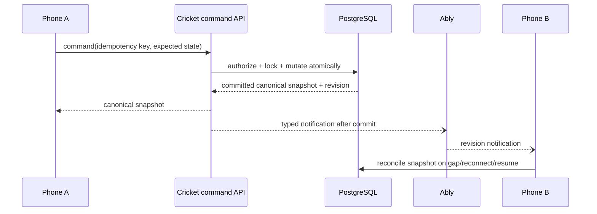
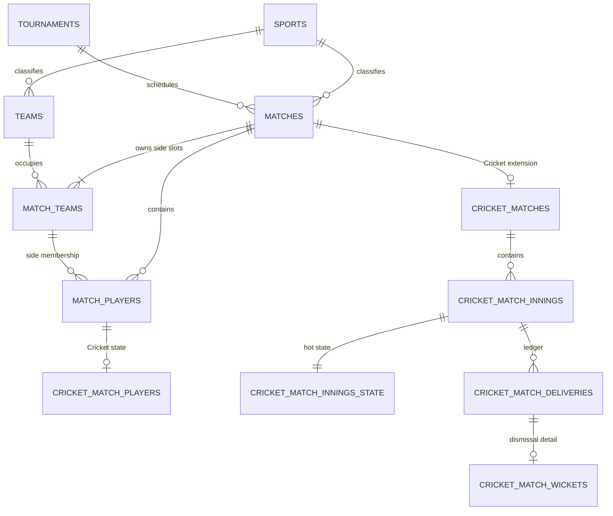
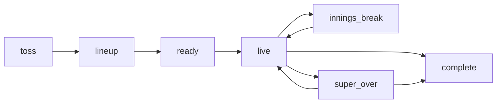
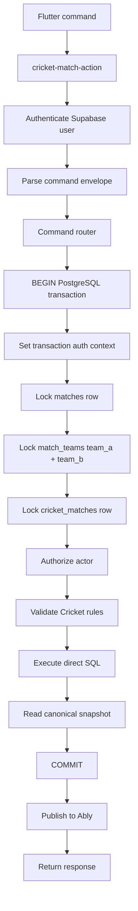
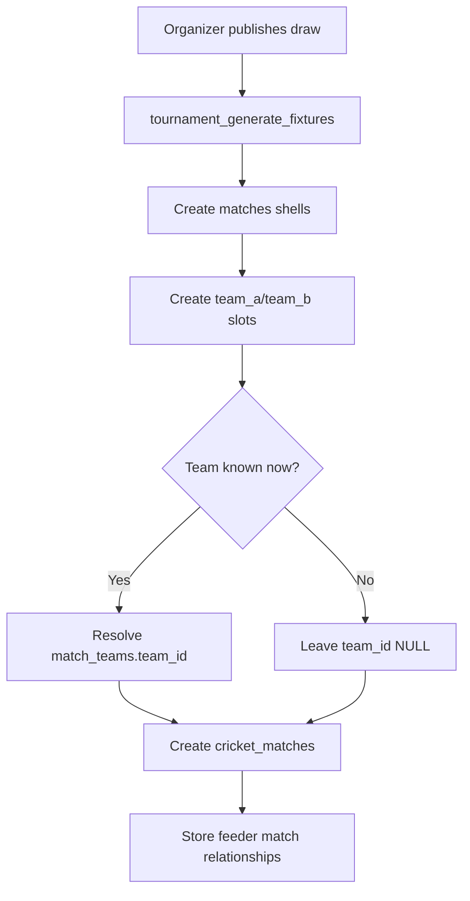
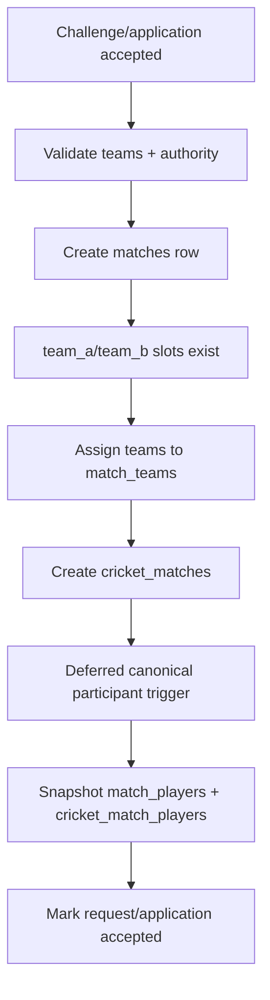
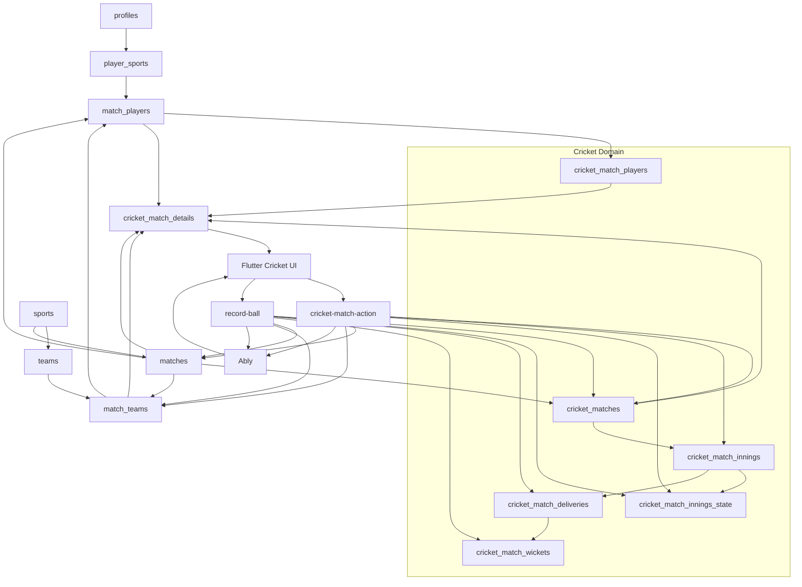

# Matchday Match Domain, Cricket Runtime & Tournament Architecture

> **Status:** Architecture contract  
> **Scope:** All match-domain work implemented after `docs/database/MATCHDAY_PLAYER_IDENTITY_ARCHITECTURE.md` during the multi-sport match refactor, Cricket-engine cleanup, direct-SQL Edge command refactor, and canonical `match_teams` redesign.  
> **Backend goal:** Multi-sport-ready shared match infrastructure with Cricket implemented as the first sport-specific engine.  
> **Frontend goal:** Keep Flutter Cricket-only until another sport is actually implemented.  
> **Migration philosophy:** Matchday is still pre-production, so the schema should converge on the clean final design rather than carrying legacy compatibility storage.

---

## Runtime coordination addendum (2026-09-22)

The live match runtime follows one command/snapshot protocol:



- PostgreSQL is authoritative; Ably is a low-latency notification layer.
- `match_players` is the only participant source for lineup and scoring.
- Friendly/practice fixtures snapshot eligible team rosters. Tournament
  fixtures snapshot registered tournament squads.
- Recording the toss performs the last roster reconciliation and freezes
  automatic roster synchronization.
- A scorer may add an unclaimed participant to either match side without
  creating a `team_members` row. Account claiming remains a later phase.
- A match becomes live only when striker, non-striker, and opening bowler are
  committed in the same start command.
- `/matches/:id` owns pre-live setup; `/matches/:id/score` owns both innings
  and the innings break. Legacy start and innings-break URLs only redirect.
- Route-scoped channel leases are reference-counted. A consumer releasing a
  shared channel cannot detach it while another consumer still holds a lease.
- Clients accept only newer revisions. Missing or malformed revisions trigger
  a canonical snapshot read; optimistic scoring operations replay on top of
  the latest confirmed base.

See `MATCH_RUNTIME_ROLLOUT.md` for deployment and operational safeguards.

---

## 1. Why this document exists

The earlier Player Identity Architecture answered:

- who the global user is,
- what `player_sports` means,
- how team and match participation activate a sport identity,
- how unclaimed players are claimed,
- and why sport-specific player attributes belong in sport-specific extensions.

The work after that solved the next layer:

> How should a match, the teams inside it, the players inside it, Cricket rules, Cricket scoring, tournament advancement, lifecycle state, result state, and server-side command execution be modeled so the backend can eventually support multiple sports without making the current Cricket product unnecessarily generic?

This document records the final architecture so future developers and AI agents do not regress toward:

- Cricket fields inside the generic `matches` table,
- two separate sources of truth for match teams,
- team UUIDs stored where match-side identity is the real concept,
- Cricket workflow states inside generic lifecycle enums,
- Cricket participant roles inside generic `match_players`,
- frequently changing Cricket behavior duplicated in PL/pgSQL RPCs,
- duplicate realtime paths beside Ably,
- or premature multi-sport Flutter abstractions.

---

# 2. Core architectural rule

> **A shared match table may know which sport a match belongs to, but it must not know how that sport works.**

For Cricket:

```text
matches
    = universal sporting-event shell

match_teams
    = universal match-side / team assignment

match_players
    = universal per-match participant identity

cricket_matches
    = Cricket-specific rules, toss, phase, conditions, and result

cricket_match_players
    = Cricket-specific per-player match state

cricket_match_innings
cricket_match_innings_state
cricket_match_deliveries
cricket_match_wickets
    = Cricket scoring engine
```

The generic shell owns event identity and lifecycle.

The Cricket extension owns Cricket behavior.

---

# 3. Final domain topology



The ownership tree is:

```text
sports
  |
  +-- teams
  |
  +-- matches
        |
        +-- match_teams
        |      |
        |      +-- match_players
        |              |
        |              +-- cricket_match_players
        |
        +-- cricket_matches
               |
               +-- cricket_match_innings
                      |
                      +-- cricket_match_innings_state
                      +-- cricket_match_deliveries
                              |
                              +-- cricket_match_wickets
```

---

# 4. `matches` is the universal sporting-event shell

`matches` owns facts that remain meaningful for Cricket, Football, Badminton, or another future sport.

Conceptually it contains:

```text
match_id
sport_id

tournament_id
match_type
stage
round

bracket_round_number
bracket_match_number
prev_match_a_id
prev_match_b_id
group_id

venue
ground_id

scheduled_start_time
actual_start_time
completed_at

status
winner_side

created_by
created_at
updated_at
```

It must **not** own Cricket-only fields such as:

```text
Cricket format
Cricket rules JSON
toss winner
toss decision
toss face
Cricket start phase
openers
Cricket scoring mode
DLS/revised conditions
innings-break state
super-over state
Cricket result detail
player of the match
delivery type
wicket type
```

Those belong to Cricket-owned tables.

---

# 5. Generic lifecycle versus Cricket phase

One of the most important refactors separated:

```text
What is the lifecycle of this sporting event?
```

from:

```text
Where is this Cricket match inside the Cricket workflow?
```

## Generic lifecycle

Final `match_status` values:

```text
scheduled
live
completed
abandoned
cancelled
```

### Meaning

`scheduled`  
The event exists and has not started. Cricket may already be in `toss`, `lineup`, or `ready`.

`live`  
The sporting event has started. Cricket may internally be `live`, `innings_break`, or `super_over`.

`completed`  
The event reached a completed result.

`abandoned`  
The event did not produce a normal completed result. Cricket no-result belongs here at the generic lifecycle level.

`cancelled`  
The match will not be played.

## Values intentionally removed from generic lifecycle

```text
toss
rescheduled
innings_break
super_over
tied
no_result
walkover
```

Why:

- `toss`, `innings_break`, `super_over` are Cricket phases.
- `tied`, `no_result`, `walkover` are outcome semantics.
- `rescheduled` is a scheduling change; the match remains `scheduled`.

---

# 6. `cricket_matches` owns Cricket workflow

`cricket_matches` extends a shared match when:

```text
matches.sport_id = cricket
```

It owns Cricket-specific state:

```text
cricket_matches
- match_id
- format_code
- rules_snapshot

- phase

- toss_won_by
- toss_decision
- toss_face
- toss_recorded_at

- openers_submitted_by
- openers_submitted_at

- scoring_mode
- revised_conditions

- result
- result_summary

- player_of_the_match_id

- created_at
- updated_at
```

It must not duplicate generic event metadata such as tournament ownership, venue, schedule, or generic lifecycle.

---

# 7. Cricket phase

Final `cricket_match_phase`:

```text
toss
lineup
ready
live
innings_break
super_over
complete
```

Flow:



Meaning:

- `toss`: toss has not been fully resolved.
- `lineup`: toss decision exists; lineup/openers can be selected.
- `ready`: required opening participants are locked.
- `live`: active Cricket innings/scoring.
- `innings_break`: Cricket-only transition between innings.
- `super_over`: Cricket tie-breaker state.
- `complete`: Cricket workflow is closed.

The parent lifecycle and child phase must agree semantically, but they are not duplicate columns.

---

# 8. Cricket enum ownership

Sport-specific enums are explicitly Cricket-prefixed:

```text
cricket_toss_decision
cricket_scoring_mode
cricket_delivery_kind
cricket_wicket_kind
cricket_match_phase
```

Do not reintroduce generic global names such as:

```text
toss_decision
scoring_mode
delivery_kind
wicket_kind
match_format
match_role
```

when their semantics are Cricket-specific.

---

# 9. Preset template versus authoritative rules

A format preset is a template.

A match's rules are its runtime contract.

```text
match_format_presets
        |
        | chosen at creation
        v
cricket_matches.rules_snapshot
```

The authoritative rules are:

```text
cricket_matches.rules_snapshot
```

not the current preset definition.

This protects historical matches if a preset changes later.

`format_code` is a convenient identifier such as `t20` or `custom_limited`; it is not a substitute for the complete rules snapshot.

A shared preset catalog must also not expose Cricket-specific top-level columns merely for convenience. Cricket-specific defaults belong in Cricket-owned configuration.

---

# 10. `match_teams` is the canonical match-to-team relationship

A major final correction was making `match_teams` the **single source of truth** for which team occupies each side of a match.

The old physical design duplicated the relationship:

```text
matches.team_a_id
matches.team_b_id

AND

match_teams
```

That created two possible sources of truth.

The final architecture removes the duplicated team columns from `matches`.

---

## 10.1 Stable side identity

Each match owns two stable side identities:

```text
team_a
team_b
```

These are match-local identities.

> `team_a` is not a team. It is a slot in a match.

Final conceptual shape:

```text
match_teams
- match_id
- team_side      team_a | team_b
- team_id        nullable
- team_name      nullable historical snapshot
- created_at
- updated_at

PRIMARY KEY (match_id, team_side)
```

A resolved team is unique within one match:

```text
UNIQUE(match_id, team_id)
```

while `NULL` remains valid for unresolved tournament slots.

---

# 11. Why unresolved sides are necessary

Knockout fixtures may exist before their participants are known.

Example:

```text
Semi Final 1

team_a = Winner of Quarter Final 1
team_b = Winner of Quarter Final 2
```

At scheduling time:

```text
match_teams

semi_final_1 | team_a | NULL
semi_final_1 | team_b | NULL
```

After Quarter Final 1 completes:

```text
semi_final_1 | team_a | kasur_kings_uuid
semi_final_1 | team_b | NULL
```

The `matches` row itself does not need duplicate team columns.

Only the participant slot resolves.

This is one of the main scalability reasons `match_teams` exists.

---

# 12. Historical team-name snapshots

`match_teams.team_name` is a match-time snapshot.

If a team later changes its public name, historical fixtures do not have to mutate.

The pattern is identical to:

```text
match_players.display_name
```

Identity remains:

```text
team_id
```

Historical display remains:

```text
team_name snapshot
```

---

# 13. Match winner is a side, not an arbitrary team UUID

The old design used:

```text
matches.winner_id -> teams.team_id
```

That only proved that the winner was a valid team.

It did not prove the team participated in that match.

The final generic representation is:

```text
matches.winner_side
```

where:

```text
winner_side = team_a | team_b | NULL
```

and the database can enforce:

```text
(matches.match_id, matches.winner_side)
        ->
match_teams(match_id, team_side)
```

This guarantees that the winner belongs to the match.

A tie, no-result, unfinished match, or other non-winning outcome uses:

```text
winner_side = NULL
```

---

# 14. Cricket result ownership

Detailed Cricket outcome semantics belong in:

```text
cricket_matches.result
```

The generic shell stores only:

```text
status
winner_side
completed_at
```

Example Cricket result:

```json
{
  "winner_side": "team_a",
  "win_type": "runs",
  "win_margin": 17,
  "description": "Team A won by 17 runs"
}
```

Examples of Cricket/tournament outcome semantics:

```text
runs
wickets
tie
draw
walkover
no_result
override
manual
```

These do not belong in the generic lifecycle enum.

---

# 15. Toss winner is a side

Canonical storage is:

```text
cricket_matches.toss_won_by
    = team_a | team_b
```

It must not store a team UUID.

This keeps Cricket state consistent with:

```text
batting_team_side
bowling_team_side
winner_side
```

Flutter may still send a team UUID. The Edge Function resolves:

```text
team UUID
   |
   v
match_teams
   |
   v
team_a / team_b
```

and persists the side.

---

# 16. `openers_submitted_by` represents a user

A mismatch was discovered during the refactor:

The Edge workflow intended:

```text
openers_submitted_by = authenticated user UUID
```

while the database had constrained the field to:

```text
team_a | team_b
```

The final meaning is:

```text
cricket_matches.openers_submitted_by
    -> profiles.user_id
```

It answers:

> Which authenticated user locked the opening batters?

The batting side is derived separately from the innings and toss.

---

# 17. `match_players` remains sport-neutral identity

The earlier Player Identity Architecture established the role of `match_players`.

Conceptually:

```text
match_players
- match_player_id
- match_id
- team_side
- user_id OR unclaimed_id
- display_name
- jersey_number
- created_at
```

It contains participant identity, not Cricket roles.

It does **not** own:

```text
sport_id
is_captain
is_wicket_keeper
batting_order
is_playing_xi
Cricket role enum
```

Those belong in Cricket extensions.

---

# 18. `cricket_match_players` owns Cricket participant state

The Cricket child contains facts such as:

```text
cricket_match_players
- match_player_id
- match_id

- is_playing_xi
- batting_order

- is_captain
- is_vice_captain
- is_wicket_keeper
- is_substitute

- created_at
- updated_at
```

These are intentionally independent booleans.

A player can simultaneously be:

```text
captain = true
wicket_keeper = true
```

Do not collapse them into a single generic role enum.

---

# 19. Player-to-side database integrity

Because `match_teams` is canonical, `match_players` can be protected by:

```text
(match_id, team_side)
        ->
match_teams(match_id, team_side)
```

This prevents a participant from being assigned to a side that does not exist for that match.

The same principle applies to Cricket innings and toss state.

---

# 20. Cricket innings use side identities

`cricket_match_innings` stores:

```text
batting_team_side
bowling_team_side
```

Example:

```text
innings 1
batting_team_side = team_b
bowling_team_side = team_a
```

The team UUID is resolved through:

```text
(match_id, team_side)
    -> match_teams.team_id
```

This is especially important for tournament fixtures that may initially exist with unresolved participants.

---

# 21. Cricket scoring engine ownership

The scoring engine is explicitly Cricket-owned.

Final canonical names:

```text
cricket_match_innings
cricket_match_innings_state
cricket_match_deliveries
cricket_match_wickets
```

Generic names such as:

```text
match_innings
match_innings_state
match_deliveries
match_wickets
balls
```

must not become the canonical engine again.

Football, tennis, badminton, and future sports should get their own engine tables when real requirements exist.

---

# 22. Ledger versus hot state

The Cricket engine separates durable scoring events from the current live projection.

## Delivery ledger

```text
cricket_match_deliveries
```

stores individual deliveries.

## Wicket detail

```text
cricket_match_wickets
```

stores dismissal-specific detail linked to a delivery.

## Innings definition

```text
cricket_match_innings
```

stores innings metadata:

```text
innings_number
batting_team_side
bowling_team_side
overs_allocated
start/end state
```

## Hot mutable state

```text
cricket_match_innings_state
```

stores the current projection required for efficient scoring:

```text
total_runs
total_wickets
legal_ball_count
striker
non_striker
bowler
target
version
```

The ledger is the durable event history.

The hot-state row is the current operational projection.

---

# 23. Why frequent Cricket commands moved out of database functions

Originally many workflow actions were PostgreSQL functions:

```text
record_toss_winner
record_toss_decision
submit_match_openers
start_match_now
start_innings
undo_last_ball
complete_cricket_match

tournament_reschedule_match
tournament_abandon_match
tournament_declare_walkover
tournament_override_result
tournament_revise_match_conditions
tournament_trigger_super_over
```

That made normal Cricket behavior changes require a database migration even when the schema itself had not changed.

The final rule is:

> **Database = durable integrity. Edge Function = frequently changing workflow behavior.**

---

# 24. PostgreSQL responsibilities

PostgreSQL remains responsible for facts that must always be true regardless of caller:

```text
foreign keys
unique constraints
check constraints
RLS
grants
sport consistency
side consistency
identity consistency
stable authorization primitives
stable read/query functions where appropriate
```

Examples:

```text
winner_side belongs to this match
player side exists for this match
Cricket innings side exists for this match
Cricket toss side exists for this match
team sport matches match sport
the same resolved team cannot occupy both sides
```

These are durable integrity rules and belong in the database.

---

# 25. Edge Function responsibilities

`cricket-match-action` owns workflow behavior that may evolve:

```text
who may record a toss
when a toss may be changed
who chooses bat/bowl
when openers may be selected
who may start an innings
how phases transition
how a walkover is represented
how a tournament override behaves
how a super over is entered
how result changes repair downstream bracket slots
```

These rules belong in TypeScript.

---

# 26. Final `cricket-match-action` transaction flow



The ordering matters:

```text
write
-> commit
-> realtime publication
```

Do not publish uncommitted state.

---

# 27. Edge command module structure

Conceptually:

```text
cricket-match-action/
  index.ts
  command_router.ts
  types.ts

  commands/
    record_toss_winner.ts
    record_toss_decision.ts
    submit_match_openers.ts
    start_match_now.ts
    start_innings.ts
    undo_last_ball.ts
    complete_cricket_match.ts
    tournament_reschedule_match.ts
    tournament_abandon_match.ts
    tournament_declare_walkover.ts
    tournament_override_result.ts
    tournament_revise_match_conditions.ts
    tournament_trigger_super_over.ts

  repositories/
    match_repository.ts
    match_team_repository.ts
    authorization_repository.ts
    innings_repository.ts
    history_repository.ts
    snapshot_repository.ts

  domain/
    cricket.ts
    validation.ts
    errors.ts

  realtime/
    publisher.ts
```

This avoids replacing one giant PL/pgSQL function with one giant TypeScript file.

Every command should read like a business workflow.

---

# 28. Standard command implementation pattern

A command should normally follow:

```text
1. Parse input
2. Lock authoritative state
3. Check authorization
4. Validate domain preconditions
5. Mutate only the tables owned by that concern
6. Maintain parent/child lifecycle consistency
7. Repair tournament consequences when required
8. Read canonical snapshot
```

Example:

```text
record_toss_winner
    |
    +-- lock match
    +-- verify recorder authority
    +-- verify supplied team belongs to match
    +-- convert team UUID -> side
    +-- verify phase still allows toss changes
    +-- update cricket_matches
```

---

# 29. Stable database functions may still exist

The architecture does **not** mean “all database functions are bad.”

Good candidates for PostgreSQL functions include stable primitives such as:

```text
can(...)
_user_team_can(...)
team_staff_ids(...)
_is_match_captain(...)
list_my_cricket_matches()
read projections
leaderboards
stable identity/integrity utilities
```

The distinction is:

```text
frequently changing Cricket workflow
    -> Edge TypeScript

stable relational / authorization / query primitive
    -> PostgreSQL when appropriate
```

---

# 30. `record-ball` is a separate high-frequency write boundary

Ball-by-ball scoring is intentionally separate from general match commands.

`record-ball` owns the hot write path:

```text
writer authorization
innings-state locking
idempotency
delivery insert
wicket insert
hot-state recomputation
innings-end transition
result calculation
match completion
canonical snapshot return
realtime publication
```

This keeps delivery ingestion isolated from lower-frequency match/tournament commands.

---

# 31. `record-ball` resolves teams through `match_teams`

The scoring runtime must not depend on physical:

```text
matches.team_a_id
matches.team_b_id
```

Those columns are not part of the final model.

The repository resolves:

```text
team_a
team_b
```

through `match_teams`.

It may expose convenient in-memory values like:

```text
teamAId
teamBId
```

but these are derived values, not columns on `matches`.

---

# 32. Scoring result conversion

The Cricket result calculator may naturally compute a winning team UUID because score lines are associated with team UUIDs.

Before persistence, the server converts:

```text
winnerTeamId
    |
    v
match side
    |
    v
team_a / team_b
    |
    v
matches.winner_side
```

This keeps the scoring algorithm understandable while preserving normalized storage.

---

# 33. Tournament fixture generation

Tournament fixtures are:

```text
generic match shell
+
two participant slots
+
optional sport-specific extension
```

Creation flow:



The request payload may still use DTO names:

```text
team_a_id
team_b_id
```

but those values are written into `match_teams`, not into `matches`.

---

# 34. Knockout advancement

A feeder result resolves a future fixture side.

Example:

```text
Quarter Final 1
winner_side = team_b

Semi Final.prev_match_a_id = Quarter Final 1
```

The server resolves:

```text
Quarter Final winner_side
        |
        v
Quarter Final match_teams
        |
        v
winning team UUID
        |
        v
Semi Final match_teams.team_a
```

The future `matches` shell remains unchanged.

---

# 35. Participant materialization during advancement

Resolving only the future team is insufficient.

The future fixture also needs its participant snapshot so Cricket lineup/start flows work immediately.

Advancement therefore updates only the future `match_teams.team_id`. The
`match_teams_sync_participants` database trigger is the sole owner that then
materializes the resolved side into:

```text
match_players
cricket_match_players
```

Neither `record-ball` nor `cricket-match-action` may manually insert these
rows. Two materializers can race, violate uniqueness, or disagree about
whether tournament registration or the mutable team roster is authoritative.

The future fixture must never reach this state:

```text
team known
but no players available for lineup/scoring
```

---

# 36. Result reversal and downstream repair

Tournament results can change through:

```text
undo
override
walkover changes
reschedule/reset
super-over reopening
```

If the old winner was already propagated downstream, changing the result may require:

```text
clear downstream match_teams slot
let the canonical trigger remove the stale automatic snapshot
resolve the new winning team
let the canonical trigger materialize the new participant snapshot
```

Do not update only the source result and leave future fixtures stale.

---

# 37. Direct challenge and pool match creation

Challenge acceptance and open-pool acceptance follow one canonical model:



No creation flow may dual-write:

```text
matches.team_a_id/team_b_id
AND
match_teams
```

There is one physical source of truth: `match_teams`.

The acceptance RPCs must not manually insert participant rows. Creating the
Cricket extension activates the same deferred synchronization trigger used by
all other match origins, so direct challenges, pool applications, tournament
fixtures, and winner advancement share one participant invariant.

---

# 38. `cricket_match_details` is the Cricket API projection

Normalized storage should not force Flutter to perform complex joins.

The aggregate read boundary is:

```text
cricket_match_details
```

It may expose convenient derived fields:

```text
team_a_id
team_b_id
team_a_name
team_b_name

winner_id
winner_side

toss_won_by
toss_won_by_side

lifecycle_status
cricket_phase

status
start_phase

format
match_format

captains
result
```

The key rule is:

> Projection convenience is allowed. Duplicate physical storage is not.

---

# 39. Flutter contract

The Flutter application remains Cricket-only.

It may continue using:

```text
teamAId
teamBId
winnerId
tossWonBy
status
startPhase
```

because the view derives them.

For example:

```text
cricket_match_details.team_a_id
    <- match_teams(team_a).team_id

cricket_match_details.team_b_id
    <- match_teams(team_b).team_id

cricket_match_details.winner_id
    <- match_teams(matches.winner_side).team_id

cricket_match_details.toss_won_by
    <- match_teams(cricket_matches.toss_won_by).team_id
```

The UI does not need to understand physical normalization.

---

# 40. Do not genericize the Flutter app yet

Backend multi-sport readiness must not introduce unnecessary frontend abstractions.

Do not add merely for architecture purity:

```text
currentSportProvider
sport selector
sport strategy registry
Football entities
generic scoring UI
multi-sport routing
sport-aware home navigation
```

until a second sport actually exists as a product requirement.

Current boundary:

```text
backend = multi-sport-ready
frontend = Cricket-only
```

---

# 41. Security-invoker views

Supabase/PostgreSQL views exposed to the client must not accidentally bypass underlying RLS.

For PostgreSQL 15+ the intended pattern is:

```sql
create view ...
with (security_invoker = true)
as ...
```

`cricket_match_details` is a projection, not an authorization bypass.

The principle is:

```text
view = convenient read shape
RLS = remains owned by underlying tables
```

---

# 42. `SECURITY DEFINER` functions are API surfaces

A `SECURITY DEFINER` function can execute with privileges different from the caller.

Therefore every such function must be deliberate about:

```text
search_path
EXECUTE grants
whether anon can call it
whether authenticated can call it
whether only service_role/server code should call it
```

Frequently changing Cricket mutation functions were removed as direct client RPC APIs.

Stable read/authorization helpers may remain where they are the correct architectural boundary.

---

# 43. Realtime architecture

Matchday uses:

```text
Ably
```

as the current live realtime transport for match state and chat.

Desired mutation flow:

```text
database transaction
    |
    v
commit canonical state
    |
    v
publish canonical snapshot to Ably
```

A second Supabase/Postgres broadcast path for the same match state creates unnecessary complexity:

```text
duplicate events
ordering ambiguity
two realtime contracts
extra maintenance
```

The final architecture therefore removes the duplicate match-state database broadcast path.

---

# 44. Publish canonical snapshots, not guessed state

Realtime payloads should represent committed server truth.

The Edge layer should:

```text
mutate
commit
read/return canonical snapshot
publish that snapshot
```

This minimizes drift between:

```text
PostgreSQL
Edge response
Ably event
Flutter state
```

---

# 45. Data ownership matrix

| Concern | Canonical owner |
|---|---|
| Global account | `profiles` |
| Registered player identity per sport | `player_sports` |
| Team identity | `teams` |
| Match identity | `matches` |
| Match sport | `matches.sport_id` |
| Generic lifecycle | `matches.status` |
| Generic winner | `matches.winner_side` |
| Match side identity | `match_teams.team_side` |
| Team occupying side | `match_teams.team_id` |
| Historical team display | `match_teams.team_name` |
| Match participant identity | `match_players` |
| Cricket participant state | `cricket_match_players` |
| Cricket rules | `cricket_matches.rules_snapshot` |
| Cricket phase | `cricket_matches.phase` |
| Toss | `cricket_matches` |
| Cricket result | `cricket_matches.result` |
| Innings metadata | `cricket_match_innings` |
| Live innings projection | `cricket_match_innings_state` |
| Delivery ledger | `cricket_match_deliveries` |
| Dismissal detail | `cricket_match_wickets` |
| Match workflow commands | `cricket-match-action` |
| Ball ingestion | `record-ball` |
| Cricket read/API projection | `cricket_match_details` |
| Live transport | Ably |

---

# 46. Lifecycle/result examples

## Before toss

```text
matches.status = scheduled
cricket_matches.phase = toss
matches.winner_side = NULL
```

## Toss completed / lineup

```text
matches.status = scheduled
cricket_matches.phase = lineup
```

## Openers ready

```text
matches.status = scheduled
cricket_matches.phase = ready
```

## Active innings

```text
matches.status = live
cricket_matches.phase = live
```

## Innings break

```text
matches.status = live
cricket_matches.phase = innings_break
```

## Super over

```text
matches.status = live
cricket_matches.phase = super_over
```

## Normal completed win

```text
matches.status = completed
matches.winner_side = team_a

cricket_matches.phase = complete
cricket_matches.result.win_type = runs
```

## Tie

```text
matches.status = completed
matches.winner_side = NULL

cricket_matches.result.win_type = tie
```

## Walkover

```text
matches.status = completed
matches.winner_side = winning side

cricket_matches.result.win_type = walkover
```

## No result

```text
matches.status = abandoned
matches.winner_side = NULL

cricket_matches.result.win_type = no_result
```

## Cancelled

```text
matches.status = cancelled
matches.winner_side = NULL
```

---

# 47. Core invariants

Future changes must preserve these rules.

## Generic match invariants

1. Every match belongs to exactly one sport.
2. `matches` remains sport-neutral.
3. Cricket workflow fields do not belong in `matches`.
4. Generic lifecycle remains limited to `scheduled`, `live`, `completed`, `abandoned`, `cancelled`.
5. Generic winner identity is `winner_side`, not an arbitrary team UUID.

## Match-team invariants

6. Every match owns stable `team_a` and `team_b` side identities.
7. A side identity is not the same thing as a team identity.
8. `match_teams` is the only physical match-to-team source of truth.
9. Physical `matches.team_a_id` and `matches.team_b_id` must not be recreated.
10. A resolved team may not occupy both sides of one match.
11. Tournament sides may stay unresolved until feeder results exist.
12. Historical team-name snapshots may remain independent of later team renames.

## Participant invariants

13. `match_players` remains sport-neutral.
14. Every `match_players.team_side` must exist for that match.
15. Cricket participant state belongs in `cricket_match_players`.
16. Captain, keeper, vice-captain, substitute, and playing-XI state are independent Cricket facts.

## Cricket invariants

17. `cricket_matches` is the Cricket extension, not another generic shell.
18. Toss winner is stored as a side.
19. Innings batting/bowling identities are sides.
20. `rules_snapshot` is authoritative for the match.
21. Detailed Cricket result belongs in `cricket_matches`.
22. Cricket engine tables remain Cricket-prefixed.
23. `openers_submitted_by` is a user identity.

## Server invariants

24. Frequent Cricket workflow behavior belongs in Edge TypeScript.
25. PostgreSQL owns durable structural integrity.
26. Commands mutate inside transactions.
27. Realtime publication occurs only after commit.
28. Ably is the canonical current match realtime transport.
29. Mutation behavior must not be duplicated in both Edge commands and PL/pgSQL command RPCs.

## Frontend invariants

30. Flutter remains Cricket-only until a second sport is implemented.
31. Flutter may consume convenient derived fields from `cricket_match_details`.
32. DTO convenience must not become a reason to duplicate physical storage.

---

# 48. What future code must NOT do

Do not reintroduce:

```text
matches.team_a_id
matches.team_b_id
matches.winner_id
```

as canonical storage.

Do not store:

```text
cricket_matches.toss_won_by = team UUID
```

Use:

```text
team_a | team_b
```

Do not put:

```text
innings_break
super_over
tied
walkover
no_result
```

back into generic `match_status`.

Do not put:

```text
captain
keeper
batting_order
playing XI
```

back into generic `match_players`.

Do not create a generic sports delivery/wicket engine before another sport demonstrates a real shared abstraction.

Do not move frequently changing Cricket workflow commands back into database functions merely to make TypeScript smaller.

Do not create a second realtime publisher for the same match state without an explicit architectural reason.

---

# 49. Migration philosophy while pre-production

Matchday currently has no production users and no older released client that must stay compatible.

Therefore the preference is:

```text
clean final architecture
>
permanent compatibility storage
```

Temporary safety during a migration is acceptable.

The final schema should not intentionally retain:

```text
mirror columns
duplicate participant tables
old RPCs
old enum aliases
legacy engine tables
dual-write triggers
duplicate realtime paths
```

for a client version that does not exist.

---

# 50. Baseline / squash strategy

Forward migrations are useful while the architecture is being reviewed.

Once this architecture is stable, the reset baseline should be rewritten/squashed so a fresh development database creates the final model directly.

A future clean reset should create:

```text
matches
    without Cricket fields
    without team_a_id/team_b_id/winner_id

match_teams
    as canonical side mapping

match_players
    referencing match_teams side identity

cricket_matches
    with Cricket-only state

cricket_match_players

cricket_match_innings
cricket_match_innings_state
cricket_match_deliveries
cricket_match_wickets
```

A fresh reset should not conceptually replay obsolete architecture forever.

---

# 51. Relationship to `MATCHDAY_PLAYER_IDENTITY_ARCHITECTURE.md`

The two documents answer different questions.

## Player Identity Architecture

Answers:

```text
Who is the person?
Which sports is this account a player in?
How is an unclaimed identity claimed?
How does team/match participation activate player_sports?
```

## This document

Answers:

```text
What is a match?
Which teams occupy it?
Which players represent those sides?
Which state is generic?
Which state belongs to Cricket?
Where does scoring behavior live?
How do tournaments propagate participants/results?
How does realtime receive committed match state?
```

Together:

```text
profiles
   |
   v
player_sports
   |
   v
team membership / match participation
   |
   v
match_players
   |
   v
sport-specific participant extension
   |
   v
sport-specific match engine
```

---

# 52. Future second-sport example

Suppose Football is added later.

Shared infrastructure stays:

```text
matches
match_teams
match_players
```

Football then adds its own extension:

```text
football_matches
football_match_players
football_events
...
```

Example:

```text
matches
  match_id = M100
  sport_id = football
  status = live

match_teams
  M100 | team_a | F1
  M100 | team_b | F2

match_players
  generic participant identity

football_matches
  football-specific match state

football_match_players
  lineup / position / card state

football_events
  goals / cards / substitutions / etc.
```

Football is not forced into Cricket innings, deliveries, or wickets.

Likewise, Cricket is not redesigned around hypothetical Football requirements.

---

# 53. Developer / AI change checklist

Before changing this area, answer:

### Ownership

1. Is this fact generic to sporting events or specific to Cricket?
2. Does it belong in `matches`, `match_teams`, `match_players`, `cricket_matches`, or the Cricket engine?
3. Am I duplicating a fact already owned elsewhere?

### Side identity

4. Am I reasoning in match-side identity or team identity?
5. Should this match-local state store `team_a/team_b` rather than a UUID?
6. Can this fixture exist before its actual team is known?

### Lifecycle

7. Is this a true generic lifecycle transition?
8. Or is it a Cricket phase/outcome?
9. Am I adding Cricket states back into `match_status`?

### Commands

10. Is this a durable integrity rule?
11. Or frequently changing Cricket workflow?
12. If it is workflow behavior, why is it not in the Edge command layer?

### Results / tournament

13. Can the database prove the winner participated in this match?
14. If a result changes, are downstream bracket slots repaired?

### Player data

15. Is this participant identity or Cricket participant state?
16. Am I leaking Cricket roles back into `match_players`?

### API

17. Does Flutter only need a derived projection?
18. Am I about to duplicate storage just because a DTO wants a convenient field?

### Realtime

19. Is publication after commit?
20. Am I introducing a second transport for the same state?

### Multi-sport

21. Does the change improve backend reuse without forcing premature generic UI?
22. Is the abstraction based on a real second-sport requirement or only an imagined one?

If any answer is unclear, stop and review the architecture before changing the schema.

---

# 54. Verification checklist after reset or major migration

## Shared shell

`matches` should have:

```text
sport_id
generic lifecycle
winner_side
```

It should not have:

```text
team_a_id
team_b_id
winner_id
Cricket toss
Cricket format/rules
Cricket phase
Cricket scoring mode
```

## Team slots

Every match should have:

```text
team_a
team_b
```

in `match_teams`.

Resolved teams must belong to the same sport as the match.

## Player consistency

Every `match_players` row must resolve:

```text
(match_id, team_side)
    -> match_teams
```

## Cricket extension

Every Cricket match must have a `cricket_matches` row and a valid Cricket phase.

## Toss consistency

If `toss_won_by` is not null, it must be a valid side of that same match.

## Innings consistency

Every batting and bowling side must exist in `match_teams`.

## Result consistency

If `winner_side` is not null, it must exist in that same match's `match_teams`.

## Edge command architecture

Old command RPCs such as direct `record_toss_winner(...)` and `start_innings(...)` database mutation APIs must not return as the primary workflow layer.

## Flutter projection

`cricket_match_details` must provide the current Cricket DTO fields without requiring duplicate physical storage.

## Realtime

Match state should use the intended Ably path without an unnecessary duplicate database broadcaster.

---

# 55. Final mental model

A developer should be able to remember the architecture using these sentences:

> **A user is global; a player identity is sport-specific.**

> **A match is a generic sporting event; Cricket behavior lives in Cricket extensions.**

> **A match owns two stable side identities; teams occupy those sides.**

> **Players belong to match sides; Cricket-specific player state extends those participant identities.**

> **Generic lifecycle says whether the event is scheduled, live, or finished; Cricket phase says what Cricket is doing inside that lifecycle.**

> **The database protects facts that must always be true; Edge Functions own frequently changing Cricket workflow behavior.**

> **The delivery ledger and innings state implement Cricket scoring; they are not generic sports infrastructure.**

> **Tournament advancement resolves future `match_teams` slots instead of rewriting participant columns on `matches`.**

> **Flutter consumes a convenient Cricket projection while normalized storage remains behind the API boundary.**

> **The backend is multi-sport-ready, but the product remains Cricket-only until a second sport actually exists.**

---

# 56. Final architecture diagram



---

# 57. Final architecture contract summary

```text
GLOBAL
profiles
sports
player_sports

SHARED TEAM / MATCH INFRASTRUCTURE
teams
team_members
matches
match_teams
match_players

CRICKET EXTENSIONS
cricket_player_profiles
cricket_match_players
cricket_matches

CRICKET ENGINE
cricket_match_innings
cricket_match_innings_state
cricket_match_deliveries
cricket_match_wickets

WRITE BOUNDARIES
cricket-match-action
record-ball

READ / API BOUNDARY
cricket_match_details

REALTIME
Ably

CLIENT
Flutter Cricket UI
```

This is the architecture future Matchday work should preserve unless a new concrete product requirement proves that one of these boundaries is wrong.
