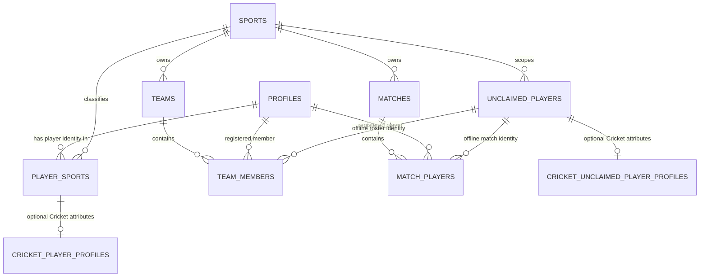
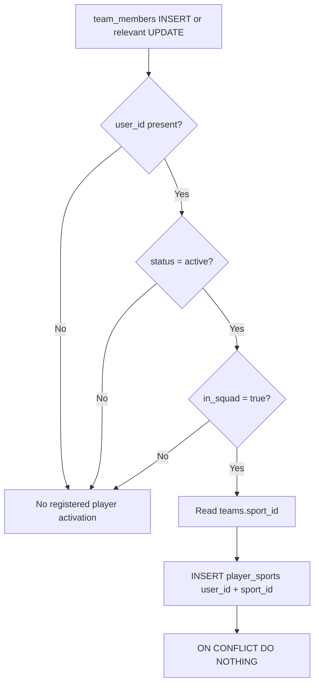
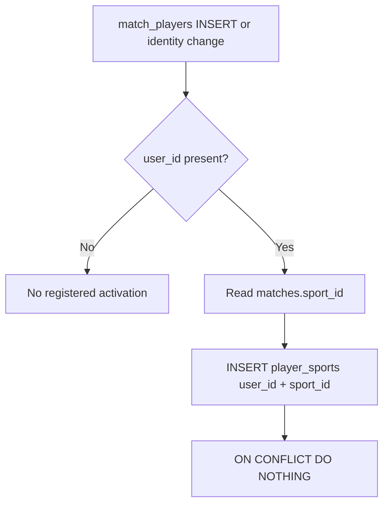
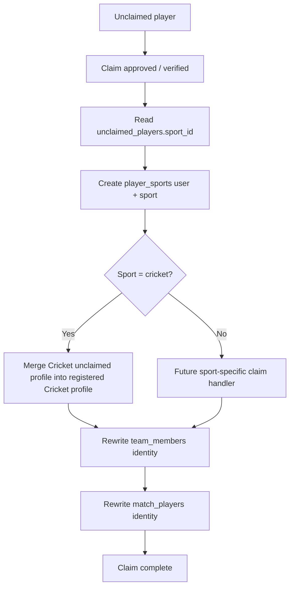
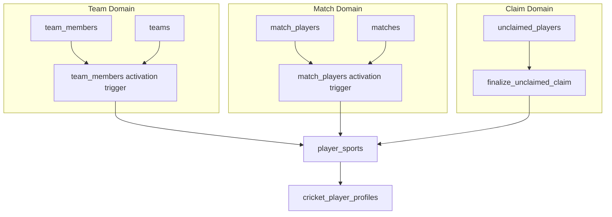

# Matchday Player Identity & Multi-Sport Backend Architecture

> **Status:** Architecture contract  
> **Scope:** Backend is multi-sport-ready; frontend remains Cricket-only for now.  
> **Primary goal:** Preserve one global Matchday account while allowing the same person to establish independent player identities in multiple sports.

---

## 1. Why this document exists

This document records the reasoning behind Matchday's player identity model so future developers and AI agents do not accidentally collapse separate concepts back into one table.

The most important design decision is:

> A Matchday account is global. A player identity is sport-specific.

A user may therefore be:

- a Cricket player,
- a Football player,
- a Badminton player,
- a manager in one sport without playing it,
- a player in another sport,
- and still have only one global `profiles` row.

The backend must support this model even though the current Flutter application is Cricket-only.

This architecture deliberately avoids adding multi-sport UI, sport selectors, or sport-aware navigation until another sport is actually implemented.

---

## 2. Core domain concepts

### `profiles`

`profiles` is the global Matchday identity.

It answers:

- Who is this account?
- What is the display name?
- What is the username?
- What is the avatar?
- What is the bio?

It does **not** answer:

- Which sport does this user play?
- Which Cricket role do they have?
- Which team do they belong to?
- Are they a manager or captain?

A user has exactly one `profiles` row.

---

### `sports`

`sports` is the stable backend catalog of supported sports.

Example:

```text
cricket
football
badminton
```

`sport_id` is a stable machine identifier and should not be treated as a display label.

Sport-specific rules, scoring models, player attributes, and match engines do not belong in this table.

---

### `player_sports`

`player_sports` is the canonical registered-player identity per sport.

It answers exactly one question:

> Has this Matchday account established a player identity in this sport?

Example:

```text
user_1 | cricket
user_1 | football
user_2 | cricket
```

The primary key is:

```text
(user_id, sport_id)
```

This is **not**:

- team membership,
- team authority,
- match participation,
- follows/interests,
- a list of sports the user likes,
- sport-specific skills.

A `player_sports` row is durable. Leaving a team does not remove it.

---

### Sport-specific player profile tables

Sport-specific attributes do not belong in `profiles` or `player_sports`.

For Cricket:

```text
cricket_player_profiles
```

contains attributes such as:

- batting style,
- bowling style,
- player role,
- preferred ball types,
- years playing.

The player identity is still:

```text
player_sports(user_id, 'cricket')
```

The Cricket profile is an optional extension.

Therefore this state is valid:

```text
player_sports:
  user_1 | cricket

cricket_player_profiles:
  no row
```

Meaning:

> `user_1` is a Cricket player, but has not supplied optional Cricket-specific attributes.

A missing `cricket_player_profiles` row must never be interpreted as "not a Cricket player."

---

## 3. High-level relationship diagram



---

## 4. Why `player_sports` exists

Without `player_sports`, Matchday would have to infer a user's sports from indirect evidence:

- team memberships,
- match appearances,
- Cricket profile rows,
- future Football profile rows,
- tournament participation.

That becomes ambiguous and expensive.

For example, if a user leaves every Cricket team but still has Cricket match history, they are still a Cricket player.

Likewise, a user may establish a Football player identity before filling any Football-specific profile fields.

`player_sports` gives the backend one canonical answer.

---

## 5. The activation rule

`player_sports` is domain-managed.

The frontend does **not** directly create or delete player identities.

A row is created when a meaningful backend event proves that the account participates as a player in a sport.

The current activation paths are:

1. Registered active squad membership.
2. Registered match participation.
3. Claiming an unclaimed player identity.

Future sport-specific onboarding may become another valid activation path, but it does not exist yet.

---

## 6. Activation from team membership

### Rule

A registered team member establishes a player identity when all are true:

```text
user_id IS NOT NULL
status = active
in_squad = true
```

The sport is derived from:

```text
team_members.team_id
    -> teams.sport_id
```

The client must not supply a separate `sport_id` to `team_members`.

### Why `in_squad` matters

Team authority and playing participation are different concepts.

Example:

```text
Ahmed
role = manager
in_squad = false
```

Ahmed manages the team but does not automatically become a player of that sport.

However:

```text
Ahmed
role = manager
in_squad = true
```

means Ahmed is both staff and player.

Authority belongs to the team-role system.

Playing participation belongs to `in_squad`.

### Flow



### Important rule

When the user later:

- leaves the team,
- becomes inactive,
- is removed,
- changes teams,

the backend does **not** delete the `player_sports` row.

Membership describes current team state.

Player identity describes a durable sport identity.

---

## 7. Activation from match participation

A registered user appearing in `match_players` establishes a player identity in the match's sport.

Sport is derived from:

```text
match_players.match_id
    -> matches.sport_id
```

This activation path exists independently of team membership.

Reasons include:

- practice matches,
- imported historical matches,
- future non-team formats,
- temporary/event-based participation.

### Flow



---

## 8. Activation from unclaimed-player claiming

An unclaimed player is an offline/placeholder identity created before a real Matchday account owns that player history.

The shared identity is:

```text
unclaimed_players
```

and it belongs to exactly one sport:

```text
unclaimed_players.sport_id
```

When the placeholder is claimed by a real user, the claim flow must establish:

```text
player_sports(claimed_user_id, unclaimed_players.sport_id)
```

before or as part of merging sport-specific attributes and rewriting identity references.

### Flow



The operation must be atomic.

If any identity rewrite fails, the whole claim transaction should fail rather than leaving a partially claimed player.

---

## 9. Unclaimed players and sport-specific attributes

`unclaimed_players` is shared infrastructure.

It contains identity/contact/claim data that makes sense across sports.

Example:

```text
unclaimed_players
- unclaimed_id
- sport_id
- display_name
- phone_number
- email
- added_by
- claimed_by_user_id
- claimed_at
```

Cricket-only attributes do not belong there.

They belong in:

```text
cricket_unclaimed_player_profiles
```

Examples:

- batting style,
- bowling style,
- Cricket player role,
- preferred ball types,
- years playing.

### Ownership rule

The parent `unclaimed_players` row owns the sport.

The Cricket child should not conceptually become a second source of truth for sport.

Preferred model:

```text
unclaimed_players
  unclaimed_id
  sport_id = cricket

cricket_unclaimed_player_profiles
  unclaimed_id
  Cricket-specific fields...
```

A database guard should ensure that a Cricket unclaimed profile may only reference an unclaimed player whose parent sport is Cricket.

---

## 10. Registered Cricket profile relationship

The current registered Cricket extension is modeled as:

```text
player_sports(user_id, cricket)
        |
        v
cricket_player_profiles
```

The database should enforce that a Cricket-specific profile cannot exist without the corresponding Cricket player identity.

This makes the relationship explicit:


`cricket_player_profiles` is not the source of truth for whether the user plays Cricket.

---

## 11. Backend-only multi-sport readiness

The frontend remains Cricket-only.

The current implementation must **not** add:

- sport selection during onboarding,
- a current-sport provider,
- Football screens,
- Football player entities,
- multi-sport navigation,
- a generic player-skills JSON blob.

The backend becomes multi-sport-ready by making shared entities sport-neutral and by putting sport-specific data in sport-specific tables.

This lets Matchday add Football later without redesigning the global account or team/match identity model.

---

## 12. Future Football example

When Football is implemented, the existing architecture should allow:

```text
profiles
  user_1

player_sports
  user_1 | cricket
  user_1 | football

cricket_player_profiles
  user_1 | batter | right_hand | ...

football_player_profiles
  user_1 | midfielder | right_foot | ...
```

No change is required to `profiles`.

No change is required to the meaning of `player_sports`.

No change is required to the core team/match activation rules.

Football only adds Football-specific domain tables and logic.

---

## 13. Search semantics

Different product questions must use different tables.

### Find any Matchday user to invite

Use:

```text
profiles
```

A user who has never played Cricket should still be inviteable to a Cricket team.

After accepting and joining the squad, the backend establishes:

```text
player_sports(user, cricket)
```

### Discover existing Cricket players

Use:

```text
player_sports
WHERE sport_id = 'cricket'
```

then join to:

```text
profiles
cricket_player_profiles
```

These are intentionally different queries.

---

## 14. Direct client writes

`player_sports` should be readable through the public API according to the product's profile visibility rules.

It should not be directly mutable from Flutter.

Do not allow the client to arbitrarily:

```text
INSERT player_sports
DELETE player_sports
```

Reason:

A user could otherwise create fake sport identities or delete a Cricket player identity while team/match history still proves Cricket participation.

The domain events that establish participation should own the write.

Account deletion may remove player identities through cascading profile deletion.

---

## 15. Idempotency

Every activation path may attempt to create the same identity.

Example:

```text
user joins Cricket squad
    -> creates (user, cricket)

same user later plays a Cricket match
    -> attempts (user, cricket) again
```

This is expected.

All activation paths should use:

```sql
insert into public.player_sports (user_id, sport_id)
values (...)
on conflict (user_id, sport_id)
do nothing;
```

The architecture relies on idempotent activation.

---

## 16. Important invariants

Future changes must preserve these rules.

### Identity invariants

1. One global account may have many player-sport identities.
2. `profiles` must not contain a single `sport_id`.
3. `player_sports` is the canonical registered player identity per sport.
4. Sport-specific profile tables are optional extensions.
5. Leaving a team must not erase a durable player identity.

### Team invariants

6. A team belongs to exactly one sport.
7. `team_members` does not duplicate `sport_id`.
8. Registered active `in_squad` membership activates the team's sport.
9. Staff-only membership does not necessarily activate a player identity.

### Match invariants

10. A match belongs to exactly one sport.
11. `match_players` does not duplicate `sport_id`.
12. Registered match participation activates the match's sport.

### Unclaimed invariants

13. An unclaimed player belongs to exactly one sport.
14. An unclaimed child profile contains only sport-specific attributes.
15. Claiming creates/ensures the registered `player_sports` identity.
16. Claiming rewrites team and match identity atomically.

---

## 17. What must NOT be inferred

Future code and AI agents must not infer:

```text
cricket_player_profiles row exists
    => only possible way to know user plays Cricket
```

Wrong.

Use:

```text
player_sports(user, cricket)
```

---

Do not infer:

```text
team member
    => automatically a player
```

Wrong.

Check:

```text
status = active
in_squad = true
```

---

Do not infer:

```text
manager
    => player
```

Wrong.

Authority and participation are independent.

---

Do not infer:

```text
no current team
    => no player identity
```

Wrong.

Player identity is durable.

---

Do not infer:

```text
sport-specific attributes belong in profiles
```

Wrong.

They belong in sport-specific extension tables.

---

## 18. Why triggers are used

Multiple workflows can create player participation:

- team creation,
- adding a registered player,
- accepting a team invite,
- approving a join request,
- claiming an unclaimed player,
- creating/importing match lineups,
- future backend workflows.

Duplicating player-sport activation logic inside every RPC is fragile.

Instead, the database enforces the invariant at the tables where participation becomes true:

```text
team_members
match_players
```

This means future RPCs automatically inherit the rule.

The claim flow still explicitly ensures `player_sports` because claiming an identity itself is sufficient evidence of player identity even if no current membership survives.

---

## 19. Trigger responsibility diagram



---

## 20. Reset verification checklist

After `supabase db reset`, `player_sports` may initially be empty.

That is valid.

### Verify team activation

Create a Cricket team using the normal application flow.

If team creation creates the owner as:

```text
status = active
in_squad = true
```

then:

```sql
select *
from public.player_sports;
```

should contain:

```text
<owner_user_id> | cricket
```

---

### Verify squad consistency

```sql
select
  tm.user_id,
  t.sport_id
from public.team_members tm
join public.teams t
  on t.team_id = tm.team_id
where tm.user_id is not null
  and tm.status = 'active'
  and tm.in_squad = true
  and not exists (
    select 1
    from public.player_sports ps
    where ps.user_id = tm.user_id
      and ps.sport_id = t.sport_id
  );
```

Expected:

```text
0 rows
```

---

### Verify match consistency

```sql
select
  mp.user_id,
  m.sport_id
from public.match_players mp
join public.matches m
  on m.match_id = mp.match_id
where mp.user_id is not null
  and not exists (
    select 1
    from public.player_sports ps
    where ps.user_id = mp.user_id
      and ps.sport_id = m.sport_id
  );
```

Expected:

```text
0 rows
```

---

### Verify Cricket profile integrity

```sql
select cpp.user_id
from public.cricket_player_profiles cpp
where not exists (
  select 1
  from public.player_sports ps
  where ps.user_id = cpp.user_id
    and ps.sport_id = 'cricket'
);
```

Expected:

```text
0 rows
```

---

### Verify client cannot directly mutate player identities

Inspect RLS/grants and confirm normal authenticated clients have read access only.

There should be no direct authenticated insert/delete path for `player_sports`.

---

## 21. Migration ownership

For a reset-clean development database, each concern should live in its owning base migration.

Recommended ownership:

```text
20260101000020_sports.sql
    sports catalog

20260101000100_profiles.sql
    global account/profile identity

20260101000101_player_sports.sql
    canonical player identity per sport

20260101000110_player_profiles.sql
    Cricket-specific registered player attributes

20260101000120_unclaimed_players.sql
    sport-scoped offline identities
    Cricket-specific unclaimed extension
    claim primitives

20260101000210_team_members.sql
    membership facts
    team-sport integrity
    registered squad -> player_sports activation

20260101000401_match_players.sql
    match lineup identity
    match-sport integrity
    registered match player -> player_sports activation
```

Do not create patch migrations merely to compensate for a mistake in a base migration while the project is intentionally resettable.

Once production migration history becomes immutable, switch to forward-only migrations.

---

## 22. Architectural non-goals

This architecture intentionally does not solve:

- Football scoring.
- Football positions.
- A multi-sport Flutter UI.
- Cross-sport team conversion.
- Generic sport-specific JSON schemas.
- Generic match engines.
- Generic scoring models.
- User interests/favorite sports.
- Sports following/subscriptions.

Those should be designed separately when requirements exist.

---

## 23. AI change checklist

Before an AI agent changes this area, it should answer:

1. Am I changing global identity or sport-specific identity?
2. Does this data belong in `profiles`, `player_sports`, or a sport-specific extension?
3. Is this authority or playing participation?
4. Am I deriving sport from the owning entity instead of duplicating `sport_id`?
5. Will this create a new player identity?
6. If yes, which domain event proves that identity?
7. Does the change preserve users playing multiple sports?
8. Does it accidentally require a Cricket profile row to prove Cricket identity?
9. Does it delete a durable identity because a temporary membership ended?
10. Does it introduce frontend multi-sport behavior before the product needs it?

If any answer is unclear, the change should stop and the architecture should be reviewed first.

---

## 24. Final mental model

The simplest way to remember the architecture is:

```text
profiles
    "Who is this account?"

player_sports
    "Which sports does this account actually have a player identity in?"

cricket_player_profiles
    "What Cricket-specific attributes has this player supplied?"

team_members
    "Which team are they currently connected to, and do they play?"

match_players
    "Who participated in this match?"

unclaimed_players
    "Who is this offline player before a real account owns the identity?"
```

And the single most important rule is:

> **Sport participation creates a durable player-sport identity; sport-specific attributes remain optional extensions.**
