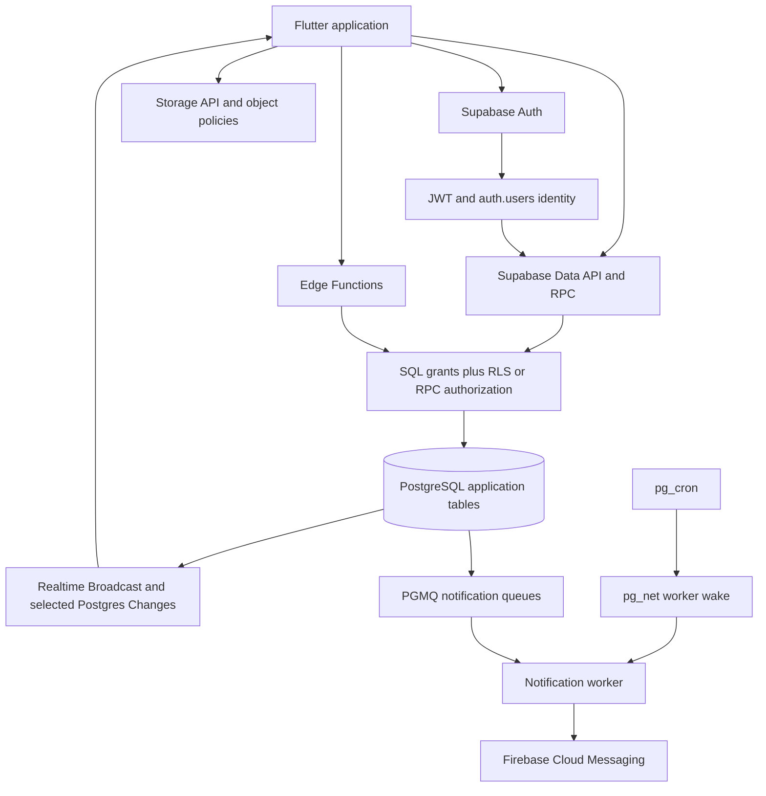
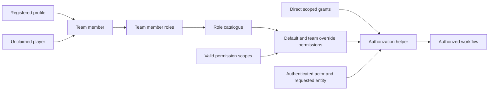
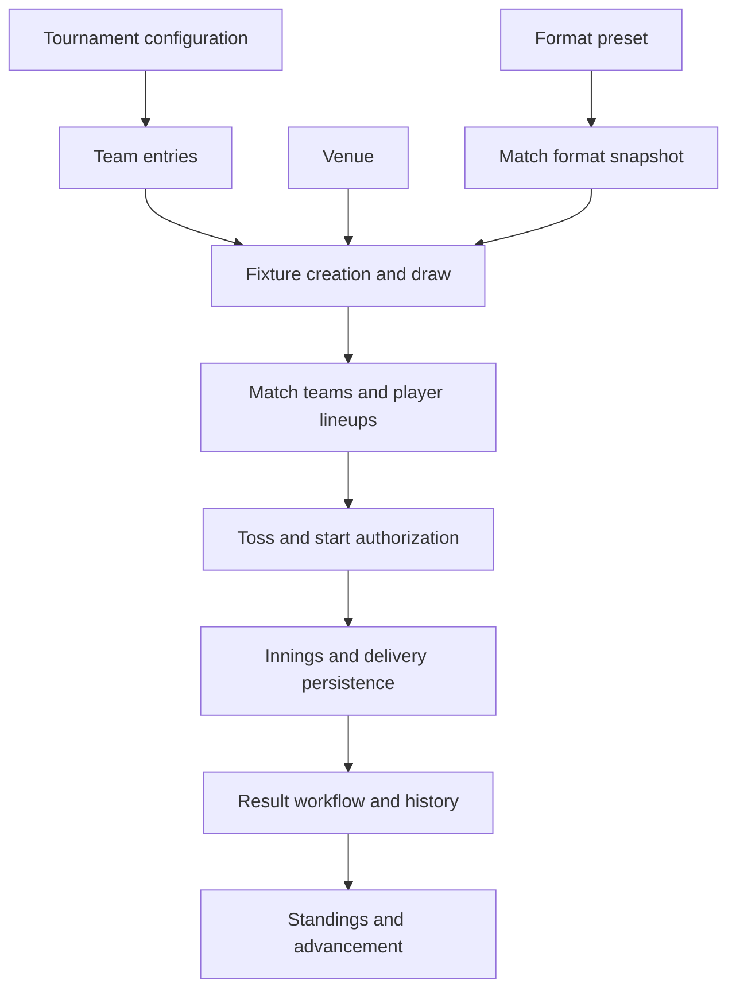
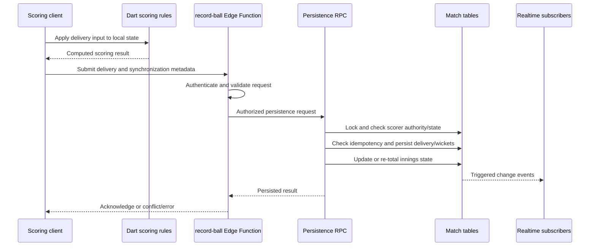
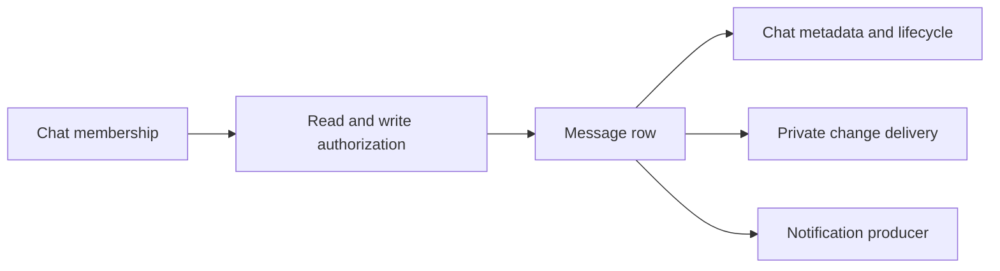
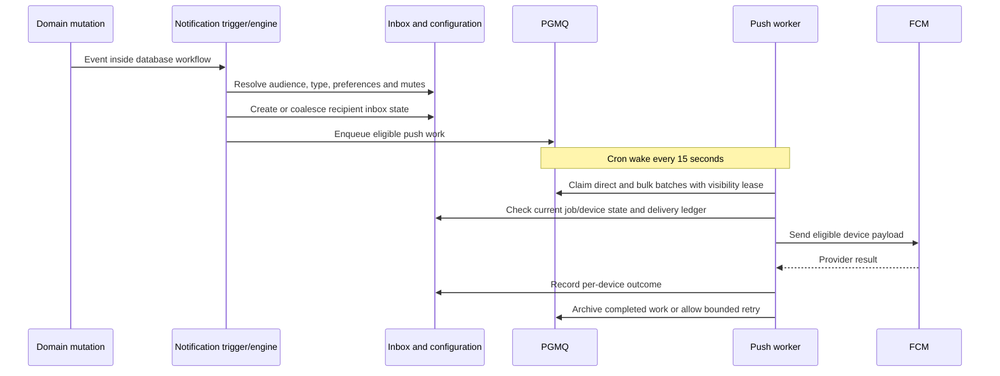
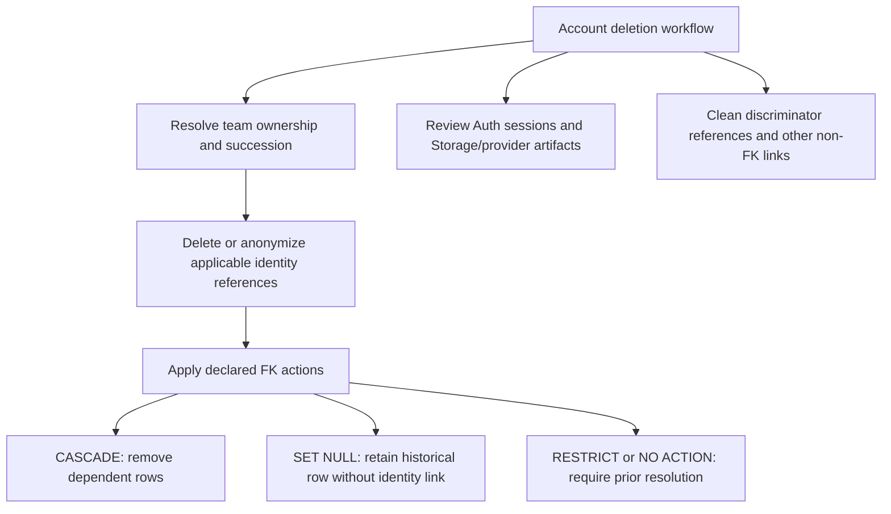

# Database architecture and workflows

[Handbook](README.md) · [Exact foreign keys](relationships.md) · [Change rules](migration-guide.md)

## System boundary

Matchday uses Supabase PostgreSQL as the shared relational system of record. Auth supplies account identity; Storage holds file bytes; Realtime distributes changes; Edge Functions handle selected server workflows and external services. Flutter contains the cricket scoring rules. PostgreSQL supplies constraints, authorization, transactions and persisted match state.

These are responsibilities, not a promise that every request traverses every box. A service-role call can bypass RLS: the Edge Function must establish identity and authorize the action before using privileged operations. Publication membership and private Broadcast authorization are distinct mechanisms; the exact current configuration is in [catalogues](catalogues.md).

## Domain map and architecture patterns

| Pattern | Current implementation | Consequence when changing it |
| --- | --- | --- |
| Relational domain separation | Identity, authorization, competition, matches, social, messaging and notifications have separate tables | Inspect cross-domain FKs and integration triggers before deletion or renaming |
| Normalized identity with match snapshots | Reusable team/player identities coexist with per-match sides, lineups and format values | Updating a team or preset must not silently rewrite historical match meaning |
| Data-driven authorization | Roles, permissions, valid scopes, override matrix and direct grants | A catalogue change can change access without a new Dart screen; test the server decision |
| Transactional workflow RPCs | Multi-row transitions and authorization live in functions | Direct writes may bypass required side effects even when a table grant exists |
| Persisted hot state | match_innings_state complements deliveries and wickets | Change scoring persistence and re-total logic together |
| Asynchronous notification delivery | Inbox/event work feeds leased queue jobs and per-device delivery records | Inbox creation, queue consumption and provider acceptance are different success states |
| Database change notifications | Triggers publish events; selected tables also use Postgres Changes | Review payload exposure and subscriber authorization independently of table RLS |
| Compatibility views | balls and format_presets retain older names | Search SQL, functions and application callers before removing aliases |

This is not pure event sourcing: last-ball undo deletes the last persisted delivery. It is not a database-only scoring engine: the removed SQL scoring reducer is not the authoritative rules implementation. It is not a universal permissions engine for every domain: tournament organizers retain a separate authorization model.

## Identity, team membership and authorization

`auth.users` owns authentication identity. `profiles` stores application identity, while `player_profiles` holds cricket-specific information. `unclaimed_players` allows a real player to appear before registration. Claim workflows reconcile these identities; do not model an unclaimed player as a fabricated Auth user.

A `team_members` row belongs to a team and represents either a registered or an unclaimed player. The exact exclusivity, uniqueness and delete actions are in [identity tables](tables-identity.md). `team_member_roles` supports multiple compatible roles. `teams.created_by` records creation history; current ownership comes from the owner role. Roles carry account requirements and singleton rules. Exclusion sets constrain combinations.

The diagram describes inputs, not an override-precedence algorithm. Read the authorization helpers in [the routine reference](routines.md) before changing precedence. Global role-permission rows use `team_id IS NULL`; per-team rows override defaults. Null-aware uniqueness prevents duplicate default entries. A direct grant must use a supported scope and permission. Match official/scorer assignments interact with scoped grants, so changing only one representation can leave authority inconsistent.

Ownership removal has lifecycle behavior: the current workflow selects a longest-tenured manager as successor or archives the team when succession cannot be satisfied. Account deletion therefore needs workflow validation beyond proving that foreign keys cascade.

## Competition and fixture lifecycle

Grounds are reusable venues. Tournaments link venues and teams through association tables and maintain persisted standings. Organizer authority uses `created_by`, the `organizers` array and tournament-specific helpers. It has not been replaced by the team role matrix.

Match format presets provide reusable defaults; matches retain their own format snapshot. Match teams and players capture match participation independently of a team's current membership. Scheduling, toss authority, scorer leases, result reporting and tournament advancement have distinct validation paths.

Challenge negotiation and pool applications are separate records associated with fixture formation. Their status enums list possible states, not all valid transitions. The expiry job evaluates pending/countered request deadlines; inspect its final function body for precise eligibility. Do not recreate transitions using arbitrary client status updates.

## Scoring transaction and synchronization

The scoring feature has local state and synchronization concerns described in [offline scoring](../offline-scoring-design.md). Other app features are online-first/direct online operations; do not infer a general offline database replication layer.

This sequence groups several implementation steps; the exact SQL contract and Edge validation are authoritative. Start at [record-ball](../../supabase/functions/record-ball/index.ts), then follow the final persistence routines. Exercise duplicate submissions, competing scorers, stale state, innings boundaries and undo when changing this boundary. A successful migration replay cannot execute these paths for you.

`match_innings_state` is the hot read model, deliveries are ordered persisted inputs/results, and wickets contain dismissal detail. Officials and scorer leases represent assignment and active control respectively. Match result history supports result operations; it is not a general immutable audit log for every mutation.

## Social and messaging

Posts own comments and engagement associations. Likes/bookmarks use relationship rows instead of embedded arrays. Follows use a target discriminator and UUID: PostgreSQL cannot enforce a conventional single FK to several possible target tables. New target types need validation, cleanup, authorization and audience-resolution changes.

Chats have membership and messages; `dm_channels` represents direct-message pairing. Chat lifecycle integration installs dependent policies once membership exists. Membership determines private access: a publicly readable team/profile does not imply access to its chat. Message creation can also trigger notifications.

## Notification catalogue, icons and delivery

[The notification contract](../notifications-design.md) explains product behavior. Types define event presentation and policy; categories organize settings; icons are reusable catalogue assets. Notification rows hold recipient-specific inbox state. Preferences and entity mutes are separate because category/type choice and muting one conversation or match have different lifecycles.

SVG bytes live in the `notification-icons` Storage bucket. Database icon metadata references the asset. Types select catalogue icons and presentation colors, avoiding repeated SVG markup in every inbox row. Preserve the current catalogue keys, color rules and validated asset mapping when extending it; exact seeded values are in [catalogues](catalogues.md). Custom SVG rendering requires controlled assets and the same ingestion/validation boundary as the existing assets.

Current wake policy claims up to **50 direct** and **100 bulk** jobs with **120 seconds** visibility. The worker bounds retries at **5 reads**. These are current implementation constants, not latency guarantees. Concurrency, provider response time, backlog and device counts affect throughput. The provider call and database outcome cannot share one atomic transaction: a crash between them can produce a duplicate push. Do not advertise exactly-once delivery.

`notification_deliveries` tracks per-device results with notification/revision context. `device_tokens` tracks push endpoints; a notification recipient can have multiple devices. Inbox read state, delivery attempts and user settings must not be collapsed into one boolean. Worker wake configuration requires the documented Vault/Edge secret values; the documentation snapshot deliberately contains none.

## Lifecycle and cross-cutting integrity

This is a review map, not a claim that every external artifact is automatically deleted today. Use each constraint's actual `ON DELETE` action. Arrays, JSON, polymorphic IDs, queue payloads and file paths do not gain referential cleanup simply because a related relational row is deleted. See [operations](operations.md) for the verification checklist.
