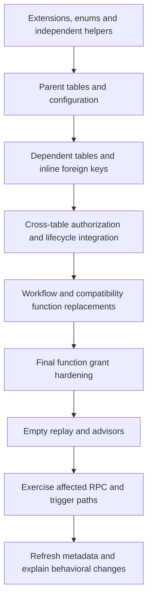

# Migration rules and change workflow

[Handbook](README.md) · [Ordered migration inventory](migrations.md)

## The repository's current migration model

[CLAUDE.md §12](../../CLAUDE.md#12-supabase-schema-conventions) declares a pre-production, source-edited schema. The directory is a buildable description of the current schema rather than an immutable upgrade history. Existing files are edited at their owning declaration. **This convention does not make rewriting history safe for a database that has already applied those files.** Before any hosted rollout, inspect the deployed migration history and actual schema and prepare an explicit upgrade/backfill plan.

A local reset destroys local database data. Use a disposable project when existing local state matters. A successful empty replay proves that the current files can build a database; it does not prove that an existing database can be upgraded without data loss.

## Required layout and SQL rules

| Rule | How to apply it |
| --- | --- |
| One table declaration per owning file | Name the file for the table. Keep its columns, constraints, indexes, independent triggers, RLS enablement and grants there. Do not duplicate declarations inside DO blocks. |
| Integration files declare zero tables | Use them for genuine cross-table dependencies; explain the dependency. Do not use them as accumulating column patches. |
| Central enum and extension declarations | Edit [shared_helpers](../../supabase/migrations/20260101000000_shared_helpers.sql). Add enum labels at source under the current model. |
| Column changes happen at source | Edit the declaring table file rather than appending a late ADD COLUMN patch. |
| Prefixes represent dependency order | Referenced objects must exist first. Renumber where needed, maintaining unique ordering. |
| Final grants hardening stays last | Keep [function_grants_hardening](../../supabase/migrations/20260906120000_function_grants_hardening.sql) after every function definition. Also revoke/grant explicitly at the definition site. |
| Demo fixtures stay outside migrations | Use opted-in seed files and guard account-specific subjects. Product-defining catalogue rows remain part of schema setup. |
| RLS enabled in each table's own file | A dependent policy can follow later, but the table must not await an integration file to enable RLS. |
| Explicit API roles in policies | Use authenticated, or anon plus authenticated only for genuinely public access. |
| Stable caller evaluation | Follow the project convention `(select auth.uid())` for row-independent caller identity checks. |
| UPDATE requires both old/new row checks | USING controls rows targeted; WITH CHECK constrains resulting rows. Column grants may additionally restrict writable fields. |
| Function privilege discipline | Fix search_path, revoke PUBLIC execution and review direct role grants. Grant only intended entry points. |
| Invoker-compatible views | Restate `security_invoker = on` on every definition/replacement intended to preserve caller RLS. |
| Index referencing FK columns | Check usable leading columns in existing composite indexes before creating duplicates. Inspect query indexes separately. |
| Avoid overlapping permissive policies | Follow the project's single policy per table/command/role convention. Combine equivalent branches deliberately. |
| No concurrent index creation in this replay path | The project runs migration files transactionally; plan live online indexing separately when deployment requires it. |

Supabase grants and RLS are two gates. A SELECT policy does not grant SELECT; a table grant does not authorize every row. Definer routines may run with privileges that bypass ordinary caller RLS, so their own actor/permission checks are part of the security boundary. RLS also does not turn administrative privileges such as TRUNCATE into row-filtered operations. The generated effective-grants matrix exposes the actual replay state, including inherited privileges; it is not an endorsement of every grant.

## Dependency order



A genuine dependency cycle can be resolved by installing its dependent FK/policy/trigger in a documented integration file. PL/pgSQL can defer relation checks until execution: placing a function early because CREATE FUNCTION succeeds is not proof of a valid runtime dependency. Later `CREATE OR REPLACE FUNCTION` statements also mean the first search hit may not be the effective implementation. Compare the final signature and definition in the snapshot.

## Recipe: add a table

1. Define ownership, lifecycle, public/private visibility and access paths before columns. Decide which identifiers are FKs and which are deliberately polymorphic.
2. Choose the correct domain and numeric position after its referenced tables/types. Create one canonically named migration.
3. Declare primary key, required fields, sensible defaults, FK actions, uniqueness and domain CHECK constraints. Use timestamptz for instants; do not confuse scheduled local display with stored timezone-aware time.
4. Add indexes supporting referencing FKs, policy predicates and actual pagination/filter paths. A foreign key does not automatically index the child columns.
5. Enable RLS, declare explicit policies and grant the intended table/column privileges. Test cross-user denial as well as owner success.
6. Add workflow functions/triggers only where needed. Privileged functions must validate the actor and referenced entity, constrain search_path and declare exact execution grants.
7. Add seed configuration only when it is part of the product contract. Put sample user rows in optional fixtures.
8. Update callers, typed models, tests and this handbook. Replay and test affected workflows.

## Recipe: change a column or enum

Search the column/type name across migrations, Edge Functions, Dart models, tests, seeds and docs. Inspect views, generated expressions, checks, indexes, JSON payloads and notification producers. Edit the canonical declaration and every dependent representation. For enum changes, edit the central declaration and client serialization together; a possible enum label does not automatically become a valid workflow transition.

For a populated deployment, separately determine how old rows are transformed, whether new constraints accept them, what old clients send, how rollback works and whether intermediate schema versions are compatible. Do not present a fresh replay as a substitute for that analysis.

## Recipe: add or change an RPC

Use a transaction-scoped database routine for a multi-row invariant where appropriate. Establish caller identity, validate permission against the requested entity, lock the shared state that concurrent callers can change, validate the current state and perform writes. State idempotency behavior explicitly: retries must not silently create duplicate domain events or notifications.

Identify functions by **name and argument types** in DROP/REVOKE/GRANT statements. Changing argument types creates an overload rather than replacing the old signature; stale callable overloads can preserve an insecure or obsolete path. Return-shape changes may require explicit replacement and caller changes. Check final grants after the last hardening migration. Test unauthenticated access, another user's access, legitimate access and relevant concurrent/retry paths.

## Recipe: add a notification type or icon

Extend the canonical category/type/icon configuration rather than placing SVG bytes on each notification row. Choose an existing semantic icon where possible, otherwise add a controlled SVG asset with the project's naming, licensing and validation conventions. Keep Storage metadata and seeded asset paths aligned. Set the type's category, display/icon/color contract and delivery policy explicitly. Add producer/audience logic and check preferences, entity mutes, coalescing/revisions, navigation targets and push behavior. Update [notification documentation](../notifications-design.md) and regenerate the catalogue reference.

## Validation before review

Use a new local project identifier and unused ports for disposable replay; do not run a reset against someone else's working database. Check `supabase start --help`, `supabase db reset --help` and `supabase stop --help` for the installed CLI before adapting commands.

The review should include:

- Clean migration replay and [repository advisors](../../supabase/snippets/advisors.sql), with any findings explained against the documented exceptions.
- `flutter test test/supabase/migration_layout_test.dart` for canonical layout.
- Affected RPC/trigger tests, including rejected access and integrity edge cases. Notification-specific SQL tests live in [notifications_test.sql](../../supabase/tests/notifications_test.sql).
- Compatibility checks for current clients, seeds, views, function overloads and Edge Functions.
- Updated documentation and `python3 scripts/database/generate_docs.py --check`.
- A separate in-place migration plan when a deployed/populated environment is involved.

Do not claim runtime correctness from CREATE success. Do not rerun unrelated tests without a reason; choose checks matching the changed behavior.

## Refreshing this handbook

The generator uses Python's standard library and Docker's psql access. It never resets or migrates a database itself. `--container` must point to an **empty disposable project just replayed from this checkout**, with fixtures disabled. Exporting another database can mislabel deployed state as source state and include changed catalogue values or function literals.

From the repository root:

```sh
# Replace this example with the verified disposable database container name.
python3 scripts/database/generate_docs.py --container supabase_db_matchday_schema_docs
python3 scripts/database/generate_docs.py --check
```

The first command exports [introspect.sql](../../scripts/database/introspect.sql) into the checked-in snapshot and generates the references. After changing only the renderer, regenerate without database access:

```sh
python3 scripts/database/generate_docs.py
python3 scripts/database/generate_docs.py --check
```

[generate_docs.py](../../scripts/database/generate_docs.py) owns the generated table pages, routines, catalogues, migration inventory, relationship diagrams and Mermaid files. Edit its domain/purpose mapping when adding or removing a table. Edit this guide, architecture, operations and README directly. Review the snapshot diff for unexpected objects, privilege changes or sensitive literals before sharing it. Stop only the disposable project when finished.
