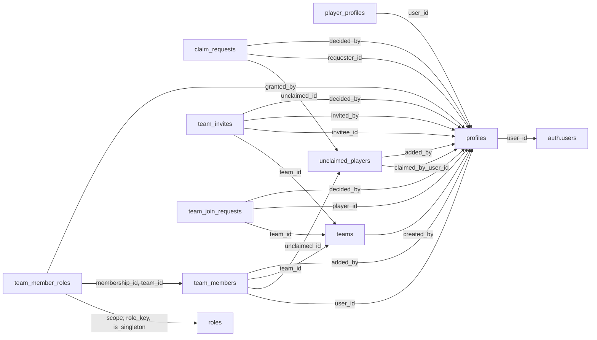
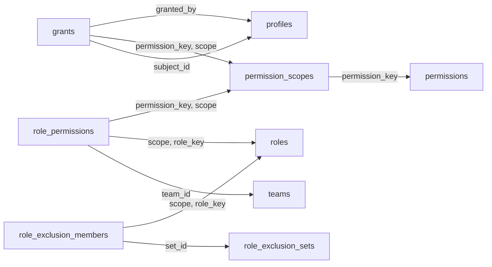
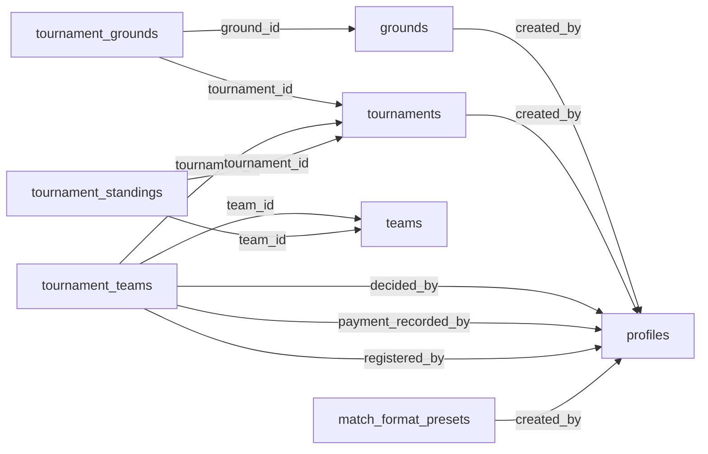
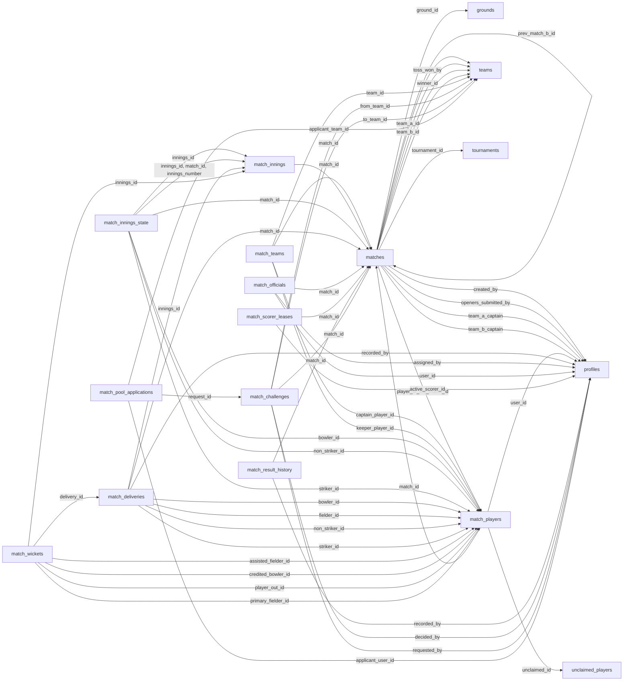
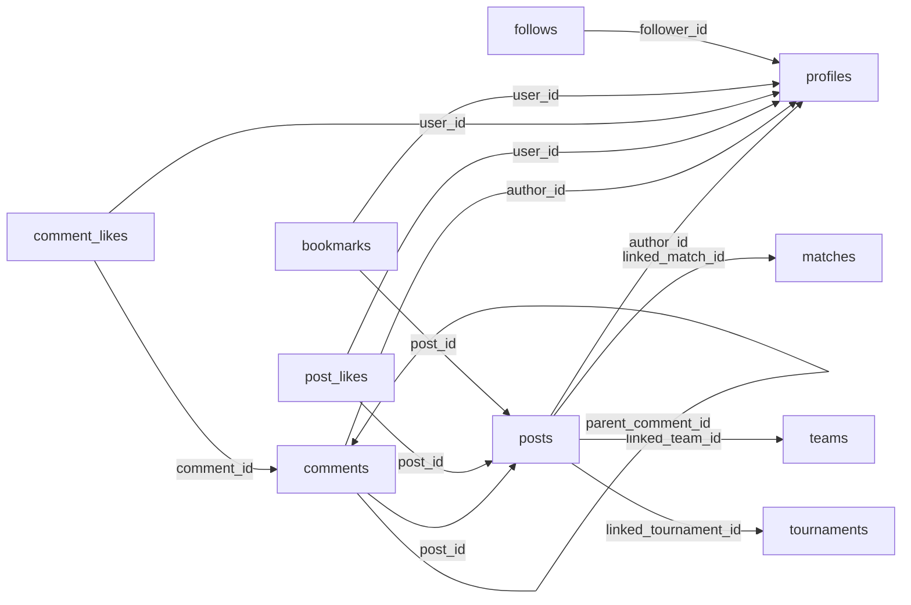
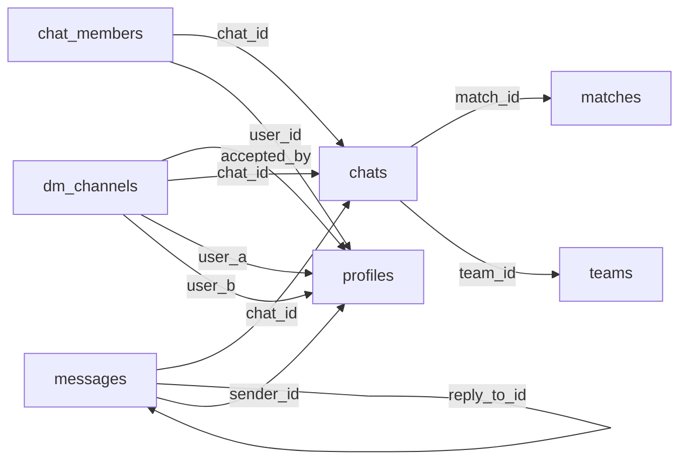
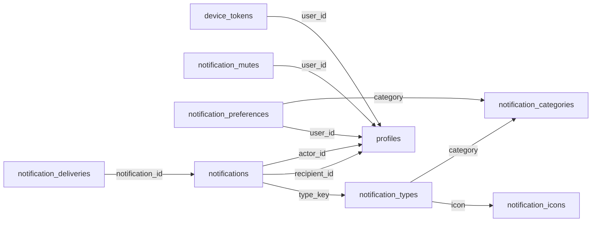

# Foreign-key relationship diagrams

> Generated from a disposable migration replay on 2026-09-13. PostgreSQL 17.6. This describes source, not hosted deployment. Regenerate with `scripts/database/generate_docs.py`.

[Handbook](README.md)

Each arrow is an actual foreign key in the replayed schema. Arrow direction is child → referenced parent. Labels identify child columns. These are dependency graphs, not claims that every parent has children or that every relationship is mandatory. Exact nullability, uniqueness, composite keys and ON DELETE actions are in the table reference. Dashed-looking logical relations are deliberately not invented for polymorphic UUIDs or UUID arrays. External/domain-crossing tables appear as reference nodes.

## Identity and teams

## Authorization catalogue

## Tournaments and venues

## Matches and scoring

## Posts and social activity

## Messaging

## Notifications

## Complete graph

[Editable Mermaid source for all foreign keys](diagrams/all-foreign-keys.mmd). Use the focused diagrams above for reading; the full graph is for impact tracing.

## Relationships without foreign keys

`follows(target_type,target_id)`, `notification_mutes(scope,entity_id)`, notification entity references, and scoped grant entity IDs need discriminator-aware reasoning. JSON payloads, arrays and Storage paths are not automatically checked by a foreign key. Their validation/cleanup depends on constraints, triggers and application code; inspect those paths when adding a new scope.
