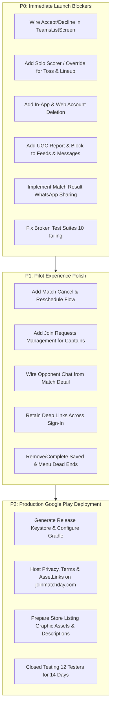

# Matchday App Launch Audit & Implementation Roadmap

> **Audit Date:** September 14, 2026  
> **Target Release:** Android-first local pilot → Google Play Closed Testing → Production  
> **Core Value Proposition:** *Run your cricket match, keep a dependable ball-by-ball scorecard, and share the verified result with your team.*

---

## 1. Executive Summary

A comprehensive source-code and architectural audit of the entire Matchday codebase was conducted across all 16 feature modules, navigation routers, database migrations, and Android platform configurations.

### Key Takeaway
The core cricket scoring engine, offline write queue (`ScoringSession`), and database models are exceptionally strong and architecturally clean. **However, several critical user journeys contain incomplete handlers (`onTap: () {}`), dead-end routes (`ComingSoonScreen`), rigid multi-device gates that deadlock on a single phone, missing match lifecycle actions (cancel/reschedule/share), and outdated test suites.**

Resolving these specific blockers will transition Matchday from a feature-rich codebase to a robust, launch-ready application.

---

## 2. Status Dashboard & Test Suite Health

| Check | Result | Details |
|---|---|---|
| `flutter analyze --no-pub lib` | **0 errors / 0 warnings** | Application source code passes all lint checks cleanly. |
| `flutter analyze --no-pub test` | **61 issues (18 errors, 33 warnings, 10 info)** | Located exclusively in `test/`, caused by out-of-sync mocks. |
| `flutter test --no-pub` | **652 passing / 10 failing** | 3 tests fail compilation due to retired repository methods; 7 are tournament UI finder tests. |
| Android Release Signing | **In progress** | `build.gradle.kts` now references `key.properties` but needs release keystore generation & Play Console setup. |
| Store Compliance (UGC & Deletion) | **Code prepared, uncommitted** | `lib/features/safety/`, `lib/features/settings/`, and web legal pages exist in working tree. |

---

## 3. Comprehensive Flow-by-Flow Audit: Missing, Broken & Incomplete Parts

---

### Flow 1: Team Invitations & Join Requests

#### Critical Defect: Empty Accept/Decline Button Handlers in Teams List
* **File:** [`lib/features/teams/presentation/screens/teams_list_screen.dart:430-470`](file:///Users/redapple/Developer/personal/matchday/lib/features/teams/presentation/screens/teams_list_screen.dart#L430-L470)
* **What’s Broken:** The invite cards rendered in the "My Teams" view contain direct **Accept** and **Decline** buttons with completely empty tap callbacks:
  ```dart
  InkWell(
    onTap: () {}, // EMPTY! Does nothing when tapped
    child: Text('Accept'),
  )
  ```
* **Impact:** A player who receives a team invitation and opens their teams list cannot accept or decline it from this screen.
* **Resolution:** Wire these buttons to call `teamsRepositoryProvider.acceptTeamInvite(inviteId)` and `declineTeamInvite(inviteId)`, matching the implementation in `tp_invite_banner.dart`.

#### Missing Flow: Captain UI for Player Join Requests
* **Files:**
  * [`lib/features/teams/data/datasources/teams_remote_datasource.dart:651-680`](file:///Users/redapple/Developer/personal/matchday/lib/features/teams/data/datasources/teams_remote_datasource.dart#L651-L680)
  * [`lib/features/teams/presentation/screens/team_manage_screen.dart`](file:///Users/redapple/Developer/personal/matchday/lib/features/teams/presentation/screens/team_manage_screen.dart)
* **What’s Broken:** The backend RPCs `accept_team_join_request` and `decline_team_join_request` exist, and notification triggers emit `team.join.requested` pointing to `/teams/:teamId/manage`. However, `team_manage_screen.dart` has **no UI tab or list to view pending join requests**.
* **Impact:** When an interested player clicks "Request to join" from search/explore, the team captain receives a notification but has nowhere to accept or decline the request in the management console.
* **Resolution:** Add a "Join Requests" section or badge within `team_manage_screen.dart` (or inside the Roster tab) displaying pending applicants with one-tap Accept/Decline actions.

#### Dead Navigation: "Invites & requests" in Menu
* **File:** [`lib/features/shell/presentation/screens/menu_screen.dart:88-94`](file:///Users/redapple/Developer/personal/matchday/lib/features/shell/presentation/screens/menu_screen.dart#L88-L94)
* **What’s Broken:**
  ```dart
  // TODO(menu): no screen behind this row yet
  _MenuRow(
    icon: _MenuGlyphs.invites,
    label: 'Invites & requests',
  ),
  ```
* **Impact:** Tapping this row in the hamburger/profile menu produces no action.
* **Resolution:** Route this row to `/my/teams` (which shows incoming team invites), or hide the row until a dedicated unified invites screen is created.

#### Inconsistent Domain & Missing Route: Unclaimed Player Claim Link
* **File:** [`lib/features/teams/presentation/widgets/team_manage/roster_tab.dart:398`](file:///Users/redapple/Developer/personal/matchday/lib/features/teams/presentation/widgets/team_manage/roster_tab.dart#L398)
* **What’s Broken:** When a captain copies the claim link for an unclaimed squad member, the copied URL is:
  ```dart
  text: 'https://matchday.app/teams/${team.id.value}/claim'
  ```
  1. The app domain everywhere else is `joinmatchday.com`, not `matchday.app`.
  2. The router (`app_router.dart`) has **no route** matching `/teams/:teamId/claim`.
* **Impact:** Anyone receiving this link lands on an invalid webpage or unhandled route.
* **Resolution:** Align the URL with `https://joinmatchday.com/t/${team.id.value}/claim` (or `/t/${team.id.value}`) and either implement an identity-claim onboarding landing or replace the button with a simple team invite share.

---

### Flow 2: Match Lifecycle, Cancellation & Rescheduling

#### Critical Gap: Inability to Reschedule, Cancel, or Message Opponent
* **File:** [`lib/features/matches/presentation/screens/match_detail_screen.dart:68-76`](file:///Users/redapple/Developer/personal/matchday/lib/features/matches/presentation/screens/match_detail_screen.dart#L68-L76)
* **What’s Broken:** Four primary match-management actions are stubs showing snackbars:
  ```dart
  case 'message':
    _comingSoon(context, 'Messaging the opponent is coming soon.');
  case 'reschedule':
    _comingSoon(context, 'Rescheduling is coming soon.');
  case 'cancel':
    _comingSoon(context, 'Cancelling a match is coming soon.');
  case 'share':
    _comingSoon(context, 'Sharing match results is coming soon.');
  ```
* **Impact:**
  1. **Cannot Cancel or Reschedule:** In local cricket, rain, ground availability, or player delays require rescheduling or cancelling. Currently, once a match is scheduled, neither captain can reschedule or cancel it. The fixture is permanently stuck in `scheduled`.
  2. **Cannot Message Opponent:** Captains cannot coordinate logistics via direct chat from the match fixture, even though `getOrCreateDmChat` already exists in `MessagesRepository`.
  3. **Cannot Share Match Details:** Fixture sharing is a coming-soon snackbar.
* **Resolution:**
  1. Add a bilateral match cancel/reschedule backend RPC and wire dialogs in `match_detail_screen.dart`.
  2. Wire the `message` action to call `ref.read(messagesRepositoryProvider).getOrCreateDmChat(opponentCaptainUserId)` and push `/messages/$chatId`.
  3. Wire the `share` action to `share_plus` with a formatted match card summary and link.

---

### Flow 3: Match Start, Toss & Lineup (The "Single-Phone" Deadlock)

#### Critical Real-World Blocker: Rigid Two-Phone Toss & Lineup Gating
* **Files:**
  * [`lib/features/matches/presentation/state/match_start_state.dart:128-137`](file:///Users/redapple/Developer/personal/matchday/lib/features/matches/presentation/state/match_start_state.dart#L128-L137)
  * [`lib/features/matches/presentation/widgets/match_start/stage_toss.dart:46-62`](file:///Users/redapple/Developer/personal/matchday/lib/features/matches/presentation/widgets/match_start/stage_toss.dart#L46-L62)
  * [`lib/features/matches/presentation/screens/innings_break_screen.dart:87-100`](file:///Users/redapple/Developer/personal/matchday/lib/features/matches/presentation/screens/innings_break_screen.dart#L87-L100)
* **What’s Broken:**
  1. **Toss Decision Lock:** When the creator records that Team B won the toss, the creator's screen displays:
     > *"WAITING ON THE TOSS WINNER. Their captain is choosing whether to bat or bowl."*
     If Team B's captain is not actively using the app at that moment, **the match cannot proceed**. The creator cannot record "They chose to bat" on their behalf.
  2. **Lineup Openers Lock:** Only `isViewerBattingCaptain` can pick the opening batters.
  3. **Innings Break Deadlock:** At the innings break, `InningsBreakScreen` checks:
     ```dart
     final canSetup = battingTeam != null &&
         currentUserId != null &&
         (myRoles[battingTeamId.value]?.hasMatchAuthority ?? false);
     ```
     If the user scoring the match is Captain A, when Innings 2 starts, Team B is batting. Captain A does **not** have authority over Team B, so Captain A's screen turns into a read-only waiting screen! **Nobody on the ground can start the 2nd innings unless Captain B logs in on another phone.**
* **Impact:** Completely breaks local match day operations where one designated scorer or captain scores the entire match for both teams on a single device.
* **Resolution:** Introduce a **"Solo Scorer / Single Device Mode"** or allow the match creator/designated scorer to record toss choices and innings setups for both sides if the opposing captain is offline.

---

### Flow 4: Match Completion, Scorecard & Result Sharing

#### Missing Feature: Result Sharing from Match End & Scorecard
* **Files:**
  * [`lib/features/matches/presentation/screens/result_screen.dart:56-65`](file:///Users/redapple/Developer/personal/matchday/lib/features/matches/presentation/screens/result_screen.dart#L56-L65)
  * [`lib/features/matches/presentation/screens/scorecard_screen.dart:45-60`](file:///Users/redapple/Developer/personal/matchday/lib/features/matches/presentation/screens/scorecard_screen.dart#L45-L60)
  * [`lib/features/matches/presentation/screens/completed_match_screen.dart:86-112`](file:///Users/redapple/Developer/personal/matchday/lib/features/matches/presentation/screens/completed_match_screen.dart#L86-L112)
* **What’s Broken:**
  1. In `ResultScreen`, the only options are "View scorecard" and "Done" (exits to `/matches`). There is **no share button**.
  2. In `ScorecardScreen`, there is an `Icons.close` button in the AppBar, but **no share icon**.
  3. In `CompletedMatchScreen`, line 110 renders:
     ```dart
     const _CircleButton(icon: Icons.add), // Inert! No onTap handler
     ```
  4. In `CompletedMatchScreen`, line 92 handles back navigation with:
     ```dart
     context.go('/my-matches'); // Broken route! Correct route is '/my/matches'
     ```
* **Impact:**
  * The primary virality loop (sharing a text scorecard to WhatsApp) is missing from the screens where matches conclude.
  * Tapping back from a cold-opened completed match navigates to an invalid route (`/my-matches`).
* **Resolution:**
  1. Add a primary **"Share Result"** button on `ResultScreen`, `ScorecardScreen`, and `CompletedMatchScreen` that formats an authentic cricket match summary and triggers the native Android share sheet via `share_plus`.
  2. Fix `context.go('/my-matches')` → `context.go('/my/matches')`.
  3. Change the inert `Icons.add` in `CompletedMatchScreen` to `Icons.share` and wire its action.

---

### Flow 5: Navigation, Deep Links & Auth Bounce

#### Critical Defect: Lost Deep Link Destination on Sign-In / Onboarding
* **File:** [`lib/router/app_router.dart:94-112`](file:///Users/redapple/Developer/personal/matchday/lib/router/app_router.dart#L94-L112)
* **What’s Broken:**
  ```dart
  if (!isSignedIn) return goingToSignIn ? null : '/sign-in';
  ...
  if (goingToSignIn || goingToOnboarding) return '/home';
  ```
* **Impact:** If an unauthenticated user opens an invite or match link (e.g., `https://joinmatchday.com/t/abc` or `/matches/xyz`), the router redirects them to `/sign-in`. Once they log in or finish onboarding, the redirect indiscriminately forces them to `/home`. **The user loses their original destination.**
* **Resolution:** Preserve the intended destination in a query parameter (e.g., `/sign-in?redirect=${Uri.encodeComponent(loc)}`) and redirect there after authentication.

#### Dead Ends: `ComingSoonScreen`
* **File:** [`lib/router/app_router.dart:401-404`](file:///Users/redapple/Developer/personal/matchday/lib/router/app_router.dart#L401-L404)
  * `/saved` → `const ComingSoonScreen(tab: 'Saved')`
* **File:** [`lib/features/shell/presentation/screens/menu_screen.dart:116-120`](file:///Users/redapple/Developer/personal/matchday/lib/features/shell/presentation/screens/menu_screen.dart#L116-L120)
  * `Help & Support` is marked `soon: true` (unclickable).
* **Resolution:**
  1. Either wire `/saved` to a simple saved-posts view (backend methods `getBookmarkedPosts()` already exist in `PostsRepository`) or remove the row from the menu.
  2. Wire `Help & Support` to open an email draft to `support@joinmatchday.com` or launch the support URL.

---

### Flow 6: Google Play Store Policy Compliance (Mandatory Launch Blockers)

#### 1. In-App and Web Account Deletion (Google Play Mandate)
* **Requirement:** Google Play requires that if an app allows account creation, it must provide both an **in-app account deletion path** and a **public web deletion URL**.
* **Status in Repo:**
  * In-app deletion UI has been implemented in `lib/features/settings/presentation/screens/settings_screen.dart` with `DELETE` keyword confirmation.
  * Supabase Edge function `delete-account/` and RPC `delete_user.sql` exist in working tree.
  * Web page `website/public/delete-account.html` exists.
* **Launch Action:** Deploy the Edge function, run migration `20260101000700_delete_user.sql`, host the static website at `joinmatchday.com`, and submit the URL in Google Play Console Data Safety.

#### 2. User-Generated Content (UGC) Moderation & Reporting
* **Requirement:** Google Play requires all social feeds, comments, and direct messaging to have:
  1. In-app user reporting for inappropriate content.
  2. In-app user blocking that hides content and prevents messaging.
  3. A defined moderation operational workflow.
* **Status in Repo:**
  * `lib/features/safety/` contains `SafetyMenu` with Report & Block dialogs.
  * SQL migrations `20260101000130_user_blocks.sql` and `20260101000850_content_reports.sql` exist in the working directory.
* **Launch Action:** Verify that blocked users are filtered in database views and realtime subscriptions, and deploy the safety migrations to production Supabase.

#### 3. Android App Links Verification
* **File:** [`android/app/src/main/AndroidManifest.xml:49-61`](file:///Users/redapple/Developer/personal/matchday/android/app/src/main/AndroidManifest.xml#L49-L61)
* **What’s Missing:**
  * Current manifest only declares path prefixes `/u/` and `/t/`.
  * Matches (`/matches/`, `/m/`) and competitions (`/c/`, `/tournaments/`) are **not** declared.
  * Domain `joinmatchday.com` must host `/.well-known/assetlinks.json` containing the release certificate SHA-256 fingerprint, otherwise deep links open in the browser instead of the app.

---

### Flow 7: Test Suite & Analysis Fixes

#### Outdated Scoring Test Files
* **Files:**
  1. `test/features/matches/data/repositories/record_ball_validation_test.dart`
  2. `test/features/matches/data/repositories/scoring_write_failure_taxonomy_test.dart`
  3. `test/features/matches/presentation/controllers/scoring_controller_test.dart`
* **Cause:** These files reference removed methods (`MatchesRepository.recordBall`, `undoLastBall`, `syncPendingOps`, `pendingOpsCount`).
* **Resolution:** Update these test suites to test against the modern `ScoringSession` or refactored `ScoringController`.

#### Tournament Widget Tests
* **Files:**
  * `test/features/tournaments/presentation/screens/team_registration_sheet_test.dart`
  * `test/features/tournaments/presentation/screens/tournament_detail_screen_test.dart`
* **Cause:** Minor string finder mismatches and scroll view height constraints in widget tests.
* **Resolution:** Update finders to match updated screen copy.

---

## 4. Priority Launch Action Plan



---

## 5. Detailed Task Breakdown & Implementation Matrix

| ID | Priority | Feature Area | Description | Target Files |
|---|---|---|---|---|
| **TASK-01** | **P0** | Teams | Wire Accept & Decline callbacks on team invite cards. | `lib/features/teams/presentation/screens/teams_list_screen.dart` |
| **TASK-02** | **P0** | Matches | Allow single-device scoring: creator can record toss decision & openers on behalf of opponent if offline. | `lib/features/matches/presentation/state/match_start_state.dart`<br>`lib/features/matches/presentation/controllers/match_start_controller.dart`<br>`lib/features/matches/presentation/screens/innings_break_screen.dart` |
| **TASK-03** | **P0** | Matches | Implement result sharing via `share_plus` on ResultScreen, ScorecardScreen, CompletedMatchScreen. | `lib/features/matches/presentation/screens/result_screen.dart`<br>`lib/features/matches/presentation/screens/scorecard_screen.dart`<br>`lib/features/matches/presentation/screens/completed_match_screen.dart` |
| **TASK-04** | **P0** | Navigation | Fix broken `/my-matches` back-route fallback in `completed_match_screen.dart` to `/my/matches`. | `lib/features/matches/presentation/screens/completed_match_screen.dart` |
| **TASK-05** | **P0** | Safety / Store | Commit & verify UGC reporting and user blocking across posts, comments, chat, profile. | `lib/features/safety/`<br>`supabase/migrations/20260101000130_user_blocks.sql`<br>`supabase/migrations/20260101000850_content_reports.sql` |
| **TASK-06** | **P0** | Settings / Store | Commit & deploy account deletion RPC, edge function, in-app flow, and web URL. | `lib/features/settings/`<br>`supabase/functions/delete-account/`<br>`website/public/delete-account.html` |
| **TASK-07** | **P0** | Quality | Fix the 3 scoring test compilation failures and 7 tournament widget test assertions. | `test/features/matches/`<br>`test/features/tournaments/` |
| **TASK-08** | **P1** | Teams | Provide team captains a UI tab/list to review, accept, or decline player join requests. | `lib/features/teams/presentation/screens/team_manage_screen.dart`<br>`lib/features/teams/presentation/widgets/team_manage/roster_tab.dart` |
| **TASK-09** | **P1** | Matches | Implement bilateral match cancellation and rescheduling RPC + UI sheet. | `supabase/migrations/`<br>`lib/features/matches/presentation/screens/match_detail_screen.dart` |
| **TASK-10** | **P1** | Messages | Wire the "Message Opponent" button in Match Detail to open a DM chat with the opponent captain. | `lib/features/matches/presentation/screens/match_detail_screen.dart` |
| **TASK-11** | **P1** | Router | Preserve deep-link URL on unauthenticated landing so user returns to target after sign-in. | `lib/router/app_router.dart` |
| **TASK-12** | **P1** | Shell / Menu | Route or hide dead-end "Invites & requests", "Help & Support", and "Saved" in menu. | `lib/features/shell/presentation/screens/menu_screen.dart`<br>`lib/router/app_router.dart` |
| **TASK-13** | **P2** | Android | Configure release signing keystore, Play App Signing, and add match/competition App Links. | `android/app/build.gradle.kts`<br>`android/app/src/main/AndroidManifest.xml` |
| **TASK-14** | **P2** | Hosting | Deploy `website/public/` to `joinmatchday.com` with `.well-known/assetlinks.json`. | `website/` |
