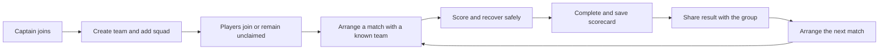

# Phase-one launch review

Reviewed against the working checkout on 2026-09-13. Audience confirmed by the founder: captains and players from a few local teams. Platform confirmed: Android first.

## Recommendation

Launch a small, supported local-team pilot around one promise: **run your next cricket match, keep a reliable scorecard, and share the result with your team.** Recruit teams that already play each other. Their existing fixtures provide a reason to use Matchday immediately, before a discovery marketplace or social feed has enough activity to sustain itself.

Phase one should prove repeat use by captains and scorers. It should not depend on tournament operations, a busy public feed, every player registering before play, or people abandoning their existing WhatsApp groups. Use WhatsApp sharing as an adoption channel. These are product recommendations, not measured findings about the market.

Do not set a public launch date from the number of completed screens. Set it when the selected journeys pass on the release build and the pilot teams can complete matches without developer intervention.

## Review scope and confidence

Reviewed feature structure, routes, screen actions, repository interfaces and selected implementations across all feature areas; platform configuration; existing database documentation/replay findings; and current official store requirements. Ran the whole Flutter test suite and static analysis. Older APP_OVERVIEW/APP_TECHNICAL content is not a reliable current completion checklist: the June overview incorrectly describes several now-implemented features as missing and describes an older scoring architecture.

This is a source-based product and release-scope review. It is not an exhaustive line-by-line security audit or a physical-device usability certification. No production deployment, real-device push delivery, external link association, live-match field test or store-console configuration was verified during this review. No application behavior was changed.

### Checks performed

- `flutter test --no-pub`: **651 passing, 10 failing results**. Three test files fail to compile because they reference removed scoring repository methods. The other seven failures are tournament widget tests with missing text/widget finders or scrolling assumptions. These need reconciliation with current behavior; they are not ten independently confirmed production defects.
- `flutter analyze --no-pub lib test`: **61 findings, all in test/**: 18 errors, 33 warnings, 10 informational findings. No lib/ findings in this run.
- An initial unrestricted analysis reported 109 issues, including copied dependency examples/tests under build/. Use the source-scoped result to avoid mislabeling build artifacts as application defects.
- 85 files are present under test/. No integration_test directory was found. Unit/widget test coverage exists, but there is no checked-in end-to-end suite in that conventional location.
- The preceding database documentation review successfully replayed 84 migration files and checked advisors. This does not establish hosted deployment parity or runtime correctness.

## Entire-app scope assessment

“Implemented” below means current code paths exist, not that the feature has passed release acceptance.

| Area | Evidence and remaining concern | Phase-one decision |
| --- | --- | --- |
| Authentication | Email OTP and native Google flows exist. Delivery, resend, session recovery and release-signing OAuth need device checks. | Keep both if verified on Android; one reliable path is mandatory. |
| Onboarding | Current wizard is identity, username, welcome; older location/player-heavy descriptions are stale. | Keep short. Send new users toward joining/creating a team or their invitation. |
| Profile | Editing, profile sharing, follow and message actions are implemented. Career-stat presentation should not be promised solely because player data exists. | Keep identity and team affiliations; defer advanced personal analytics. |
| Teams | Create/manage, roles, registered/unclaimed players and join-request workflows exist. Recipient invitation completion is unfinished. | Core. Finish invite/join discovery and acceptance; keep optional metadata optional. |
| Identity claims | Manager-side claim-related UI exists, but the copied claim URL has a different domain and no corresponding router claim path. | Fix an approved claim path or hide the claim promise for the pilot; never merge identities manually without verification. |
| Match challenges | Send/detail/counter screens and backend workflows exist; no need to build negotiation from scratch. | Keep one easy way to arrange a match between known teams; prove both captains' paths. |
| Open match pool | Browse/apply/request screens and tests exist. It depends on local supply and demand. | Secondary or hidden initially; existing captain contacts should be enough to start a match. |
| Match setup | Fixture/start/lineup/toss screens exist. Match detail has unfinished reschedule/cancel actions. | Core. Include a practical cancellation and schedule-change path with correct authority and notification behavior. |
| Scoring | Dart engine, local session persistence, synchronization, innings break, result and completed screens exist. Some tests still target the previous API. | Highest reliability priority. Validate one agreed limited-overs format end to end before expanding the supported-format promise. |
| Spectator experience | Scorecard and matches screens exist. The router gates all routes behind sign-in. | Keep signed-in viewing; add easy result sharing. Guest/web live viewing is a valuable next increment, not required to start a captain pilot. |
| Tournaments | Substantial wizard, registration, console, draw, live operations, fees and wrap-up implementation exists. Seven current widget failures and some inert organizer-contact actions remain. | Defer public exposure. Preserve code for a later organizer-led pilot. |
| Posts/social | Likes, comments, bookmarks and feed filtering have real code; older overview says otherwise. Saved destination is still a placeholder. No complete report/block workflow was found. | Supporting feature only. If exposed, finish moderation controls; defer new feed features. Hide or complete Saved. |
| Follows/explore | User follow actions and grouped discovery exist. | Keep simple search for known teams/people. Defer sophisticated discovery and recommendations. |
| Messages | Inbox, threads, text/image operations, read state and profile message entry exist. Match/opponent and some tournament-context contact buttons are unfinished. | Optional support layer. Keep only if blocking/reporting and delivery checks are complete; do not make chat a prerequisite for arranging a match. |
| Notifications | Inbox, icon catalogue, settings sheet and queued delivery are implemented locally. General Settings being missing does not mean notification preferences are missing. | Keep actionable team/match notifications and user controls; verify deployed worker and physical-device delivery. |
| Location | Search/picker and venue-related code exist. A team-search settings action is marked inert. | Keep venue text/manual fallback; location permission denial must not block team or match setup. |
| Navigation/account/support | Settings and Saved route to ComingSoonScreen; Invites & requests has no destination; Help & Support is marked Soon. | Remove dead ends. Basic Settings, deletion, policy links and reachable support belong in release scope. |
| Release/operations | Android release uses debug signing in the checked-in Gradle config. No crash-reporting SDK/integration found in the reviewed dependency/bootstrap paths. | Configure real release signing, operational monitoring, deployment verification and support ownership. |

## Concrete gaps to fix first

| Priority | Finding and evidence | Required outcome |
| --- | --- | --- |
| P0 | [General Settings and Saved](../../lib/router/app_router.dart) currently open ComingSoonScreen. [Menu](../../lib/features/shell/presentation/screens/menu_screen.dart) exposes unavailable invitations/support. | Working account/settings/support paths; hide optional unavailable destinations. |
| P0 | [Team invite cards](../../lib/features/teams/presentation/screens/teams_list_screen.dart) contain empty Accept/Decline handlers; no client call to accept_team_invite was found although the [RPC exists](../../supabase/migrations/20260101000240_team_invites.sql). | A real recipient can discover, accept or decline an invitation and see correct membership/role/chat results. Do not treat the rendered card as completed functionality. |
| P0 | [Scoring validation tests](../../test/features/matches/data/repositories/record_ball_validation_test.dart), [failure tests](../../test/features/matches/data/repositories/scoring_write_failure_taxonomy_test.dart) and [controller tests](../../test/features/matches/presentation/controllers/scoring_controller_test.dart) reference removed APIs. | Port meaningful assertions to the current session/write boundary and obtain a clean test result. Do not delete coverage simply to make the suite green. |
| P0 | [Match detail](../../lib/features/matches/presentation/screens/match_detail_screen.dart) routes rescheduling, cancellation, opponent messaging and result sharing to coming-soon notices. | Finish schedule/cancel and a basic sharing path; wire optional contact or remove its affordance. |
| P0 for public distribution | No complete user/content reporting or user-blocking flow found in client/schema review; account deletion has no reviewed client entry point. | Finish user controls plus the operational ability to act on reports and deletion requests. |
| P0 for Play release | [Android Gradle](../../android/app/build.gradle.kts) signs release with the debug configuration. | Release signing, correct Google OAuth certificate configuration, upgrade/install tests and a reproducible release artifact. |
| P1 | [Roster claim link](../../lib/features/teams/presentation/widgets/team_manage/roster_tab.dart) copies `matchday.app/teams/.../claim`; configured links use joinmatchday.com and the router has no claim destination. | One coherent tested domain/route contract, or remove the unsupported claim action from phase one. |
| P1 | [Router](../../lib/router/app_router.dart) redirects unauthenticated deep links to sign-in, then home after onboarding; it does not retain the original destination in this redirect. | Restore invitation/match intent after authentication. Test new install, logged-out, logged-in and expired-session cases. |
| P1 | [Completed match header](../../lib/features/matches/presentation/screens/completed_match_screen.dart) has an inert action and a `/my-matches` fallback inconsistent with `/my/matches`. | Real result-share action and reliable navigation from a cold/deep-linked screen. |
| P1 | Release telemetry and hosted configuration were not demonstrated by this review. | Observe fatal errors, failed scoring synchronization, OTP issues and queue failures; identify who responds. |

## Minimum useful phase one

A captain must be able to put an unregistered player in the squad. Otherwise recruiting 20-plus users becomes a prerequisite to demonstrating value. An invited registered player must have a complete join path. Supported sharing can begin with a useful score summary/image through the Android share sheet; a public web scorecard can follow after the pilot if necessary.

Start with the overs, ball type and team size those first teams actually play. Support normal real-world exceptions for that format: extras, wickets, innings change, undo, interruptions, ties/no-result and safe recovery. Do not describe unusual formats or rain formulas as supported merely because enum values or a screen exist.

For the first-use screen, give clear actions such as Join your team, Create a team and Open your match. The current default Home feed may be empty for a new local cohort. This is an onboarding/navigation improvement, not a request to redesign every screen. Put My Team and My Matches within easy reach; hide unused tournament and marketplace entry points for the pilot.

## Public Android release essentials

Account creation brings account deletion obligations. Google requires an in-app path and an external web resource for requesting deletion. Implement the associated data handling and document any permitted retention; an inert settings row is insufficient. [Google Play account deletion requirements](https://support.google.com/googleplay/android-developer/answer/13327111?hl=en).

Public posts and user interaction require appropriate moderation, reporting and blocking. Google explicitly requires report-user/content and block-user functionality for publicly accessible UGC, with moderation operations behind it. Keeping the social/chat surfaces visible makes these relevant release work even if they are not the main product pitch. [Google Play UGC policy](https://support.google.com/googleplay/android-developer/answer/9876937?hl=en-GB).

Prepare working privacy/terms/support links, accurate store declarations for actual collected data/SDKs, a support contact and a process for reports. Verify production Auth/email, deployed migrations/RPCs, Edge versions/secrets, Storage assets, Realtime, push worker and Android notification permission behavior. The source-edited migration convention in this repository requires a separate deployment reconciliation step for an existing hosted database; never assume edited historical migrations automatically apply there.

Android-first means iOS signing/APNs/App Store work need not block this pilot. Revisit those as a separate release; the current iOS entitlements file does not contain aps-environment. This observation is about the checkout, not the Apple developer account.

## Acceptance scenarios before inviting the first teams

Use a signed release candidate on physical Android phones, including a lower-end device and weak connectivity. Record expected/actual outcomes and build/backend versions.

1. New captain signs in, completes onboarding, creates a team and adds unclaimed players without forced optional data.
2. Another account receives and accepts an invitation; a third declines. Double taps/retries do not create duplicate memberships. A removed member loses protected access.
3. Two captains arrange a match, choose venue/time and lineups, complete the toss and start under correct permissions.
4. A scorer completes both innings of the chosen format, including wides, no-balls, wickets and undo; result and scorecard agree.
5. Kill/reopen while scoring, lose/recover network, expire a session and attempt competing scorer access. Confirm no lost/duplicated acknowledged delivery, visible unsynced state and an actionable recovery path.
6. A second device follows the score, backgrounds and resumes; it recovers the current state. Complete the match and reopen its result from another account.
7. Reschedule/cancel with authorization; all affected screens and notifications agree. Do not leave a fixture appearing playable after cancellation.
8. Share a result and follow invitation/notification links across login and cold start. Verify expired/deleted destinations produce a useful explanation.
9. Deny notification/location/photo permissions; retain usable alternatives. Test push foreground/background/terminated, mute settings and sign-out on a shared device.
10. Report/block where social or messaging is enabled; prove restrictions are enforced by the backend. Delete an account through the real path and verify ownership/historical-data rules.
11. Exercise empty/error/loading states with no demo content and slow uploads. Install an update over the previous release candidate without losing local scoring work.

These are proposed release gates, not results already achieved by this source review.

## Rollout and measures

Begin with roughly **4–6 connected teams**, one dependable scorer per team and a small number of genuine fixtures. This is a suggested pilot size, not a forecast. Agree on the supported format and provide a short scorer walkthrough. Be available during the first fixtures and log every place somebody needs help.

Use a simple pilot sheet before building an analytics dashboard:

| Measure | Why it matters |
| --- | --- |
| Teams reaching their first completed match | Captures actual activation beyond downloads/accounts |
| Invite recipients who successfully join | Tests recruitment friction |
| Setup time and number of support interventions | Shows whether a captain can operate independently |
| Lost/duplicated delivery or unrecoverable session incidents | Trust in the core product; any such incident needs resolution before expansion |
| Completed matches with consistent result/scorecard | Confirms the promised output |
| Teams returning for a second match | Best early signal of recurring value |
| Shared results opened or acknowledged by teammates | Tests the adoption loop; manual confirmation is acceptable initially |

A reasonable expansion gate is ten real completed matches across several teams, no unresolved score-loss incidents, working account/report/support flows, and repeat use by at least three teams without setup assistance. These are suggested decision thresholds, not statistically validated benchmarks. If teams do not return, interview captains before adding tournaments or more feed features.

## What comes after phase one

Choose the next increment from actual pilot friction: richer player history, guest/live web viewing, stronger result sharing, open opponent discovery or better team communications. Run a separate organizer pilot before exposing the full tournament lifecycle. Fees/ledger expansion, advanced permissions UI, awards, complex formats and a broad social-growth push can wait.

The next product decision to discuss is the first teams' actual match format and whether they can provide one scorer each. That determines the smallest reliable scoring contract and the first acceptance fixtures. No implementation or feature hiding has been performed by this review.
