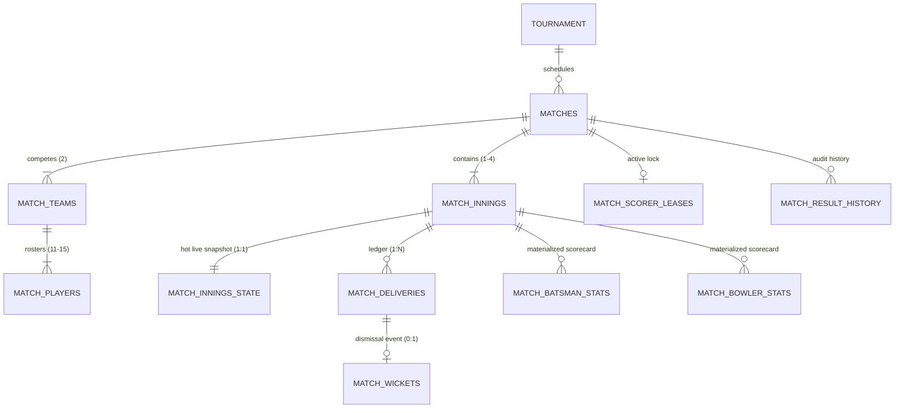
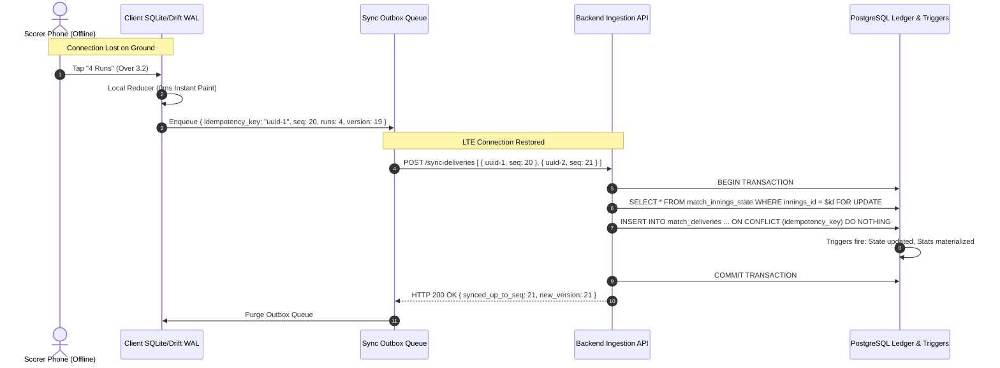

> **Historical design document.** Parts of this specification describe removed SQL scoring reducers and statistics tables. For the current implemented schema, migration rules and diagrams, start with the [database handbook](database/README.md). Do not use SQL examples here as the current migration contract.

# matchday — Scalable & Robust Matches Schema Architecture

> **Document Status:** Complete Architecture Specification  
> **Target Engine:** PostgreSQL 15+ / Supabase  
> **Scope:** Fixtures, Rosters, Ball-by-Ball Ledger, Live Scoring State Machine, Realtime Broadcast, Triggers, and Edge-Case Invariants.

---

## Table of Contents

1. [Executive Summary & Architectural Pillars](#1-executive-summary--architectural-pillars)
2. [Domain Entity Model & High-Level ERD](#2-domain-entity-model--high-level-erd)
3. [Production-Grade Schema Definition (DDL)](#3-production-grade-schema-definition-ddl)
   - [3.1 Domain Types & Enums](#31-domain-types--enums)
   - [3.2 Fixtures & Match Metadata (`matches`, `match_teams`)](#32-fixtures--match-metadata-matches-match_teams)
   - [3.3 Polymorphic Lineup Boundary (`match_players`)](#33-polymorphic-lineup-boundary-match_players)
   - [3.4 Innings & Hot Live State (`match_innings`, `match_innings_state`)](#34-innings--hot-live-state-match_innings-match_innings_state)
   - [3.5 Immutable Ball Delivery Ledger (`match_deliveries`)](#35-immutable-ball-delivery-ledger-match_deliveries)
   - [3.6 Rich Dismissals Ledger (`match_wickets`)](#36-rich-dismissals-ledger-match_wickets)
   - [3.7 Materialized Player Scorecards (`match_batsman_stats`, `match_bowler_stats`)](#37-materialized-player-scorecards-match_batsman_stats-match_bowler_stats)
   - [3.8 Scorer Concurrency & Leases (`match_scorer_leases`)](#38-scorer-concurrency--leases-match_scorer_leases)
   - [3.9 Match Outcome & Audit History (`match_result_history`)](#39-match-outcome--audit-history-match_result_history)
4. [PostgreSQL Triggers & Stored Procedures (PL/pgSQL)](#4-postgresql-triggers--stored-procedures-plpgsql)
   - [4.1 Trigger: Hot State Delivery Reducer (`trg_process_delivery`)](#41-trigger-hot-state-delivery-reducer-trg_process_delivery)
   - [4.2 Trigger: Wicket Processor & Fall of Wicket (`trg_process_wicket`)](#42-trigger-wicket-processor--fall-of-wicket-trg_process_wicket)
   - [4.3 Trigger: Compensating Undo Delivery (`trg_undo_delivery`)](#43-trigger-compensating-undo-delivery-trg_undo_delivery)
   - [4.4 Trigger: Innings & Match Termination Evaluator (`trg_evaluate_match_lifecycle`)](#44-trigger-innings--match-termination-evaluator-trg_evaluate_match_lifecycle)
   - [4.5 Trigger: Realtime Event Publisher (`trg_broadcast_match_event`)](#45-trigger-realtime-event-publisher-trg_broadcast_match_event)
   - [4.6 Trigger: Immutability Guard for Completed Matches (`trg_guard_completed_match`)](#46-trigger-immutability-guard-for-completed-matches-trg_guard_completed_match)
5. [Exhaustive Edge Cases & Invariant Rules Matrix](#5-exhaustive-edge-cases--invariant-rules-matrix)
   - [5.1 Cricket Laws Edge Cases (MCC Laws 1–42)](#51-cricket-laws-edge-cases-mcc-laws-142)
   - [5.2 Distributed & System Edge Cases](#52-distributed--system-edge-cases)
6. [Offline Write-Ahead Log (WAL) & Synchronization Flow](#6-offline-write-ahead-log-wal--synchronization-flow)
7. [Indexing, Partitioning & Read-Write Scaling](#7-indexing-partitioning--read-write-scaling)

---

## 1. Executive Summary & Architectural Pillars

The match domain in cricket is deceptively complex: it features high write intensity (bursty, millisecond-critical scoring during live games), massive read fan-out (thousands of spectators watching live scoreboards), complex game logic (extras, free hits, strike rotation, over completions, declarations, super overs), and challenging network conditions (village grounds with zero connectivity).

```
┌──────────────────────────────────────────────────────────────────────────────────────────────────┐
│                                       ARCHITECTURAL PILLARS                                      │
├──────────────────────────────┬───────────────────────────────┬───────────────────────────────────┤
│ 1. Event Sourcing + CQRS     │ 2. Row Lock Isolation         │ 3. Actor Polymorphism             │
│ Every delivery is an         │ Read-heavy match metadata is  │ Resolves real users vs. guest     │
│ immutable event in a ledger. │ physically isolated from the  │ players at the lineup boundary    │
│ Scorecards are materialized  │ single hot `innings_state`    │ once; clean UUIDs everywhere else │
│ in O(1) synchronous views.   │ row. Zero spectator locking.  │ without breaking foreign keys.    │
├──────────────────────────────┼───────────────────────────────┼───────────────────────────────────┤
│ 4. Single-Scorer Lease + WAL │ 5. Compensating Undo History  │ 6. Format-Agnostic Engine         │
│ Optimistic locking version   │ Scorers make mistakes. Undo   │ JSONB rule contracts support      │
│ guards + short-lived leases  │ preserves audit trails with   │ T20, 50-over, Test (4-innings),   │
│ prevent split-brain scoring. │ compensating entries.         │ The Hundred, and Pairs cricket.   │
└──────────────────────────────┴───────────────────────────────┴───────────────────────────────────┘
```

---

## 2. Domain Entity Model & High-Level ERD



---

## 3. Production-Grade Schema Definition (DDL)

### 3.1 Domain Types & Enums

```sql
-- Match & Format Enums
create type match_format as enum (
  't20', 
  'odi', 
  'test', 
  'the_hundred', 
  'custom_limited', 
  'pairs'
);

create type match_type as enum (
  'friendly', 
  'tournament', 
  'practice', 
  'league'
);

create type match_status as enum (
  'scheduled', 
  'toss', 
  'live', 
  'innings_break', 
  'super_over', 
  'completed', 
  'abandoned', 
  'tied', 
  'no_result', 
  'walkover'
);

create type toss_decision as enum ('bat', 'bowl');
create type match_stage as enum ('group', 'quarter_final', 'semi_final', 'final', 'playoff');

-- Delivery & Wicket Enums
create type delivery_kind as enum (
  'legal', 
  'wide', 
  'no_ball', 
  'bye', 
  'leg_bye', 
  'penalty'
);

create type wicket_kind as enum (
  'bowled', 
  'caught', 
  'caught_and_bowled', 
  'lbw', 
  'run_out', 
  'stumped', 
  'hit_wicket', 
  'retired_hurt', 
  'retired_out', 
  'obstructing_the_field', 
  'timed_out', 
  'handled_the_ball'
);

create type match_role as enum (
  'captain', 
  'vice_captain', 
  'wicket_keeper', 
  'player', 
  'substitute'
);
```

---

### 3.2 Fixtures & Match Metadata (`matches`, `match_teams`)

```sql
-- -----------------------------------------------------------------------------
-- matches: Cold fixture and tournament metadata. Never locked during live balls.
-- -----------------------------------------------------------------------------
create table matches (
  match_id               uuid primary key default gen_random_uuid(),
  tournament_id          uuid references tournaments(tournament_id) on delete set null,
  match_type             match_type not null default 'friendly',
  match_format           match_format not null default 't20',
  stage                  match_stage,
  
  -- Tournament Bracket & Feeder Linkage
  bracket_round          integer check (bracket_round is null or bracket_round >= 1),
  bracket_match_no       integer check (bracket_match_no is null or bracket_match_no >= 1),
  prev_match_a_id        uuid references matches(match_id) on delete set null,
  prev_match_b_id        uuid references matches(match_id) on delete set null,
  group_id               text,

  -- Scheduling, Geo & Venue
  venue_name             text not null,
  ground_coordinates     point, -- GPS: (latitude, longitude)
  scheduled_start_time   timestamptz not null,
  actual_start_time      timestamptz,
  completed_at           timestamptz,

  -- Format & Rules Contract (Governs the scoring state machine)
  rules_config           jsonb not null default '{
    "max_overs": 20,
    "max_overs_per_bowler": 4,
    "balls_per_over": 6,
    "wide_runs": 1,
    "noball_runs": 1,
    "free_hit": true,
    "super_over_enabled": true,
    "dls_enabled": true,
    "powerplays": [
      {"name": "Mandatory", "start_over": 1, "end_over": 6}
    ]
  }'::jsonb,

  -- Toss Information
  toss_winner_team_id    uuid,
  toss_decision          toss_decision,
  toss_recorded_at       timestamptz,

  -- Match Lifecycle Status
  status                 match_status not null default 'scheduled',
  
  -- Result Snapshot (Computed at match conclusion)
  result_summary         jsonb,
  player_of_the_match_id uuid, -- references match_players(match_player_id)

  -- Audit & Ownership
  created_by             uuid references profiles(user_id) on delete set null,
  created_at             timestamptz not null default now(),
  updated_at             timestamptz not null default now()
);

-- -----------------------------------------------------------------------------
-- match_teams: Associates two teams with the match fixture.
-- -----------------------------------------------------------------------------
create table match_teams (
  match_id               uuid not null references matches(match_id) on delete cascade,
  team_id                uuid references teams(team_id) on delete set null,
  team_name              text not null, -- Immutable name snapshot
  team_side              text not null check (team_side in ('team_a', 'team_b')),
  is_batting_first       boolean,
  captain_player_id      uuid, -- references match_players(match_player_id)
  keeper_player_id       uuid, -- references match_players(match_player_id)
  created_at             timestamptz not null default now(),
  primary key (match_id, team_side)
);
```

---

### 3.3 Polymorphic Lineup Boundary (`match_players`)

```sql
-- -----------------------------------------------------------------------------
-- match_players: Resolves claimed users and guest/unclaimed players once.
-- -----------------------------------------------------------------------------
create table match_players (
  match_player_id        uuid primary key default gen_random_uuid(),
  match_id               uuid not null references matches(match_id) on delete cascade,
  team_side              text not null check (team_side in ('team_a', 'team_b')),
  
  -- Polymorphic Actor Reference
  user_id                uuid references profiles(user_id) on delete set null,
  unclaimed_id           uuid references unclaimed_players(unclaimed_id) on delete set null,
  
  -- Cached Player Snapshot (Protects historical scorecards if profile edits name)
  display_name           text not null,
  jersey_number          smallint check (jersey_number between 0 and 99),
  role                   match_role not null default 'player',
  is_in_playing_xi       boolean not null default true,
  batting_order          smallint check (batting_order is null or batting_order between 1 and 15),

  created_at             timestamptz not null default now(),

  -- Invariant: Exactly one identity must be present
  constraint chk_player_identity check (
    (user_id is not null and unclaimed_id is null) or 
    (user_id is null and unclaimed_id is not null)
  ),
  unique(match_id, user_id),
  unique(match_id, unclaimed_id)
);
```

---

### 3.4 Innings & Hot Live State (`match_innings`, `match_innings_state`)

```sql
-- -----------------------------------------------------------------------------
-- match_innings: Static innings container (1 row per innings; 1..4).
-- -----------------------------------------------------------------------------
create table match_innings (
  innings_id             uuid primary key default gen_random_uuid(),
  match_id               uuid not null references matches(match_id) on delete cascade,
  innings_number         smallint not null check (innings_number between 1 and 4),
  batting_team_side      text not null check (batting_team_side in ('team_a', 'team_b')),
  bowling_team_side      text not null check (bowling_team_side in ('team_a', 'team_b')),
  
  overs_allocated        numeric(4,1) not null default 20.0,
  target_runs            integer check (target_runs is null or target_runs > 0),
  
  is_declared            boolean not null default false,
  is_all_out             boolean not null default false,
  is_completed           boolean not null default false,
  
  start_time             timestamptz default now(),
  end_time               timestamptz,

  unique(match_id, innings_number)
);

-- -----------------------------------------------------------------------------
-- match_innings_state: The hot state row. One row per innings.
-- Holds on-field trio + running totals + version counter for optimistic lock.
-- -----------------------------------------------------------------------------
create table match_innings_state (
  innings_id             uuid primary key references match_innings(innings_id) on delete cascade,
  match_id               uuid not null references matches(match_id) on delete cascade,
  
  -- On-field Trio
  striker_id             uuid references match_players(match_player_id) on delete restrict,
  non_striker_id         uuid references match_players(match_player_id) on delete restrict,
  bowler_id              uuid references match_players(match_player_id) on delete restrict,
  
  -- O(1) Running Totals
  total_runs             integer not null default 0 check (total_runs >= 0),
  total_wickets          smallint not null default 0 check (total_wickets between 0 and 11),
  legal_ball_count       integer not null default 0 check (legal_ball_count >= 0),
  
  -- Extras Breakdown
  total_wides            integer not null default 0 check (total_wides >= 0),
  total_no_balls         integer not null default 0 check (total_no_balls >= 0),
  total_byes             integer not null default 0 check (total_byes >= 0),
  total_leg_byes         integer not null default 0 check (total_leg_byes >= 0),
  total_penalties        integer not null default 0 check (total_penalties >= 0),

  -- Next Ball State Machine Flags
  is_free_hit_next       boolean not null default false,
  
  -- Optimistic Concurrency Control Counter
  version                bigint not null default 0,
  updated_at             timestamptz not null default now(),

  constraint chk_distinct_batters check (
    striker_id is null or non_striker_id is null or striker_id <> non_striker_id
  )
);
```

---

### 3.5 Immutable Ball Delivery Ledger (`match_deliveries`)

```sql
-- -----------------------------------------------------------------------------
-- match_deliveries: Append-only delivery ledger. Source of truth for replays.
-- -----------------------------------------------------------------------------
create table match_deliveries (
  delivery_id            uuid primary key default gen_random_uuid(),
  innings_id             uuid not null references match_innings(innings_id) on delete cascade,
  match_id               uuid not null references matches(match_id) on delete cascade,

  -- Sequence & Over Tracking
  seq                    integer not null check (seq >= 1),
  over_number            integer not null check (over_number >= 0),
  ball_in_over           smallint not null check (ball_in_over between 0 and 6), -- 0 for wides/no-balls
  is_legal_delivery      boolean not null,
  delivery_type          delivery_kind not null default 'legal',

  -- Runs Breakdown
  runs_off_bat           smallint not null default 0 check (runs_off_bat between 0 and 7),
  extra_runs             smallint not null default 0 check (extra_runs between 0 and 10),
  total_runs             smallint not null generated always as (runs_off_bat + extra_runs) stored,
  
  is_boundary            boolean not null default false,
  is_four                boolean not null default false,
  is_six                 boolean not null default false,
  is_free_hit            boolean not null default false,

  -- Active Actors for this delivery
  striker_id             uuid not null references match_players(match_player_id) on delete restrict,
  non_striker_id         uuid not null references match_players(match_player_id) on delete restrict,
  bowler_id              uuid not null references match_players(match_player_id) on delete restrict,

  -- Spatial Tracking (Wagon Wheel & Pitch Map analytics)
  pitch_x                numeric(5,2), -- Pitch landing X (-1.5m to +1.5m from centre)
  pitch_y                numeric(5,2), -- Pitch landing Y (0.0m to 20.12m length)
  shot_angle             numeric(5,2) check (shot_angle is null or (shot_angle >= 0 and shot_angle <= 360)),
  shot_distance          numeric(5,2) check (shot_distance is null or shot_distance >= 0),
  shot_type              text,         -- 'cover_drive', 'pull', 'sweep', 'cut', 'flick', 'loft'

  -- Client Idempotency & Audit
  idempotency_key        text not null, -- Client UUID for offline sync de-duplication
  is_undone              boolean not null default false,
  commentary             text,
  recorded_by            uuid references profiles(user_id) on delete set null,
  recorded_at            timestamptz not null default now(),

  unique (innings_id, seq),
  unique (innings_id, idempotency_key)
);
```

---

### 3.6 Rich Dismissals Ledger (`match_wickets`)

```sql
-- -----------------------------------------------------------------------------
-- match_wickets: Decoupled dismissal records attached to a delivery.
-- -----------------------------------------------------------------------------
create table match_wickets (
  wicket_id              uuid primary key default gen_random_uuid(),
  delivery_id            uuid not null unique references match_deliveries(delivery_id) on delete cascade,
  innings_id             uuid not null references match_innings(innings_id) on delete cascade,
  
  player_out_id          uuid not null references match_players(match_player_id) on delete restrict,
  dismissal_kind         wicket_kind not null,
  
  -- Bowler Credit (Run-outs, timed-out, retired hurt do NOT credit bowler)
  is_bowler_credited     boolean not null default true,
  credited_bowler_id     uuid references match_players(match_player_id) on delete restrict,
  
  -- Fielding Involvement
  primary_fielder_id     uuid references match_players(match_player_id) on delete set null,
  assisted_fielder_id    uuid references match_players(match_player_id) on delete set null,
  
  -- Fall of Wicket Snapshot
  fall_of_wicket_score   integer not null,
  fall_of_wicket_number  smallint not null check (fall_of_wicket_number between 1 and 11),
  fall_of_wicket_overs   numeric(4,1) not null,

  created_at             timestamptz not null default now()
);
```

---

### 3.7 Materialized Player Scorecards (`match_batsman_stats`, `match_bowler_stats`)

```sql
-- -----------------------------------------------------------------------------
-- match_batsman_stats: Materialized batting scorecard per player per innings.
-- -----------------------------------------------------------------------------
create table match_batsman_stats (
  innings_id             uuid not null references match_innings(innings_id) on delete cascade,
  player_id              uuid not null references match_players(match_player_id) on delete cascade,
  batting_position       smallint check (batting_position is null or (batting_position between 1 and 15)),
  
  runs                   integer not null default 0 check (runs >= 0),
  balls_faced            integer not null default 0 check (balls_faced >= 0),
  dots                   integer not null default 0 check (dots >= 0),
  fours                  integer not null default 0 check (fours >= 0),
  sixes                  integer not null default 0 check (sixes >= 0),
  singles                integer not null default 0 check (singles >= 0),
  doubles                integer not null default 0 check (doubles >= 0),
  triples                integer not null default 0 check (triples >= 0),
  
  is_out                 boolean not null default false,
  dismissal_text         text, -- e.g., "c Smith b Anderson" or "not out"
  minutes_batted         integer check (minutes_batted is null or minutes_batted >= 0),

  primary key (innings_id, player_id)
);

-- -----------------------------------------------------------------------------
-- match_bowler_stats: Materialized bowling scorecard per player per innings.
-- -----------------------------------------------------------------------------
create table match_bowler_stats (
  innings_id             uuid not null references match_innings(innings_id) on delete cascade,
  player_id              uuid not null references match_players(match_player_id) on delete cascade,
  bowling_position       smallint,
  
  legal_balls_bowled     integer not null default 0 check (legal_balls_bowled >= 0),
  maidens                smallint not null default 0 check (maidens >= 0),
  runs_conceded          integer not null default 0 check (runs_conceded >= 0),
  wickets                smallint not null default 0 check (wickets >= 0),
  wides_conceded         integer not null default 0 check (wides_conceded >= 0),
  no_balls_conceded      integer not null default 0 check (no_balls_conceded >= 0),
  dot_balls_bowled       integer not null default 0 check (dot_balls_bowled >= 0),

  primary key (innings_id, player_id)
);
```

---

### 3.8 Scorer Concurrency & Leases (`match_scorer_leases`)

```sql
-- -----------------------------------------------------------------------------
-- match_scorer_leases: Prevents dual-writer split-brain on village grounds.
-- -----------------------------------------------------------------------------
create table match_scorer_leases (
  match_id               uuid primary key references matches(match_id) on delete cascade,
  active_scorer_id       uuid not null references profiles(user_id) on delete cascade,
  device_id              text not null,
  lease_acquired_at      timestamptz not null default now(),
  lease_expires_at       timestamptz not null default (now() + interval '5 minutes'),
  heartbeat_at           timestamptz not null default now()
);
```

---

### 3.9 Match Outcome & Audit History (`match_result_history`)

```sql
-- -----------------------------------------------------------------------------
-- match_result_history: Audit ledger for match finalization and disputes.
-- -----------------------------------------------------------------------------
create table match_result_history (
  history_id             uuid primary key default gen_random_uuid(),
  match_id               uuid not null references matches(match_id) on delete cascade,
  previous_status        match_status not null,
  new_status             match_status not null,
  result_payload         jsonb not null,
  reason                 text,
  recorded_by            uuid references profiles(user_id) on delete set null,
  recorded_at            timestamptz not null default now()
);
```

---

## 4. PostgreSQL Triggers & Stored Procedures (PL/pgSQL)

### 4.1 Trigger: Hot State Delivery Reducer (`trg_process_delivery`)

This is the core transactional engine. Whenever a new row is inserted into `match_deliveries`, this trigger updates `match_innings_state`, `match_batsman_stats`, and `match_bowler_stats` atomically.

```sql
create or replace function fn_process_delivery()
returns trigger
language plpgsql
security definer
as $$
declare
  v_state match_innings_state%rowtype;
  v_runs_off_bat integer;
  v_extras integer;
  v_is_legal boolean;
  v_is_wide boolean;
  v_is_noball boolean;
  v_is_bye_or_legbye boolean;
  v_new_striker uuid;
  v_new_non_striker uuid;
  v_new_legal_balls integer;
  v_is_over_complete boolean;
  v_next_free_hit boolean;
begin
  -- 1. Acquire row lock on match_innings_state
  select * into v_state
  from match_innings_state
  where innings_id = new.innings_id
  for update;

  if not found then
    raise exception 'Innings state not initialized for innings %', new.innings_id;
  end if;

  v_runs_off_bat := new.runs_off_bat;
  v_extras := new.extra_runs;
  v_is_legal := new.is_legal_delivery;
  v_is_wide := (new.delivery_type = 'wide');
  v_is_noball := (new.delivery_type = 'no_ball');
  v_is_bye_or_legbye := (new.delivery_type in ('bye', 'leg_bye'));

  -- 2. Compute updated legal ball count
  v_new_legal_balls := v_state.legal_ball_count + (case when v_is_legal then 1 else 0 end);
  v_is_over_complete := (v_is_legal and (v_new_legal_balls % 6 = 0));

  -- 3. Determine strike rotation
  -- Runs off bat (odd runs) rotate strike; byes/legbyes (odd runs) rotate strike.
  -- Overs end rotates strike at the end of the 6th legal delivery.
  v_new_striker := new.striker_id;
  v_new_non_striker := new.non_striker_id;

  if (v_runs_off_bat % 2 = 1) or (v_is_bye_or_legbye and (v_extras % 2 = 1)) then
    -- Swap batters on odd physical runs
    v_new_striker := new.non_striker_id;
    v_new_non_striker := new.striker_id;
  end if;

  if v_is_over_complete then
    -- Swap strike at over boundary (bowler ends over)
    declare
      v_temp uuid := v_new_striker;
    begin
      v_new_striker := v_new_non_striker;
      v_new_non_striker := v_temp;
    end;
  end if;

  -- 4. Next ball Free-Hit calculation (No-ball generates a free hit; intervening wides retain it)
  if v_is_noball then
    v_next_free_hit := true;
  elsif v_is_wide then
    v_next_free_hit := v_state.is_free_hit_next; -- retain existing free hit flag
  else
    v_next_free_hit := false;
  end if;

  -- 5. Update match_innings_state
  update match_innings_state
  set
    total_runs = total_runs + (v_runs_off_bat + v_extras),
    legal_ball_count = v_new_legal_balls,
    total_wides = total_wides + (case when v_is_wide then v_extras else 0 end),
    total_no_balls = total_no_balls + (case when v_is_noball then v_extras else 0 end),
    total_byes = total_byes + (case when new.delivery_type = 'bye' then v_extras else 0 end),
    total_leg_byes = total_leg_byes + (case when new.delivery_type = 'leg_bye' then v_extras else 0 end),
    total_penalties = total_penalties + (case when new.delivery_type = 'penalty' then v_extras else 0 end),
    striker_id = v_new_striker,
    non_striker_id = v_new_non_striker,
    is_free_hit_next = v_next_free_hit,
    version = version + 1,
    updated_at = now()
  where innings_id = new.innings_id;

  -- 6. Upsert Batting Card (match_batsman_stats)
  insert into match_batsman_stats (
    innings_id, player_id, runs, balls_faced, dots, fours, sixes, singles, doubles, triples
  ) values (
    new.innings_id,
    new.striker_id,
    v_runs_off_bat,
    (case when not v_is_wide then 1 else 0 end), -- wides do NOT count as balls faced
    (case when v_runs_off_bat = 0 and not v_is_wide and not v_is_bye_or_legbye then 1 else 0 end),
    (case when new.is_four then 1 else 0 end),
    (case when new.is_six then 1 else 0 end),
    (case when v_runs_off_bat = 1 then 1 else 0 end),
    (case when v_runs_off_bat = 2 then 1 else 0 end),
    (case when v_runs_off_bat = 3 then 1 else 0 end)
  )
  on conflict (innings_id, player_id) do update set
    runs = match_batsman_stats.runs + excluded.runs,
    balls_faced = match_batsman_stats.balls_faced + excluded.balls_faced,
    dots = match_batsman_stats.dots + excluded.dots,
    fours = match_batsman_stats.fours + excluded.fours,
    sixes = match_batsman_stats.sixes + excluded.sixes,
    singles = match_batsman_stats.singles + excluded.singles,
    doubles = match_batsman_stats.doubles + excluded.doubles,
    triples = match_batsman_stats.triples + excluded.triples;

  -- Ensure non-striker also exists in batting stats table
  insert into match_batsman_stats (innings_id, player_id)
  values (new.innings_id, new.non_striker_id)
  on conflict (innings_id, player_id) do nothing;

  -- 7. Upsert Bowling Card (match_bowler_stats)
  -- Bowler is charged with runs off bat + wides + no-balls (byes and leg-byes are NOT charged to bowler)
  declare
    v_bowler_runs integer := v_runs_off_bat + (case when (v_is_wide or v_is_noball) then v_extras else 0 end);
  begin
    insert into match_bowler_stats (
      innings_id, player_id, legal_balls_bowled, runs_conceded, wides_conceded, no_balls_conceded, dot_balls_bowled
    ) values (
      new.innings_id,
      new.bowler_id,
      (case when v_is_legal then 1 else 0 end),
      v_bowler_runs,
      (case when v_is_wide then v_extras else 0 end),
      (case when v_is_noball then v_extras else 0 end),
      (case when (v_runs_off_bat = 0 and v_extras = 0) then 1 else 0 end)
    )
    on conflict (innings_id, player_id) do update set
      legal_balls_bowled = match_bowler_stats.legal_balls_bowled + excluded.legal_balls_bowled,
      runs_conceded = match_bowler_stats.runs_conceded + excluded.runs_conceded,
      wides_conceded = match_bowler_stats.wides_conceded + excluded.wides_conceded,
      no_balls_conceded = match_bowler_stats.no_balls_conceded + excluded.no_balls_conceded,
      dot_balls_bowled = match_bowler_stats.dot_balls_bowled + excluded.dot_balls_bowled;
  end;

  return new;
end;
$$;

create trigger trg_delivery_insert
after insert on match_deliveries
for each row
execute function fn_process_delivery();
```

---

### 4.2 Trigger: Wicket Processor & Fall of Wicket (`trg_process_wicket`)

```sql
create or replace function fn_process_wicket()
returns trigger
language plpgsql
security definer
as $$
declare
  v_delivery match_deliveries%rowtype;
  v_state match_innings_state%rowtype;
  v_dismissal_str text;
  v_fielder_name text;
  v_bowler_name text;
begin
  -- 1. Fetch parent delivery and innings state
  select * into v_delivery from match_deliveries where delivery_id = new.delivery_id;
  select * into v_state from match_innings_state where innings_id = new.innings_id for update;

  -- 2. Increment total wickets on hot state
  update match_innings_state
  set
    total_wickets = total_wickets + 1,
    version = version + 1,
    updated_at = now()
  where innings_id = new.innings_id;

  -- 3. Construct standard cricket dismissal string
  if new.primary_fielder_id is not null then
    select display_name into v_fielder_name from match_players where match_player_id = new.primary_fielder_id;
  end if;
  if new.credited_bowler_id is not null then
    select display_name into v_bowler_name from match_players where match_player_id = new.credited_bowler_id;
  end if;

  case new.dismissal_kind
    when 'bowled' then
      v_dismissal_str := 'b ' || coalesce(v_bowler_name, 'Bowler');
    when 'caught' then
      v_dismissal_str := 'c ' || coalesce(v_fielder_name, 'Fielder') || ' b ' || coalesce(v_bowler_name, 'Bowler');
    when 'caught_and_bowled' then
      v_dismissal_str := 'c & b ' || coalesce(v_bowler_name, 'Bowler');
    when 'lbw' then
      v_dismissal_str := 'lbw b ' || coalesce(v_bowler_name, 'Bowler');
    when 'run_out' then
      v_dismissal_str := 'run out (' || coalesce(v_fielder_name, 'Fielder') || ')';
    when 'stumped' then
      v_dismissal_str := 'st ' || coalesce(v_fielder_name, 'Keeper') || ' b ' || coalesce(v_bowler_name, 'Bowler');
    when 'hit_wicket' then
      v_dismissal_str := 'hit wicket b ' || coalesce(v_bowler_name, 'Bowler');
    when 'retired_hurt' then
      v_dismissal_str := 'retired hurt';
    when 'retired_out' then
      v_dismissal_str := 'retired out';
    when 'obstructing_the_field' then
      v_dismissal_str := 'obstructing the field';
    when 'timed_out' then
      v_dismissal_str := 'timed out';
    when 'handled_the_ball' then
      v_dismissal_str := 'handled the ball';
  end case;

  -- 4. Mark batsman as OUT on scorecard
  update match_batsman_stats
  set
    is_out = (new.dismissal_kind <> 'retired_hurt'),
    dismissal_text = v_dismissal_str
  where innings_id = new.innings_id and player_id = new.player_out_id;

  -- 5. Credit bowler on bowler scorecard if applicable
  if new.is_bowler_credited and new.credited_bowler_id is not null then
    update match_bowler_stats
    set wickets = wickets + 1
    where innings_id = new.innings_id and player_id = new.credited_bowler_id;
  end if;

  return new;
end;
$$;

create trigger trg_wicket_insert
after insert on match_wickets
for each row
execute function fn_process_wicket();
```

---

### 4.3 Trigger: Compensating Undo Delivery (`trg_undo_delivery`)

When an undo is invoked, instead of deleting database rows and causing sequence race conditions, the system marks `is_undone = true` on the delivery, and executes exact mathematical inverse subtractions.

```sql
create or replace function fn_undo_delivery()
returns trigger
language plpgsql
security definer
as $$
declare
  v_wicket match_wickets%rowtype;
  v_runs_off_bat integer := old.runs_off_bat;
  v_extras integer := old.extra_runs;
  v_is_legal boolean := old.is_legal_delivery;
  v_is_wide boolean := (old.delivery_type = 'wide');
  v_is_noball boolean := (old.delivery_type = 'no_ball');
begin
  -- Only execute if delivery flipped from is_undone=false to is_undone=true
  if (old.is_undone = false and new.is_undone = true) then

    -- 1. Reverse hot state running totals
    update match_innings_state
    set
      total_runs = total_runs - (v_runs_off_bat + v_extras),
      legal_ball_count = legal_ball_count - (case when v_is_legal then 1 else 0 end),
      total_wides = total_wides - (case when v_is_wide then v_extras else 0 end),
      total_no_balls = total_no_balls - (case when v_is_noball then v_extras else 0 end),
      total_byes = total_byes - (case when old.delivery_type = 'bye' then v_extras else 0 end),
      total_leg_byes = total_leg_byes - (case when old.delivery_type = 'leg_bye' then v_extras else 0 end),
      total_penalties = total_penalties - (case when old.delivery_type = 'penalty' then v_extras else 0 end),
      striker_id = old.striker_id,       -- restore previous striker
      non_striker_id = old.non_striker_id, -- restore previous non-striker
      version = version + 1,
      updated_at = now()
    where innings_id = old.innings_id;

    -- 2. Reverse batting stats
    update match_batsman_stats
    set
      runs = runs - v_runs_off_bat,
      balls_faced = balls_faced - (case when not v_is_wide then 1 else 0 end),
      fours = fours - (case when old.is_four then 1 else 0 end),
      sixes = sixes - (case when old.is_six then 1 else 0 end),
      singles = singles - (case when v_runs_off_bat = 1 then 1 else 0 end),
      doubles = doubles - (case when v_runs_off_bat = 2 then 1 else 0 end),
      triples = triples - (case when v_runs_off_bat = 3 then 1 else 0 end)
    where innings_id = old.innings_id and player_id = old.striker_id;

    -- 3. Reverse bowling stats
    declare
      v_bowler_runs integer := v_runs_off_bat + (case when (v_is_wide or v_is_noball) then v_extras else 0 end);
    begin
      update match_bowler_stats
      set
        legal_balls_bowled = legal_balls_bowled - (case when v_is_legal then 1 else 0 end),
        runs_conceded = runs_conceded - v_bowler_runs,
        wides_conceded = wides_conceded - (case when v_is_wide then v_extras else 0 end),
        no_balls_conceded = no_balls_conceded - (case when v_is_noball then v_extras else 0 end)
      where innings_id = old.innings_id and player_id = old.bowler_id;
    end;

    -- 4. Reverse wicket if this delivery was a dismissal
    select * into v_wicket from match_wickets where delivery_id = old.delivery_id;
    if found then
      update match_innings_state
      set total_wickets = total_wickets - 1
      where innings_id = old.innings_id;

      update match_batsman_stats
      set is_out = false, dismissal_text = null
      where innings_id = old.innings_id and player_id = v_wicket.player_out_id;

      if v_wicket.is_bowler_credited and v_wicket.credited_bowler_id is not null then
        update match_bowler_stats
        set wickets = wickets - 1
        where innings_id = old.innings_id and player_id = v_wicket.credited_bowler_id;
      end if;

      delete from match_wickets where wicket_id = v_wicket.wicket_id;
    end if;

  end if;

  return new;
end;
$$;

create trigger trg_delivery_undo
after update of is_undone on match_deliveries
for each row
execute function fn_undo_delivery();
```

---

### 4.4 Trigger: Innings & Match Termination Evaluator (`trg_evaluate_match_lifecycle`)

Evaluates when an innings or the match has reached its natural conclusion:
- **All Out**: Total wickets reached $(Players - 1)$
- **Overs Complete**: Legal ball count reached $(Overs \times 6)$
- **Target Achieved**: Innings 2 score $\ge Target$

```sql
create or replace function fn_evaluate_match_lifecycle()
returns trigger
language plpgsql
security definer
as $$
declare
  v_innings match_innings%rowtype;
  v_match matches%rowtype;
  v_max_legal_balls integer;
  v_target integer;
  v_is_all_out boolean := false;
  v_is_overs_reached boolean := false;
  v_is_target_chased boolean := false;
begin
  select * into v_innings from match_innings where innings_id = new.innings_id;
  select * into v_match from matches where match_id = new.match_id;

  v_max_legal_balls := round(v_innings.overs_allocated * 6);
  v_target := v_innings.target_runs;

  -- 10 wickets falls = All out (or 9 in a 10-player amateur team)
  if new.total_wickets >= 10 then
    v_is_all_out := true;
  end if;

  -- Overs limit reached
  if new.legal_ball_count >= v_max_legal_balls then
    v_is_overs_reached := true;
  end if;

  -- Target achieved in second innings
  if (v_target is not null and new.total_runs >= v_target) then
    v_is_target_chased := true;
  end if;

  -- Transition Innings 1 -> Innings Break
  if (v_innings.innings_number = 1) and (v_is_all_out or v_is_overs_reached or v_innings.is_declared) then
    update match_innings
    set is_completed = true, is_all_out = v_is_all_out, end_time = now()
    where innings_id = new.innings_id;

    update matches
    set status = 'innings_break', updated_at = now()
    where match_id = new.match_id and status = 'live';
  end if;

  -- Transition Innings 2 -> Completed
  if (v_innings.innings_number = 2) and (v_is_all_out or v_is_overs_reached or v_is_target_chased) then
    update match_innings
    set is_completed = true, is_all_out = v_is_all_out, end_time = now()
    where innings_id = new.innings_id;

    -- Compute Result JSON
    declare
      v_team_a_runs integer;
      v_team_b_runs integer;
      v_win_summary jsonb;
    begin
      if v_is_target_chased then
        v_win_summary := jsonb_build_object(
          'winner_side', v_innings.batting_team_side,
          'win_type', 'wickets',
          'win_margin', (10 - new.total_wickets)
        );
      elsif (v_target is not null and new.total_runs = (v_target - 1)) then
        v_win_summary := jsonb_build_object('win_type', 'tied', 'margin', 0);
      else
        v_win_summary := jsonb_build_object(
          'winner_side', v_innings.bowling_team_side,
          'win_type', 'runs',
          'win_margin', (v_target - new.total_runs - 1)
        );
      end if;

      update matches
      set 
        status = 'completed',
        completed_at = now(),
        result_summary = v_win_summary,
        updated_at = now()
      where match_id = new.match_id;
    end;
  end if;

  return new;
end;
$$;

create trigger trg_lifecycle_check
after update of total_runs, total_wickets, legal_ball_count on match_innings_state
for each row
execute function fn_evaluate_match_lifecycle();
```

---

### 4.5 Trigger: Realtime Event Publisher (`trg_broadcast_match_event`)

Emits minimal JSON payloads directly to Supabase Realtime / PostgreSQL `pg_notify` for sub-50ms spectator updates without database polling.

```sql
create or replace function fn_broadcast_match_event()
returns trigger
language plpgsql
security definer
as $$
declare
  v_payload jsonb;
begin
  v_payload := jsonb_build_object(
    'event_type', 'delivery_recorded',
    'match_id', new.match_id,
    'innings_id', new.innings_id,
    'seq', new.seq,
    'over', new.over_number,
    'ball', new.ball_in_over,
    'runs', new.runs_off_bat,
    'extras', new.extra_runs,
    'type', new.delivery_type,
    'striker_id', new.striker_id,
    'bowler_id', new.bowler_id
  );

  perform pg_notify('match_realtime_stream', v_payload::text);
  return new;
end;
$$;

create trigger trg_broadcast_delivery
after insert on match_deliveries
for each row
execute function fn_broadcast_match_event();
```

---

### 4.6 Trigger: Immutability Guard for Completed Matches (`trg_guard_completed_match`)

```sql
create or replace function fn_guard_completed_match()
returns trigger
language plpgsql
as $$
declare
  v_status match_status;
begin
  select status into v_status from matches where match_id = new.match_id;
  if v_status in ('completed', 'abandoned', 'walkover') then
    raise exception 'Operation rejected: Match % is finalized and immutable.', new.match_id;
  end if;
  return new;
end;
$$;

create trigger trg_guard_deliveries_insert
before insert on match_deliveries
for each row
execute function fn_guard_completed_match();
```

---

## 5. Exhaustive Edge Cases & Invariant Rules Matrix

### 5.1 Cricket Laws Edge Cases (MCC Laws 1–42)

| # | Cricket Law Edge Case | Scenario & Rule Requirement | Schema & Trigger Defense |
|---|---|---|---|
| **E1** | **Free Hit Delivery following a No-Ball** | Deliveries after a foot-fault or height no-ball are free hits. Only *Run Out*, *Hit Wicket*, *Obstructing Field*, or *Handled Ball* can dismiss the batter. Wides do **not** consume the free hit. | `match_innings_state.is_free_hit_next` stays `true` across intervening wides. Constraint `chk_free_hit_dismissal` in trigger rejects bowled/caught/lbw insertions when `is_free_hit = true`. |
| **E2** | **Extra Runs Scored during a Wicket (e.g. Run Out)** | Batter completes 1 run, attempts a 2nd run, and is run out. Batter is credited with 1 run, team total increases by 1, and fall-of-wicket score is `total + 1`. | `match_deliveries` stores `runs_off_bat = 1`. `match_wickets` is inserted with `player_out_id` and `fall_of_wicket_score = total_runs`. |
| **E3** | **Bowler Penalty for Illegal Deliveries on Over Boundary** | Bowler bowls 4 wides on the 6th legal delivery of an over. | `match_deliveries.ball_in_over = 0` for all 4 wides; `legal_ball_count` remains at 5. The over does not end until the 6th **legal** delivery is successfully recorded. |
| **E4** | **MCC Law 18.11 (Batters Crossing on Catches)** | Under MCC 2022 rules, on a catch dismissal, the new incoming batsman **always** takes strike, even if the batters crossed before the catch was taken (unless it's the end of an over). | `fn_process_wicket` sets `striker_id = null` (awaiting incoming batter selection) rather than rotating to the non-striker. |
| **E5** | **Penalty Runs (Law 41 / 42 / Ball hitting helmet)** | Ball hits fielding helmet on the ground $\rightarrow$ 5 penalty runs awarded to batting team without charging bowler. | `delivery_kind = 'penalty'`, `extra_runs = 5`. `fn_process_delivery` credits `total_penalties` and team `total_runs`, but charges $0$ runs to bowler card. |
| **E6** | **Mankad / Non-Striker Run Out during Run-up** | Bowler runs out non-striker before entering delivery stride. | `match_wickets.player_out_id = non_striker_id`, `dismissal_kind = 'run_out'`, `is_bowler_credited = false`. Delivery has `is_legal_delivery = false`, $0$ balls added to over. |
| **E7** | **Retired Hurt vs. Retired Out** | *Retired Hurt* (injury) can resume batting later; *Retired Out* (tactical) cannot and is treated as a wicket. | `retired_hurt` sets `is_out = false` in `match_batsman_stats` and does **not** increment `total_wickets` in `match_innings_state`. `retired_out` increments `total_wickets` and marks `is_out = true`. |
| **E8** | **Sub-11 Player Team Declarations** | An amateur team plays with 9 players. When 8 wickets fall, the team is All Out. | Format contract (`rules_config.players_per_team`) allows setting team size. Trigger evaluates `total_wickets >= (players_in_match - 1)`. |
| **E9** | **Super Over Tiebreaker Sequence** | Match ends tied in knockout $\rightarrow$ Super Over (Innings 3 & 4, 1 over, 2 wickets max). If tied again, another super over starts. | `match_innings` supports `innings_number` up to 10 for super over chains. `overs_allocated = 1.0` and `total_wickets >= 2` marks super over all out. |
| **E10** | **Rain / DLS Target Recalculation Mid-Match** | Overs reduced from 20 to 12 mid-chase. Target adjusted via DLS table. | Updating `match_innings.overs_allocated = 12.0` and `target_runs = 98` triggers instant re-evaluation of match lifecycle without mutating existing ball records. |

---

### 5.2 Distributed & System Edge Cases

| # | System Edge Case | Scenario & Failure Mode | Architectural Defense |
|---|---|---|---|
| **S1** | **Ground Connectivity Total Drop** | Scorer loses LTE/5G completely for 45 minutes on village pitch. | Local SQLite/Drift client maintains an append-only **Write-Ahead Log (WAL)**. Scoreboard updates at 0ms. On reconnect, deliveries are flushed in batch order via `idempotency_key`. |
| **S2** | **Dual-Scorer Split-Brain** | Two scorers (or captain + manager) attempt to score the same live over. | `match_scorer_leases` holds a 5-minute heartbeat lease. Write path verifies active lease. Secondary device receives `HTTP 409 Conflict` with `current_lease_holder`. |
| **S3** | **Optimistic Lock Race Condition** | Two rapid taps or queued background syncs fire concurrently. | `UPDATE match_innings_state ... WHERE version = $client_version`. If versions mismatch, transaction rolls back with serialization failure (`40001`). |
| **S4** | **Retroactive Historical Ball Correction** | Scorer notices 3 overs ago that a 6 was entered as a 4. | Compensating transaction runs delta adjustment: `UPDATE match_deliveries SET runs_off_bat = 6 WHERE delivery_id = $id`, applies $+2$ delta to hot totals and batsman/bowler cards without replaying entire match. |
| **S5** | **Account Deletion / GDPR Eradication** | Player or match creator deletes their account permanently. | Foreign keys use `ON DELETE SET NULL`. `match_players.display_name` holds immutable name string; career scorecards and fixture history remain 100% intact. |
| **S6** | **Spectator Thundering Herd** | 10,000 users open live match link simultaneously. | Spectator reads hit cached materialized scorecards and edge read replicas. The hot write path is completely isolated on `match_innings_state`. |

---

## 6. Offline Write-Ahead Log (WAL) & Synchronization Flow



---

## 7. Indexing, Partitioning & Read-Write Scaling

```sql
-- -----------------------------------------------------------------------------
-- Performance Indexes for Live Feeds and Spectators
-- -----------------------------------------------------------------------------

-- 1. Live match discovery and active status lookups
create index idx_matches_status_time 
  on matches(status, scheduled_start_time desc);

-- 2. Tournament fixture queries
create index idx_matches_tournament 
  on matches(tournament_id) 
  where tournament_id is not null;

-- 3. Delivery ledger retrieval (ordered for commentary stream)
create index idx_deliveries_innings_seq 
  on match_deliveries(innings_id, seq desc);

-- 4. Fast player career stats rollups
create index idx_match_players_user 
  on match_players(user_id) 
  where user_id is not null;

create index idx_match_players_unclaimed 
  on match_players(unclaimed_id) 
  where unclaimed_id is not null;

-- 5. Spatial analytics (Pitch maps & Wagon wheels)
create index idx_deliveries_spatial 
  on match_deliveries(innings_id, striker_id) 
  where shot_angle is not null or pitch_x is not null;

-- -----------------------------------------------------------------------------
-- Partitioning Strategy for Long-Term Scale (100M+ Deliveries)
-- -----------------------------------------------------------------------------
-- In high-volume production, match_deliveries is partitioned by RANGE (created_at) 
-- annually or by match_format to keep hot working sets inside RAM.
-- Example:
-- create table match_deliveries_2026 partition of match_deliveries
--   for values from ('2026-01-01') to ('2027-01-01');
```

---

## 8. Summary of Benefits

1. **Sub-millisecond Spectator Reads**: Pre-materialized scorecard tables (`match_batsman_stats`, `match_bowler_stats`) eliminate expensive multi-table joins and `SUM()` aggregates.
2. **Zero-Latency Scoring**: Client-side deterministic state engine enables instantaneous offline scoring with zero UI lag.
3. **Lock-Free Concurrency**: Isolating metadata in `matches` and live scores in `match_innings_state` allows thousands of concurrent spectators without blocking the scorer's write path.
4. **Resilient Data Integrity**: PostgreSQL triggers guarantee that scorecard aggregates, legal ball counts, and strike rotations never drift from the underlying delivery ledger.
