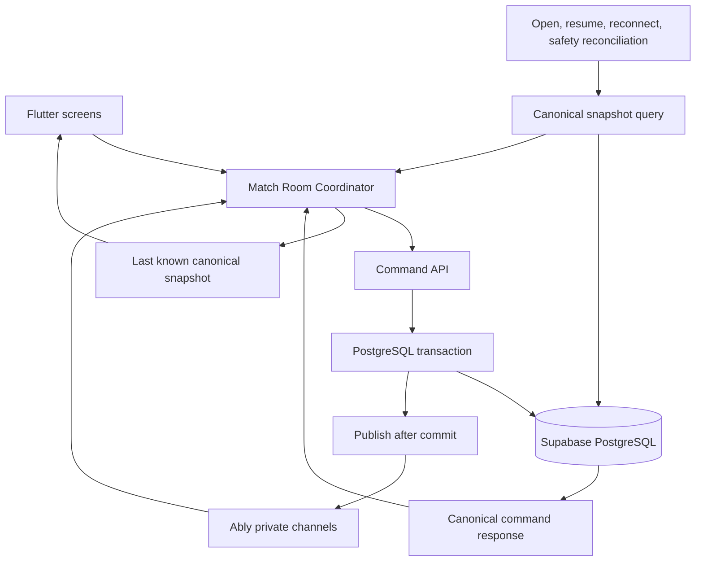
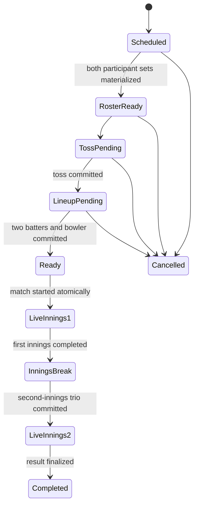
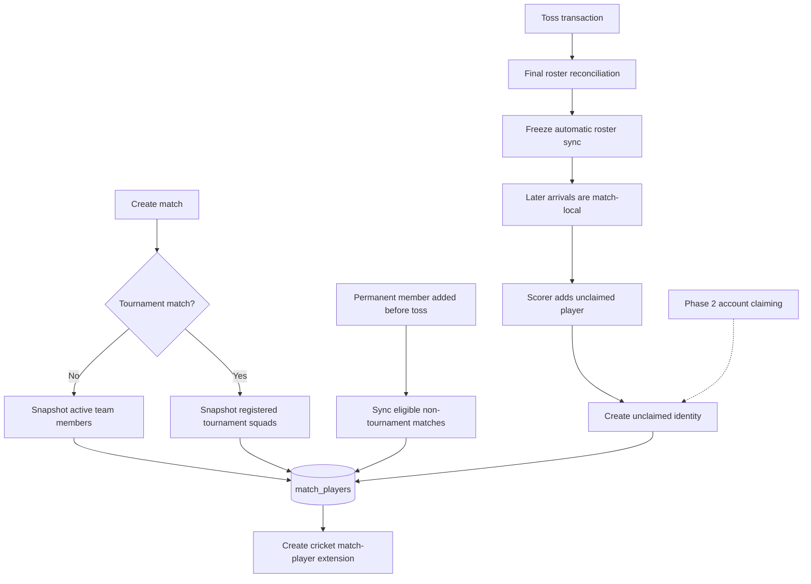
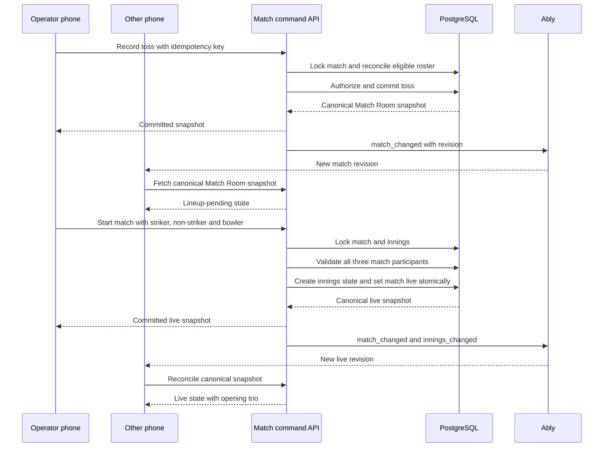
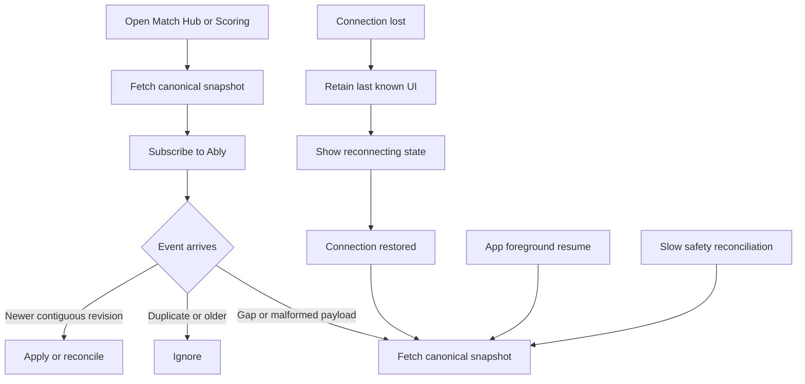
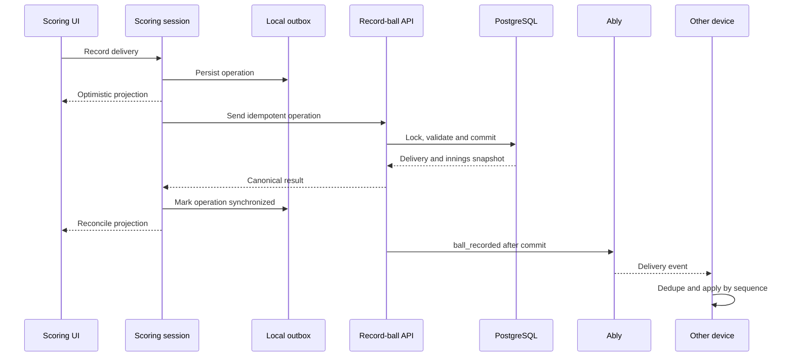
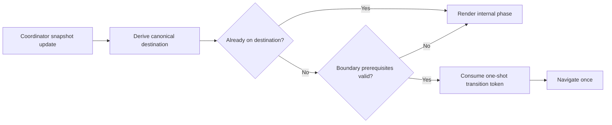

# Match Runtime and Realtime Architecture

**Status:** Approved conversational design, awaiting written-spec review

**Date:** 2026-09-21

**Scope:** Match participant materialization, pre-match setup, live scoring coordination, realtime delivery, navigation, and match-only players

## 1. Purpose

Match Day needs a reliable match lifecycle that works when two teams are on the ground and different phones observe or operate the same match. A fixture must have usable participants, toss and lineup changes must appear promptly on other devices, and the scoring UI must not blink or navigate through contradictory intermediate states.

The design has four central rules:

1. PostgreSQL is the canonical source of match state.
2. Commands make workflow changes atomically and return the committed state.
3. Ably reduces propagation latency but is never required for correctness.
4. One client-side coordinator owns the lifecycle; screens render it instead of independently reconstructing it.

## 2. Product Decisions

These decisions are part of the approved scope:

- A non-tournament match initially copies all active or in-squad members of both teams into `match_players`.
- A tournament match uses the registered tournament squads, not the mutable team roster.
- Permanent team members added before the toss automatically become available in eligible non-tournament matches.
- Recording the toss freezes automatic team-roster synchronization for that match.
- After the toss, the active scorer may add a match-only unclaimed player to either side.
- A match-only player is not inserted into `team_members` in V1.
- Linking or claiming an unclaimed player from an account is Phase 2.
- The scorer may choose players for both sides, including the opposing opening bowler.
- Scoring remains a separate operational surface from pre-match setup.
- The innings break is a state within the scoring experience, not an independent lifecycle owner.

## 3. Current-State Findings

### 3.1 Missing participant materialization

The affected Saran XI versus Hyderabad Hawks fixture has no `match_players` rows. The lineup UI correctly filters opener candidates from `match_players`, so it has nothing to display.

The database already contains `_materialize_match_team_side`, and tournament/challenge paths contain participant-copying logic. Generic match creation does not consistently invoke equivalent materialization. This makes participant availability depend on which creation path produced the fixture.

### 3.2 Premature live transition

The current start sequence submits two openers, calls `start_match_now`, navigates to scoring, and asks for the opening bowler there. Consequently, the match can enter `live` without a complete on-field trio.

The new invariant is:

> A match cannot become live unless the innings state contains a striker, non-striker, and bowler.

### 3.3 Fragmented lifecycle ownership

`MyMatchesScreen`, `MatchDetailScreen`, `MatchStartScreen`, `InningsBreakScreen`, and `ScoringScreen` make overlapping routing and lifecycle decisions. Several listeners can react to the same status change and schedule navigation. Intermediate loading states and duplicate events can therefore produce blinking or repeated route replacement.

### 3.4 Incomplete realtime recovery

`watchMatch` and `watchMatchInningsState` perform an initial snapshot and subscribe to Ably. Their comments describe reconnect snapshots and periodic polling, but those mechanisms are not implemented.

`watchBalls` also hydrates once and then relies on Ably events except when an explicit `balls_resync` event arrives.

### 3.5 Unsafe shared-channel release

`AblyService` records active channel names in a `Set`. Match and innings watchers share `match:<id>:state`. Cancelling either watcher can detach the channel while another consumer is still using it.

### 3.6 Scoring is not consuming the available realtime streams

`ScoringSession.load` reads match, innings, deliveries, players, and permissions once. It manages a durable optimistic outbox, but it does not subscribe to the match, innings, ball, or participant changes made by another device.

### 3.7 Two realtime transports describe the same runtime

Database triggers call Supabase `realtime.send`, while Edge Functions publish the corresponding committed state through Ably. The Flutter runtime listens to Ably. Maintaining both application transports creates misleading comments and event contracts without providing a coherent fallback.

## 4. Target Architecture

### 4.1 Backend ownership

- PostgreSQL stores all durable state and enforces relational invariants.
- Edge command functions own authorization, workflow validation, row locking, idempotency, and atomic mutations.
- Events are published only after a transaction commits.
- A publish failure does not roll back a committed cricket action.
- A canonical query restores any state missed while realtime was unavailable.

### 4.2 Client ownership

- A route-scoped `MatchRoomCoordinator` holds a coherent aggregate snapshot.
- It adopts the canonical response to its own commands immediately.
- It consumes Ably events for changes made by other devices.
- It reconciles from the server after gaps, malformed events, resume, or reconnect.
- Screens render coordinator state and submit commands; they do not directly own navigation based on separate provider snapshots.

## 5. Screen and Route Model

```mermaid
flowchart LR
    LIST[My Matches] --> HUB[Match Hub]

    subgraph PRELIVE[Match Hub route]
        INFO[Fixture information]
        ROSTER[Roster readiness]
        TOSS[Toss]
        SETUP[Openers and opening bowler]
        WAIT[Waiting for another operator]
    end

    HUB --> INFO
    INFO --> ROSTER
    ROSTER --> TOSS
    TOSS --> SETUP
    SETUP --> WAIT

    WAIT -->|Canonical phase is live| SCORE[Scoring route]

    subgraph LIVE[Scoring route]
        FIRST[First innings]
        BREAK[Innings-break setup]
        SECOND[Second innings]
    end

    SCORE --> FIRST
    FIRST --> BREAK
    BREAK --> SECOND
    SECOND --> RESULT[Result and scorecard]
```

### 5.1 My Matches

My Matches lists fixtures and displays summary status. It routes a user into a match but does not own toss, lineup, innings, or scoring state.

### 5.2 Match Hub

`/matches/:matchId` is the stable pre-live surface. It displays fixture information, both match rosters, toss controls, lineup controls, match-only player creation, and read-only waiting states.

The existing `/matches/:matchId/start` location should become a compatibility redirect after the Match Hub owns all pre-live states.

Most phase changes replace content inside the Match Hub without changing routes.

### 5.3 Scoring

`/matches/:matchId/score` begins only after a complete opening trio has been committed and the match is live.

The innings break belongs inside the scoring route. The scoring shell remains mounted while its internal phase changes from first innings to break setup and then second innings. The existing innings-break route becomes a compatibility redirect.

### 5.4 Result

Completion is the second genuine route boundary. The client moves from scoring to the result surface only after the canonical match status is terminal.

## 6. Match State Machine

The database representation may retain existing status and phase columns, but the domain layer must expose one normalized lifecycle state. Invalid combinations, such as `status = live` with no bowler, must be rejected by the command boundary.

## 7. Participant Lifecycle

### 7.1 Initial materialization

All fixture-creation paths must call one shared participant-materialization function inside the fixture transaction. Duplicated inline insert logic should be replaced by this shared invariant.

For non-tournament matches, eligibility is an active team membership whose squad status permits match participation. For tournaments, eligibility comes from the tournament squad snapshot.

Materialization is idempotent. Repeating it must not create duplicate participant rows.

### 7.2 Pre-toss synchronization

When a permanent team member is added before the toss, backend membership mutation logic synchronizes the player into scheduled, non-tournament matches for that team that have not frozen their rosters.

The toss command performs one final reconciliation while holding the relevant match lock. This closes the race between a roster addition and toss submission.

Automatic synchronization stops once the toss transaction commits.

### 7.3 Removal semantics

Before roster freeze, a team member who becomes ineligible may be removed from an unreferenced match participant set. A participant already referenced by innings, deliveries, wickets, or statistics is never physically deleted. After freeze, team-roster removal does not mutate match history.

### 7.4 Match-only unclaimed participant

The active scorer can create a participant for either team. The command:

1. Validates scorer authorization and the target side.
2. Creates or resolves an unclaimed identity.
3. Inserts `match_players` without inserting `team_members`.
4. Inserts the `cricket_match_players` extension.
5. Returns the canonical participant and updated Match Room snapshot.
6. Publishes `participants_changed` after commit.

The match participant should record provenance and audit information, including source, creator, and creation time. Phase 2 may link the underlying unclaimed identity to an account without changing historical match-player IDs.

## 8. Atomic Toss and Match Start

The existing `submit_match_openers` followed by `start_match_now` should not remain the primary UI sequence. One command must validate and commit the complete starting trio and live transition.

The same command shape starts the second innings with its next striker, non-striker, bowler, and target.

## 9. Canonical Match Room Snapshot

The coordinator should load one versioned aggregate rather than combining unrelated asynchronous providers.

The snapshot contains:

- Match identity, format, teams, status, phase, and revision
- Toss winner and decision
- Both participant lists and cricket-specific participant attributes
- Current innings number and innings state
- Current score summary where applicable
- Current scorer lease summary
- Caller capabilities such as `can_record_toss`, `can_setup_innings`, `can_add_participant`, and `can_score`
- A server timestamp

The exact transport may be an RPC or Edge Function query, but it must read a coherent database state and expose a domain-owned DTO contract.

## 10. Realtime Contract

### 10.1 State channel

Channel: `match:<matchId>:state`

Events:

- `match_changed`
- `participants_changed`
- `innings_changed`
- `match_completed`

Each event has this common envelope:

| Field | Purpose |
| --- | --- |
| `event_id` | Event deduplication |
| `match_id` | Scope validation |
| `revision` | Ordering and gap detection |
| `event_type` | Typed dispatch |
| `innings_number` | Optional affected innings |
| `occurred_at` | Diagnostics |

State events are notifications of committed change. The command sender already has the canonical response; other devices reconcile when the event revision is newer than their snapshot.

### 10.2 Ball channel

Channel: `match:<matchId>:balls`

Events:

- `ball_recorded`
- `ball_deleted`
- `balls_resync`

`ball_recorded` may carry the complete delivery because deliveries are high-volume and append-only. Every delivery must have a stable ID, innings number, idempotency key, and monotonic sequence.

### 10.3 One application realtime transport

Ably remains the Match Day application realtime transport. Supabase `realtime.send` triggers for this runtime should be removed or formally excluded from the application contract after confirming no other consumer relies on them. PostgreSQL remains the data authority regardless of transport.

### 10.4 Channel lifecycle

`AblyService` must reference-count channel acquisitions. A channel detaches only when its final consumer releases it. Subscription objects remain independently cancellable.

Connection recovery must notify coordinators when Ably becomes subscribed after a disconnect. App foreground resume also triggers canonical reconciliation.

## 11. Realtime Recovery

Realtime has no correctness responsibility. If publication fails, another device becomes current through resume, reconnect, safety reconciliation, or a later event that reveals a revision gap.

Refresh does not replace existing content with a full-screen loader. The UI retains its last canonical snapshot and exposes a small refreshing/reconnecting indicator.

## 12. Scoring Data Flow

The existing single-writer write-ahead log remains the correct basis for offline ball recording. The scoring session must additionally consume remote match, innings, delivery, and participant changes and merge them into its confirmed base before replaying local pending operations.

Structural operations such as adding a participant require connectivity in V1. The server-generated participant ID must exist before a delivery references it. While the addition is pending, the screen stays mounted and disables only the affected action.

## 13. Navigation and Rendering

Navigation is derived from normalized lifecycle state, not individual events. Duplicate events and refreshed snapshots cannot cause repeated navigation because the transition guard records the last consumed boundary and revision.

Only two normal lifecycle boundaries navigate:

- Match Hub to Scoring when live state and the complete opening trio are present
- Scoring to Result when the canonical match is terminal

## 14. Authorization and Concurrency

### 14.1 Permissions

- Recording toss requires the appropriate team-management, match-setup, or official permission.
- Starting an innings and adding a match-only participant requires `match.score` and the active scorer lease.
- The scorer can operate both team sides.
- Recording, undoing, or changing the on-field trio requires `can_score_innings` and the active lease.
- Other participants may observe realtime state but cannot mutate it without permission.

All rules are enforced by server commands. Flutter capability fields control presentation only.

### 14.2 Locking

Workflow commands lock the match row before validating its phase. Participant synchronization and toss recording occur in the same transaction. Starting an innings locks both match and innings state in a stable order. Delivery commands retain their current single-writer and database locking protections.

### 14.3 Idempotency

Toss, start-innings, add-participant, delivery, undo, and completion commands accept idempotency keys. Repeating an accepted command returns the accepted result without applying the mutation twice.

## 15. Layer Changes

### 15.1 Domain

- Add a normalized match lifecycle value.
- Add a versioned `MatchRoomSnapshot` aggregate.
- Add participant provenance.
- Add caller capabilities and connection/reconciliation status.
- Keep `MatchPlayerId` stable and independent from profile claiming.

### 15.2 Data

- Add canonical Match Room snapshot DTO and query.
- Add typed realtime event envelopes.
- Add atomic toss, start-innings, and match-participant commands.
- Reference-count Ably channels and expose connection restoration.
- Make scoring consume confirmed remote changes while preserving local pending operations.

### 15.3 Presentation

- Introduce one route-scoped Match Room coordinator.
- Fold Match Start into Match Hub.
- Fold innings-break setup into Scoring.
- Keep cached content during reconciliation.
- Centralize lifecycle navigation at the route-shell boundary.

### 15.4 Backend and database

- Centralize participant materialization.
- Add participant provenance/audit fields if the existing schema cannot represent them.
- Add a monotonic match revision.
- Add an idempotency store or command-level deduplication mechanism.
- Add canonical snapshot query support.
- Publish typed Ably events after commit.
- Backfill scheduled matches with missing participant snapshots.
- Retire redundant Supabase application broadcasts after dependency verification.

## 16. Alternatives Considered

### 16.1 Supabase authority with Ably notification — selected

This matches the current operational direction, provides low latency, preserves immediate command responses, and remains recoverable when realtime events are missed. It requires fixing channel ownership, event ordering, and reconciliation.

### 16.2 Supabase Realtime as the only realtime transport

This removes a vendor but requires rewriting the current Ably client/auth integration and still needs snapshots, ordering, deduplication, and reconnect recovery. It is not selected for this phase.

### 16.3 Client-side orchestration of existing endpoints

This avoids an aggregate backend contract initially but leaves multiple reads describing different database moments and perpetuates fragmented navigation and authorization. It is rejected.

## 17. Failure Handling

| Failure | Required behavior |
| --- | --- |
| Match creation partially fails | Entire creation transaction rolls back |
| Participant snapshot is missing | Reconciliation repairs it before toss; UI reports roster not ready |
| Toss command repeats | Idempotent response, no duplicate transition |
| Start command races another device | Row lock accepts one canonical transition; other caller receives canonical state |
| Ably publication fails | Command remains committed; clients recover through snapshot reconciliation |
| Realtime disconnects | Preserve last known UI and show reconnecting state |
| Event arrives out of order | Ignore revisions not newer than current |
| Revision gap appears | Fetch canonical snapshot |
| Participant addition is offline | Refuse clearly; do not create a local-only participant |
| Ball recording is offline | Persist to the existing WAL and replay in FIFO order |
| Permission or lease is lost | Stop new writes, preserve display state, reconcile permission snapshot |

## 18. Verification Strategy

### 18.1 Database and command tests

- Every match-creation path materializes both sides.
- Re-running materialization is idempotent.
- Non-tournament pre-toss roster additions synchronize.
- Tournament squads remain independent of later team roster changes.
- Toss performs final reconciliation and freezes automatic sync.
- Match-only participant insertion does not create a team membership.
- A scorer can add to either side; an unauthorized viewer cannot.
- A match cannot become live without all three on-field roles.
- Concurrent toss/start requests yield one canonical transition.
- Idempotency retries do not duplicate participants, innings, or deliveries.

### 18.2 Flutter tests

- The Match Hub changes internal phase without route flicker.
- Duplicate and older realtime events do not navigate or regress state.
- One shared channel remains attached until its final consumer releases it.
- Reconnect and foreground resume trigger reconciliation.
- Existing data stays rendered during refresh.
- Scoring merges a remote confirmed ball beneath pending local operations.
- Participant changes refresh the relevant batter, bowler, and fielder pickers.

### 18.3 Two-device integration scenarios

- Phone A records the toss; Phone B reaches lineup state.
- Phone A starts the match; Phone B reaches live scoring with the complete trio.
- The scorer adds an opposing bowler; both phones show the player.
- One phone misses an event and repairs itself after reconnect.
- Two devices attempt to start simultaneously; only one transition commits.
- The scorer records balls offline, reconnects, and preserves FIFO scoring order.

### 18.4 Production checks

- Monitor publish failures, revision gaps, reconciliation frequency, command conflicts, and lease changes.
- Log event IDs and revisions without exposing player private data.
- Run database security and performance advisors after schema or RLS changes.

## 19. Delivery Sequence

Implementation should proceed in dependency order:

1. Participant materialization invariant and repair/backfill tooling.
2. Match revision, canonical snapshot, and command idempotency foundation.
3. Atomic toss, start-innings, and add-match-participant commands.
4. Ably event envelope, reference counting, and recovery lifecycle.
5. Match Room coordinator and stable Match Hub phases.
6. Scoring-session realtime reconciliation.
7. Innings-break integration and route compatibility redirects.
8. Removal of redundant runtime broadcasts and obsolete orchestration.
9. Two-device, authorization, concurrency, and recovery verification.

Each step must preserve existing match history and stable match-player identifiers. Existing scheduled matches with empty participant sets must be repaired before the new lineup UI relies on the invariant.

## 20. Out of Scope

- Claiming or attaching an unclaimed participant to a user account
- Automatically promoting a match-only participant into a permanent team roster
- Multi-scorer collaborative editing within one innings
- Offline creation of match-only participants
- Tournament squad-management redesign
- Spectator product redesign beyond consuming the canonical match state
