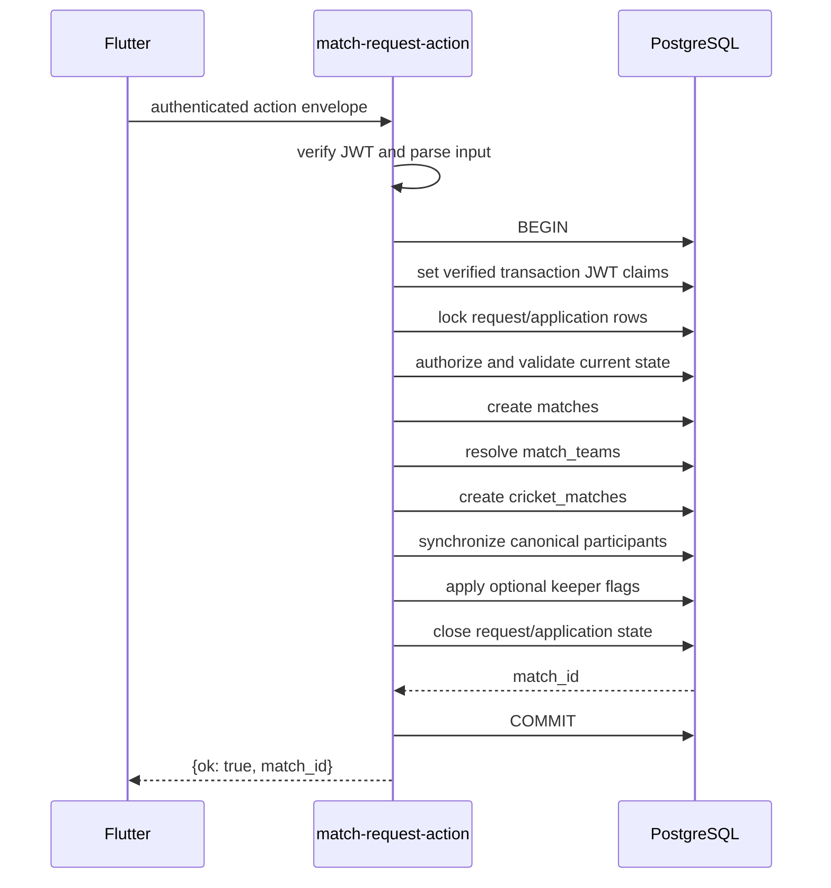

# Match Request Acceptance Edge Command Design

> **Status:** Approved design awaiting implementation planning  
> **Date:** 2026-09-22  
> **Scope:** Move direct-challenge and open-pool acceptance orchestration from PostgreSQL RPCs into one authenticated Edge command boundary.  
> **Compatibility:** Matchday has no released clients. The obsolete acceptance RPCs will be removed rather than retained as compatibility wrappers.

## 1. Problem and intended outcome

`accept_match_request` and `accept_pool_application` currently implement large,
frequently changing product workflows in PL/pgSQL. They are atomic, but they
combine authorization sequencing, lifecycle rules, match construction,
participant setup, keeper selection, notification effects, and API error
behavior inside exposed database functions.

The match runtime already follows a clearer ownership model:

```text
PostgreSQL = integrity and authoritative state
Edge       = changing product behavior and command orchestration
Flutter    = typed client of the command boundary
```

Acceptance must adopt that model without losing its all-or-nothing transaction.
Success means that both acceptance flows execute through one Edge Function,
perform every database mutation in one PostgreSQL transaction, create only the
normalized match aggregate, and leave participant creation to the canonical
database synchronizer.

## 2. Existing system findings

- Flutter currently invokes both acceptance operations through Supabase RPC.
- `send-match-request` is already an Edge Function, but it is a standalone,
  monolithic handler and explicitly retains a database fallback.
- `cricket-match-action` provides reusable patterns for verified JWT identity,
  transaction-scoped JWT claims, command routing, domain errors, and repository
  isolation.
- Acceptance occurs before a match exists, so it cannot use the runtime
  envelope that requires `matchId`.
- `matches` is the sport-neutral fixture shell.
- `match_teams` is the only persisted match-to-team relationship.
- `cricket_matches` owns Cricket rules and setup state.
- `sync_match_participants` and its triggers are the only implementation that
  may create automatic `match_players` and `cricket_match_players` snapshots.
- Updating `match_challenges` already participates in existing database
  notification triggers. A new match-runtime Ably event is unnecessary because
  consumers cannot be subscribed to a match ID that did not previously exist.

## 3. Selected architecture

Create one Edge Function named `match-request-action` with two actions:

```text
accept_challenge
accept_pool_application
```

The boundary will follow this sequence:



One transaction must contain every persistent effect. Any error rolls back the
new match, participant rows, request/application transitions, and notification
trigger effects together.

## 4. Command contract

### 4.1 Common request envelope

```json
{
  "action": "accept_challenge",
  "body": {}
}
```

The caller identity is always derived from the verified bearer token. Actor IDs
from the body are forbidden.

### 4.2 `accept_challenge`

Input body:

```json
{
  "request_id": "uuid",
  "scheduled_start_time": "optional ISO-8601 timestamp",
  "venue": "optional string",
  "format": "optional MatchFormat JSON",
  "decision_note": "optional string",
  "to_team_id": "optional uuid for claiming an open challenge",
  "to_team_xi": ["optional uuid"],
  "to_team_keeper_id": "optional uuid"
}
```

It supports the existing three domain flows:

1. A receiving-team manager accepts a targeted pending challenge.
2. A team manager claims an open pending challenge for their team.
3. The original sending-team manager accepts a countered challenge.

The command retains current XI validation while the development UI still sends
those fields. V1 participant persistence nevertheless snapshots the complete
eligible roster; XI selection belongs to match-day lineup setup.

### 4.3 `accept_pool_application`

Input body:

```json
{
  "application_id": "uuid",
  "decision_note": "optional string"
}
```

Only a manager of the host team may accept. The selected application becomes
accepted, other pending applications for the same challenge become rejected,
and the challenge becomes accepted inside the same transaction.

### 4.4 Success and failure responses

Success:

```json
{
  "ok": true,
  "match_id": "uuid"
}
```

Errors use the established command shape:

```json
{
  "ok": false,
  "error": {
    "code": "CONFLICT",
    "message": "Request is no longer actionable"
  }
}
```

HTTP mapping:

| Status | Meaning |
|---|---|
| 400 | Invalid JSON, UUID, timestamp, or envelope |
| 401 | Missing or invalid session |
| 403 | Authenticated actor lacks team authority |
| 404 | Request or application does not exist |
| 409 | Stale decision, already-accepted state, or concurrent conflict |
| 422 | Domain rule violation such as invalid team/XI/keeper |
| 500 | Unexpected database or server failure |

## 5. Transaction and concurrency rules

### Direct challenge

1. Lock the `match_challenges` row with `FOR UPDATE`.
2. Require status `pending` or `countered`.
3. Resolve the receiving team and effective terms from the action type and
   request state.
4. Check authority after the row is locked, using the verified actor through
   transaction-scoped JWT claims.
5. Validate both team identities, XI values, keeper values, and captains.
6. Create the normalized match aggregate.
7. Update the challenge using its previously observed status as an additional
   guard. A zero-row update is a conflict and rolls back the aggregate.

### Pool application

1. Lock the selected `match_pool_applications` row.
2. Lock its parent `match_challenges` row.
3. Require both rows to remain pending.
4. Verify that the actor manages the host team.
5. Create the normalized match aggregate.
6. Accept the chosen application, reject its pending competitors, and accept
   the challenge.
7. Guard every terminal transition so concurrent attempts cannot create two
   matches from one challenge.

Row locks and guarded transitions are authoritative. Client-side disabled
buttons and optimistic state are usability features, not concurrency controls.

## 6. Match construction ownership

A shared repository function will create the aggregate in this exact order:

1. Insert the sport-neutral `matches` row.
2. Update the automatically created `match_teams` slots.
3. Insert `cricket_matches` with canonical rules and `setup_side = team_a`.
4. Invoke `sync_match_participants(match_id)` through the trusted transaction.
5. Apply optional wicketkeeper flags to the synchronized Cricket participant
   rows.

The Edge Function must never insert `match_players` or
`cricket_match_players` directly. The deferred trigger may invoke the same
idempotent synchronizer again at commit.

Challenge-format input may use legacy `overs`; the Edge normalizer will always
produce `overs_per_innings` and defaults for players, balls per over, and bowler
limits. No removed database normalization helper will be reintroduced.

## 7. Component structure

```text
supabase/functions/match-request-action/
  index.ts                         HTTP/auth/transaction boundary
  types.ts                         envelope and command contracts
  command_router.ts                action dispatch
  domain/
    validation.ts                  parsing and format normalization
    errors.ts                      typed HTTP/domain errors
  commands/
    accept_challenge.ts            direct/counter/open-claim behavior
    accept_pool_application.ts     pool-selection behavior
  repositories/
    challenge_repository.ts        row locks and transitions
    match_creation_repository.ts   normalized aggregate construction
    team_repository.ts             authority and roster validation
```

Modules remain small enough to test without starting the HTTP server. Commands
receive dependency interfaces so unit tests can exercise state rules without a
database, while pgTAP integration tests verify actual transactional storage.

## 8. Flutter changes

`MatchRequestsRemoteDataSource` will replace both RPC calls with:

```dart
_supabase.functions.invoke('match-request-action', body: envelope)
```

It will require a successful response containing a string `match_id`; missing
or malformed data becomes `ServerException` rather than returning null.

Both operations will reuse one Edge-error translator with operation-neutral
messages. The domain repository contracts and presentation flows remain
unchanged because they already return `MatchId` through `Either<Failure, ...>`.

## 9. Database cleanup

A forward migration will:

- revoke execution on `accept_match_request` and `accept_pool_application`;
- drop both functions using their exact signatures;
- retain small integrity helpers used by trusted Edge transactions;
- retain notification triggers and canonical participant synchronization;
- update database tests so they test normalized creation through repository
  integration or invariant helpers, not the removed public RPC definitions.

No deprecated wrapper functions or Flutter RPC fallback will remain.

## 10. Security model

- Authentication uses `auth.getUser()` through the existing shared helper.
- The Edge Function injects only the verified user ID into transaction-local
  JWT claims.
- Authorization uses current database team-permission helpers inside the same
  transaction as the writes.
- Direct PostgreSQL credentials remain server-side and never enter Flutter.
- Inputs are parameterized through `postgres.js`; no SQL strings contain user
  interpolation.
- The removed SECURITY DEFINER RPCs reduce the exposed database API surface.

## 11. Realtime and notifications

Acceptance creates a new match rather than mutating an already-open Match Room,
so it will not emit a match-runtime revision event. Existing database triggers
continue to produce request/application notifications transactionally.

The accepting phone navigates using the returned `match_id`. Other challenge
surfaces refresh through their existing request data lifecycle. A future
request-specific Ably protocol is outside this change and should be introduced
only if product behavior demonstrates a need.

## 12. Verification strategy

### Command unit tests

- targeted pending challenge succeeds for the receiving manager;
- countered challenge succeeds only for the original sender;
- open challenge requires and authorizes the claiming team;
- stale or terminal requests return conflict;
- invalid XI and keeper selections return rule violations;
- pool acceptance rejects non-host managers;
- two competing pool acceptances produce only one match;
- response always contains the created match ID.

### Database integration tests

- aggregate uses `matches`, `match_teams`, and `cricket_matches` correctly;
- no creation code references removed match columns;
- participant rows come from the canonical synchronizer;
- keeper flags are retained;
- tournament provenance rules remain unaffected;
- rollback leaves no partial match after a forced transition conflict;
- removed acceptance functions are not executable or present.

### Flutter tests

- both methods invoke `match-request-action` with the correct envelope;
- malformed success payloads fail explicitly;
- 401/403 map to unauthorized failure;
- 409 maps to conflict failure;
- 422 and unexpected failures preserve useful server messages.

### Quality gates

- reset the local database from all migrations;
- run all pgTAP tests;
- run Edge command unit tests in the repository's supported Deno environment;
- run focused Flutter data/repository tests;
- run `flutter analyze lib`;
- run migration and diff validation.

## 13. Explicit non-goals

- Moving send, counter, decline, withdraw, apply, or reject operations in this
  change.
- Adding a compatibility RPC or client fallback.
- Introducing request-specific Ably channels.
- Changing Match Room runtime revision behavior.
- Redesigning challenge or application screens.
- Changing the V1 full-roster participant snapshot policy.
