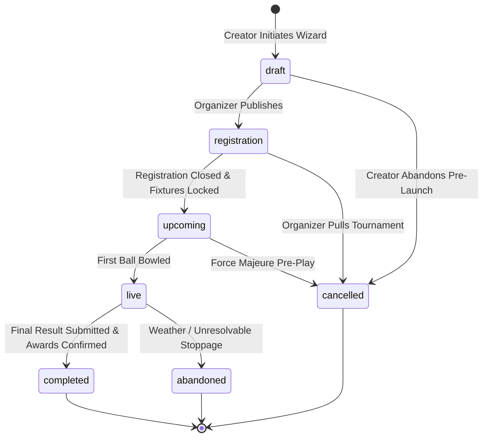
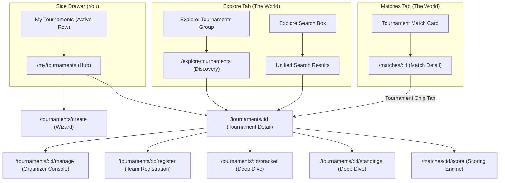

# matchday — Dedicated Tournaments System: Comprehensive Product & Architecture Specification

> **Document Type:** Master Product Requirements Document (PRD) & Technical Architecture Specification  
> **Status:** Approved Specification / Implementation Blueprint  
> **Target System:** Matchday Mobile Platform (Flutter · Riverpod 3.x · Supabase Clean Architecture)  
> **Domain Focus:** Amateur, Grassroots, Semi-Professional & Weekend Cup Cricket  
> **Design Language:** "One ink · one earned red · warm paper" (Wisden-inspired, Light Theme Only)  
> **Target Viewport:** Mobile 390 × 844 (iOS & Android)  
> **Snapshot Date:** 2026-08-25  

---

## Table of Contents

1. [Executive Summary & Architectural Foundations (Pass 0)](#1-executive-summary--architectural-foundations-pass-0)
   - [1.1 The Grassroots Cricket Tournament Problem](#11-the-grassroots-cricket-tournament-problem)
   - [1.2 Brand Tokens & Design System](#12-brand-tokens--design-system)
   - [1.3 Information Architecture Axioms](#13-information-architecture-axioms)
   - [1.4 Role-Based Access Control (RBAC) & Lifecycle State Machine](#14-role-based-access-control-rbac--lifecycle-state-machine)
   - [1.5 System Boundaries & Non-Goals](#15-system-boundaries--non-goals)
2. [Phase 1: Information Architecture & Component Design System (Pass 1)](#2-phase-1-information-architecture--component-design-system-pass-1)
   - [2.1 Global Navigation Map & Back-Stack Resolution](#21-global-navigation-map--back-stack-resolution)
   - [2.2 Answers to the Five Core Architectural Questions](#22-answers-to-the-five-core-architectural-questions)
   - [2.3 Authoritative Component Catalog & Redlines](#23-authoritative-component-catalog--redlines)
3. [Phase 2: Hub, Discovery & Unified Search (Pass 2)](#3-phase-2-hub-discovery--unified-search-pass-2)
   - [3.1 My Tournaments Hub (`/my/tournaments`)](#31-my-tournaments-hub-mytournaments)
   - [3.2 Tournament Discovery & Geo Filtering (`/explore/tournaments`)](#32-tournament-discovery--geo-filtering-exploretournaments)
   - [3.3 Unified Explore Search Integration](#33-unified-explore-search-integration)
   - [3.4 Zero-States, Cold Starts & Card Information Hierarchy](#34-zero-states-cold-starts--card-information-hierarchy)
4. [Phase 3: Tournament Detail Read Surface (Pass 3)](#4-phase-3-tournament-detail-read-surface-pass-3)
   - [4.1 Collapsible Header Architecture & Follow Mechanics](#41-collapsible-header-architecture--follow-mechanics)
   - [4.2 Dynamic Tab Structures by Tournament Type](#42-dynamic-tab-structures-by-tournament-type)
   - [4.3 Overview Tab Lifecycle States (Registration, Live, Completed)](#43-overview-tab-lifecycle-states-registration-live-completed)
   - [4.4 Fixtures, Teams & Statistics Leaderboards](#44-fixtures-teams--statistics-leaderboards)
   - [4.5 Organizer Management Overlays & Generative Banner Fallback](#45-organizer-management-overlays--generative-banner-fallback)
5. [Phase 4: Bracket & Standings Deep Dive on 390px Viewport (Pass 4)](#5-phase-4-bracket--standings-deep-dive-on-390px-viewport-pass-4)
   - [5.1 Knockout Bracket Engine (8-Team, 6-Team Byes, 16-Team Trees)](#51-knockout-bracket-engine-8-team-6-team-byes-16-team-trees)
   - [5.2 Standings Table Engine (Fixed Columns, Expandable Rows, Qualification Cuts)](#52-standings-table-engine-fixed-columns-expandable-rows-qualification-cuts)
   - [5.3 Live Realtime Broadcast & NRR Calculation Formulas](#53-live-realtime-broadcast--nrr-calculation-formulas)
6. [Phase 5: Organizer Create Wizard (Pass 5)](#6-phase-5-organizer-create-wizard-pass-5)
   - [6.1 Six-Step Progressive Disclosure Architecture](#61-six-step-progressive-disclosure-architecture)
   - [6.2 Inline Rule & Format Guidance](#62-inline-rule--format-guidance)
   - [6.3 Drift Local Draft Persistence & Validation Invariants](#63-drift-local-draft-persistence--validation-invariants)
   - [6.4 Review, Lock & Post-Publish Viral Sharing](#64-review-lock--post-publish-viral-sharing)
7. [Phase 6: Organizer Console & Live Operations (Pass 6)](#7-phase-6-organizer-console--live-operations-pass-6)
   - [7.1 Registration Inbox, Bulk Review & Manual Fee Tracking](#71-registration-inbox-bulk-review--manual-fee-tracking)
   - [7.2 Seeding, Schedule Generation & Fixture Publication](#72-seeding-schedule-generation--fixture-publication)
   - [7.3 Matchday Ground Operations, Rain Abandonments & Walkovers](#73-matchday-ground-operations-rain-abandonments--walkovers)
   - [7.4 Result Overrides & Audit Logs](#74-result-overrides--audit-logs)
8. [Phase 7: Team Manager Registration Flow (Pass 7)](#8-phase-7-team-manager-registration-flow-pass-7)
   - [8.1 Manager Discovery & Entry Gate](#81-manager-discovery--entry-gate)
   - [8.2 Team Selection & Roster Squad Picker (Claimed vs Unclaimed)](#82-team-selection--roster-squad-picker-claimed-vs-unclaimed)
   - [8.3 Fee Instructions & Cash Flow Acknowledgment](#83-fee-instructions--cash-flow-acknowledgment)
   - [8.4 Application Lifecycle Tracking (Pending, Approved, Rejected)](#84-application-lifecycle-tracking-pending-approved-rejected)
9. [Phase 8: Completion, Awards & Social Sharing (Pass 8)](#9-phase-8-completion-awards--social-sharing-pass-8)
   - [9.1 The Champion Moment: Deliberate Dark Mode Exception](#91-the-champion-moment-deliberate-dark-mode-exception)
   - [9.2 Automated Awards Engine (Auto-Calculations & Overrides)](#92-automated-awards-engine-auto-calculations--overrides)
   - [9.3 Completed Tournament Archive Page](#93-completed-tournament-archive-page)
   - [9.4 Shareable WhatsApp Graphic Card Generator](#94-shareable-whatsapp-graphic-card-generator)
   - [9.5 Cancelled & Abandoned Exit States](#95-cancelled--abandoned-exit-states)
10. [Phase 9: States, Edge Cases, Notifications & Permissions (Pass 9)](#10-phase-9-states-edge-cases-notifications--permissions-pass-9)
    - [10.1 Shimmer Skeleton Suite & Empty/Error States](#101-shimmer-skeleton-suite--emptyerror-states)
    - [10.2 Push Notification & Deep-Linking Matrix](#102-push-notification--deep-linking-matrix)
    - [10.3 Role-Based Permission Matrix (RBAC)](#103-role-based-permission-matrix-rbac)
    - [10.4 120% OS Text Scale & Long String Overflow Proofs](#104-120-os-text-scale--long-string-overflow-proofs)
    - [10.5 Day-1 Cold Start & MVP De-scoping Triage](#105-day-1-cold-start--mvp-de-scoping-triage)
11. [Technical Clean Architecture & Database Implementation](#11-technical-clean-architecture--database-implementation)
    - [11.1 PostgreSQL Schema, Triggers & RPCs](#111-postgresql-schema-triggers--rpcs)
    - [11.2 Flutter Domain Layer (Entities, Value Objects, Failures)](#112-flutter-domain-layer-entities-value-objects-failures)
    - [11.3 Data Layer (DTOs, Mappers, Remote Data Sources)](#113-data-layer-dtos-mappers-remote-data-sources)
    - [11.4 Presentation Layer (Riverpod 3.x Notifiers, Controllers & Routes)](#114-presentation-layer-riverpod-3x-notifiers-controllers--routes)
12. [Implementation Phases & Rollout Plan](#12-implementation-phases--rollout-plan)

---

## 1. Executive Summary & Architectural Foundations (Pass 0)

### 1.1 The Grassroots Cricket Tournament Problem

In grassroots and amateur cricket across Pakistan, South Asia, the UK, Australia, and beyond, tournament management is dominated by **WhatsApp group chaos and paper brackets**:
- Weekend cups (8–16 teams) are arranged over frantic phone calls.
- Seeding, schedules, and tie-breakers are drawn by hand or typed into WhatsApp notes.
- Ball-by-ball scores, standings, and net run rates (NRR) are computed manually or lost entirely.
- Awards (Best Batsman, Best Bowler, Player of the Tournament) are disputed due to incomplete ledgers.

**Matchday Tournaments** solves this end-to-end:
From tournament creation, team registrations, squad freeze, seeding, fixture generation, multi-ground matchday operations, ball-by-ball live scoring, realtime NRR standings and brackets, all the way to crowning a champion with auto-suggested awards and viral shareable graphics.

```
┌──────────────────────────────────────────────────────────────────────────────────────────────────┐
│                                MATCHDAY TOURNAMENT VALUE CHAIN                                   │
├─────────────────┬──────────────────┬─────────────────┬──────────────────┬────────────────────────┤
│ 1. AUTHORING    │ 2. REGISTRATION  │ 3. SEED & LOCK  │ 4. LIVE OPS      │ 5. FINALE & AWARDS     │
│ 6-step wizard,  │ Team rosters,    │ Auto or manual  │ Ball-by-ball     │ Champion moment,       │
│ format rules,   │ claimed/unclaimed│ draw, venue &   │ scoring, rain    │ auto-stat awards, NRR  │
│ grounds, dates  │ players, cash fee│ time scheduler  │ rules, walkovers │ archive, viral shares  │
└─────────────────┴──────────────────┴─────────────────┴──────────────────┴────────────────────────┘
```

---

### 1.2 Brand Tokens & Design System

Matchday adheres strictly to the brand philosophy:  
**"One ink · one earned red · warm paper."**  
The interface uses warm off-white paper surfaces, rich warm near-black typography, and exactly **one** accent colour—Cricket Red (`#DC4D32`)—spent only on live, destructive, or actively selected moments. Green and amber are strictly functional status indicators.

#### Authoritative Color Tokens

| Token | Hex Value | Semantic Application |
|---|---|---|
| `ink` | `#29251E` | Primary text, primary icons, solid status fills |
| `ink2` | `#4A4339` | Secondary text, subheadings, subtitle labels |
| `muted` | `#8A8170` | Tertiary text, metadata, trailing chevrons, disabled labels |
| `soft` | `#B9B1A2` | Inactive glyphs, borders on inactive inputs, placeholder text |
| `paper` | `#FBFAF6` | Canonical page background |
| `paper2` | `#F3F0E9` | Recessed fills: chips, buttons, avatar fallbacks, neutral badges |
| `surface` | `#FFFFFF` | Elevated cards, dialog backgrounds, dropdown sheets |
| `line` | `#E6E2D9` | Input borders, stronger structural separators |
| `hairline` | `#EEEBE3` | 1px dividers, standard card borders (default) |
| `red` | `#DC4D32` | **Cricket Red** — LIVE badges, destructive actions, active tabs |
| `redSoft` | `#F7E6E1` | Background tint behind red text (contrast: `#8C2218`) |
| `green` | `#338946` | Status only: Won, Confirmed, Approved, Qualified |
| `greenSoft` | `#CFEED2` | Background tint behind green text (contrast: `#1E5A2C`) |
| `amber` | `#E6AC3D` | Status only: Pending approval, Awaiting toss, Walkover warning |
| `cream` | `#F4ECDD` | Seam Cream: Amber-tinted chip background (contrast: `#6B5414`) |
| `creamBorder` | `#DED0AC` | Border for cream status chips |

#### Shadow & Elevation Tokens
Only two shadow elevations exist in the design system:
- **`shadow-1`**: `0 1px 2px rgba(40,30,15,0.04), 0 1px 1px rgba(40,30,15,0.03)` (Cards, chips on hover/press)
- **`shadow-2`**: `0 8px 28px rgba(40,30,15,0.07), 0 2px 6px rgba(40,30,15,0.04)` (Modals, bottom sheets, floating CTAs)

#### Radii Tokens
- `sm`: 8dp (Chips, buttons, status pills)
- `md`: 14dp (Cards, dialog containers, form fields)
- `lg`: 20dp (Sheet top corners, large banner containers)
- `xl`: 28dp (Floating pill bars, pill buttons)
- **Scrim**: Flat `ink` at 32% opacity (`rgba(41, 37, 30, 0.32)`), no blur.

#### Typography Scale (Google Fonts: Inter, Inter Tight, JetBrains Mono)

| Role | Family | Default Weight | Letter Spacing | Purpose / Sizes |
|---|---|---|---|---|
| **Display** | `Inter Tight` | 700 / 600 | `-0.02em` | Screen titles (`26`), Card titles (`17/700`), Row labels (`14.5/600`), Scores |
| **Body** | `Inter` | 400 / 500 | `0.00em` | Sentences (`13.5`), Form labels (`13`), Buttons (`14/600`), Subtitles (`11.5 muted`) |
| **Mono** | `JetBrains Mono` | 600 / 700 | `+0.10em` to `+0.14em` | UPPERCASE eyebrows (`10/700`), Status pills (`9/700`), Tabular scores (`14/700`) |

---

### 1.3 Information Architecture Axioms

The Matchday information architecture is governed by two immutable laws:

1. **"Bottom nav is the world. Side panel is you."**
   - The 4 bottom-nav tabs (**Home · Explore · Matches · Pool**) represent global community activity.
   - The left-side navigation drawer represents personal identity and assets (**My Matches, My Teams, My Pool Requests, My Tournaments**).
2. **"The side panel is nouns only. No verbs."**
   - The side panel navigates to destination hubs. It never houses floating creation triggers. You enter `/my/tournaments`, and that hub owns its own "+ Create Tournament" action.

---

### 1.4 Role-Based Access Control (RBAC) & Lifecycle State Machine

#### User Roles Matrix

| Role | Identity Definition | Core Capabilities |
|---|---|---|
| **Organizer** | Tournament Creator + listed `organizers` (UUIDs) | Full admin: edit rules, approve/reject registrations, seed teams, generate fixtures, assign scorers, reschedule, abandon, declare walkovers, submit awards |
| **Team Manager / Captain** | Manager of a registered or participating team | Register team, select/freeze squad roster, withdraw prior to lock, view team-specific schedule |
| **Player** | Member of a registered tournament squad | View squad status, personal matchday fixtures, individual tournament batting/bowling statistics |
| **Follower / Spectator** | Any authenticated or guest user | Read public tournament details, follow for live updates, view brackets, live standings, ball-by-ball scorecards |

#### Lifecycle State Machine



- **`draft`**: Visible **only** to tournament organizers. Unlisted from public search.
- **`registration`**: Publicly discoverable; team managers can submit registration applications and squad rosters.
- **`upcoming`**: Registrations locked; seeds assigned; fixtures generated with dates/venues.
- **`live`**: Matches actively in progress; live standings and bracket nodes update dynamically.
- **`completed`**: Champion crowned; awards verified; final archive locked.
- **`cancelled` / `abandoned`**: Unhappy terminal exits preserved with audit context.

---

### 1.5 System Boundaries & Non-Goals

To maintain high engineering velocity and product integrity, the following boundaries are strictly enforced for v1.0:

1. **No Online Payment Gateway**: Entry fees are **recorded, never processed**. Organizers collect cash or bank transfers offline and manually toggle "Mark as Paid" inside the organizer console.
2. **Supported Tournament Formats**:
   - `knockout`: Single-elimination tree (with optional 3rd place playoff).
   - `round_robin`: Single round where every team plays every other team once.
   - `league`: Extended league format with points table.
   - *Deferred to v1.1/v1.2*: `group_knockout` (groups feeding a knockout) and `double_elimination`.
3. **No In-App Tournament Chat or Ticketing**: WhatsApp links can be shared in the description, but no internal chat, ticketing, or sponsor engine is built in v1.
4. **Online-Only Architecture**: In accordance with the global architecture mandate, all tournament operations are online-only via Supabase (reads return `Future<Either<Failure, T>>` and live streams; multi-step wizard drafts use local Drift `WizardDrafts`).

---

## 2. Phase 1: Information Architecture & Component Design System (Pass 1)

### 2.1 Global Navigation Map & Back-Stack Resolution



---

### 2.2 Answers to the Five Core Architectural Questions

1. **Does "My Tournaments" in the side panel go to a hub or straight to a list?**  
   **Decision: A Unified Segmented Hub.**  
   A user can simultaneously be an **Organizer** for one cup, a **Team Manager/Player** in another, and a **Follower** of two local leagues. The hub (`/my/tournaments`) defaults to a segmented view with three sub-views: `Organizing`, `Playing`, and `Following`.
2. **Where does "Create a Tournament" live?**  
   **Decision: Inside `/my/tournaments` Hub Header.**  
   Per the IA rule ("Side panel is nouns only; no verbs"), the side panel contains only the destination row `Tournaments`. Tapping it opens `/my/tournaments`, which houses the prominent primary `+ Create Tournament` button in its top header.
3. **How does a spectator find a public tournament?**  
   **Decision: Explore Group + Matches Tab Context.**  
   Spectators discover tournaments via the dedicated Explore Tournaments carousel (`/explore/tournaments`) with distance/city filters, via unified search queries, and via contextual tournament badges pinned to live match cards in the Matches tab.
4. **How does Match Detail link back to its parent tournament?**  
   **Decision: Pinned Header Metadata Chip.**  
   Matches linked to a `tournament_id` render a prominent pill chip beneath the match title:  
   `[🏆 Lahore Champions Trophy '26 · Semi-Final 1 >]`  
   Tapping this navigates directly to the Tournament Detail page with the Fixtures tab focused on that match.
5. **What is the back-stack when an organizer scores a tournament match and finishes?**  
   **Decision: Return to Match Result Screen, with Back pointing to Organizer Console.**  
   `ScoringScreen` → `ResultScreen` (awards, summary) → Tapping Back returns directly to `/tournaments/:id/manage` (Live Matchday tab) so the organizer can immediately progress the bracket or start the next match.

---

### 2.3 Authoritative Component Catalog & Redlines

#### 1. Tournament Card (`CkTournamentCard`)
The fundamental list unit across Discovery, My Tournaments, and Explore.

```
┌─────────────────────────────────────────────────────────────────┐
│ [CREST 36]  Spring Premier League 2026          [LIVE PILL]     │
│             Lahore Gymkhana · T20 Knockout                      │
│ ─────────────────────────────────────────────────────────────── │
│  📅 14 Mar – 22 Mar · 8 Teams · Model Town Ground               │
│  🔴 LIVE: QF 1 — Model Town CC vs Gulberg Lions (142/3, 16.2 ov)│
└─────────────────────────────────────────────────────────────────┘
```

- **Container**: Fill `paper` (`#FBFAF6`), radius `14dp`, border `1px hairline` (`#EEEBE3`), padding `14px 16px`.
- **Card Title**: `Inter Tight 17/700`, color `ink`, max 1 line with ellipsis.
- **Subtitle / Meta**: `Inter 11.5/400`, color `ink2` and `muted`.
- **Variants**:
  - `Default`: Standard list card (Discovery, Hub).
  - `Compact`: 56dp height row variant for dense home/search screens.
  - `Hero`: Elevated card featuring full-bleed banner backing, floating logo, and live marquee ticker.

#### 2. Status Pills (`CkStatusPill`)
- **Dimensions**: Vertical padding `3dp`, horizontal padding `7dp`, border radius `4dp`.
- **Typography**: `JetBrains Mono 9/700`, UPPERCASE, letter-spacing `+0.12em`.
- **Tone Matrix**:

| State | Background Fill | Border | Text Color |
|---|---|---|---|
| `LIVE` | `red` (`#DC4D32`) | None | `#FFFFFF` |
| `REGISTRATION OPEN` | `cream` (`#F4ECDD`) | `1px creamBorder` | `#6B5414` |
| `UPCOMING` | `paper2` (`#F3F0E9`) | `1px line` | `ink2` (`#4A4339`) |
| `COMPLETED` | `greenSoft` (`#CFEED2`) | None | `green` (`#1E5A2C`) |
| `DRAFT` | `paper2` (`#F3F0E9`) | `1px dashed soft` | `muted` (`#8A8170`) |
| `CANCELLED / ABANDONED`| `paper2` (`#F3F0E9`) | `1px line` | `red` (`#DC4D32`) |

#### 3. Fixture Row (`CkTournamentFixtureRow`)
- **Height**: 68dp, horizontal padding 16dp, vertical padding 10dp.
- **Left**: Stage Eyebrow (`JetBrains Mono 10/700 muted`) + Scheduled Time/Ground (`Inter 11.5 muted`).
- **Center**: Team A Crest (`24dp`) + Name vs Team B Crest (`24dp`) + Name (`Inter Tight 14.5/600 ink`).
- **Right**: Match Status or Live Score (`JetBrains Mono 13/700 red` for live, `ink` for completed, `amber` for walkovers).

#### 4. Bracket Node (`CkBracketNode`)
- **Dimensions**: Width 170dp, Height 64dp.
- **Border**: `1px hairline`, radius `8dp`, fill `surface` (`#FFFFFF`).
- **Winner Treatment**: Winner team row gets fill `cream` (`#F4ECDD`), bold font `Inter Tight 13/700 ink`, and right-aligned score. Loser team text color `muted`.

---

## 3. Phase 2: Hub, Discovery & Unified Search (Pass 2)

### 3.1 My Tournaments Hub (`/my/tournaments`)

The hub organizes a user's direct tournament involvement without splintering into disconnected sub-apps.

```
┌─────────────────────────────────────────────────────────────────┐
│ ←  My Tournaments                                [ + CREATE ]   │
│ ─────────────────────────────────────────────────────────────── │
│  [ Organizing (2) ]      [ Playing (1) ]      [ Following (4) ] │
│                                                                 │
│  ORGANIZING (ACTIVE)                                            │
│  ┌────────────────────────────────────────────────────────────┐ │
│  │ [LOGO] Model Town Super Cup 2026             [REGISTRATION]│ │
│  │        6 / 8 Teams Approved · Closes in 2 days             │ │
│  │        [ Manage Console → ]                                │ │
│  └────────────────────────────────────────────────────────────┘ │
│                                                                 │
│  DRAFTS (1)                                                     │
│  ┌────────────────────────────────────────────────────────────┐ │
│  │ 📝 Lahore Ramadan Night T20                  [DRAFT]       │ │
│  │    Last edited yesterday · 3 of 6 steps completed          │ │
│  │    [ Resume Setup → ]                                      │ │
│  └────────────────────────────────────────────────────────────┘ │
└─────────────────────────────────────────────────────────────────┘
```

- **Urgency without spending Red**: When a registration deadline is approaching (e.g., "Closes in 2 days"), the status badge uses `cream` background with `#6B5414` text and an amber timer icon. **Red is reserved exclusively for LIVE games and destructive actions.**
- **Single-Relationship State**: If a user is only organizing and has zero followed or playing tournaments, the hub hides redundant tabs and displays an organic discovery card at the bottom: *"Looking for local cups to join? Browse Public Tournaments →"*.

---

### 3.2 Tournament Discovery & Geo Filtering (`/explore/tournaments`)

- **Location Precision via PostGIS**: Utilizes `tournaments.location_point` and `ST_DWithin` to compute accurate spherical distance from user coordinates.
- **Filter Chips**:
  - Distance (`Within 10 km`, `25 km`, `50 km`, `Entire City`).
  - Format (`T20`, `ODI`, `The Hundred`, `Custom Tape-Ball`).
  - Type (`Knockout`, `Round Robin`, `League`).
  - Status (`Registration Open`, `Live Now`, `Upcoming`).

---

### 3.3 Unified Explore Search Integration

Search queries in the global Explore search bar execute against the `tournaments` trigram index (`tournaments_name_trgm` via `gin_trgm_ops`).
- Search results present grouped hits: **Teams**, **Players**, **Matches**, and **Tournaments**.
- Tournament search rows display the tournament logo monogram, verified organizer badge, city, format tag, and live registration status.

---

## 4. Phase 3: Tournament Detail Read Surface (Pass 3)

### 4.1 Collapsible Header Architecture & Follow Mechanics

```
┌─────────────────────────────────────────────────────────────────┐
│ [ < Back ]                        [ 🔔 Follow (148) ] [ ↗ Share ]│
│                                                                 │
│   ██████████████████████████████████████████████████████████    │
│   █              TOURNAMENT BANNER IMAGE                   █    │
│   ██████████████████████████████████████████████████████████    │
│                                                                 │
│   [LOGO 48]  Lahore Champions Trophy 2026                       │
│              Organized by Model Town Sports Club · Lahore       │
│              📅 10 Apr – 18 Apr 2026 · 📍 Model Town Grounds    │
│                                                                 │
│  [ OVERVIEW ]  [ FIXTURES ]  [ BRACKET ]  [ TEAMS ]  [ STATS ]  │
└─────────────────────────────────────────────────────────────────┘
```

- **Header Collapse**: As the user scrolls up, the hero banner collapses into a compact 56dp navigation app bar with the tournament monogram, truncated title, and follow icon pinned to the top.
- **Follow Action**: Realtime counter increments dynamically via Supabase table listener (`follows` table).
- **Banner Fallback Algorithm**: If no banner image is provided, the header renders a crisp, geometric warm pattern using `#F3F0E9` (`paper2`) with faint cricket seam vector curves in `#E6E2D9` (`line`).

---

### 4.2 Dynamic Tab Structures by Tournament Type

The navigation tabs adapt automatically according to the `tournament_type`:
- **`knockout`**: `[ Overview · Fixtures · Bracket · Teams · Stats ]`
- **`round_robin` / `league`**: `[ Overview · Fixtures · Standings · Teams · Stats ]`
- **`group_knockout` (v1.1)**: `[ Overview · Fixtures · Groups · Bracket · Stats ]`

---

### 4.3 Overview Tab Lifecycle States

1. **Registration State (Manager Focus)**:
   - Registration progress bar: `6 / 8 Teams Confirmed`.
   - Entry fee notice: `PKR 15,000 / Team (Pay offline to organizer)`.
   - Rules summary: Overs per innings (20), ball type (Kookaburra Red Turf), squad size limits (11–16 players).
   - Primary sticky CTA for eligible team managers: `[ Register Your Team → ]`.
2. **Live State (Spectator Focus)**:
   - **Hero Match Strip**: Prominent live scorecard banner showing active ball-by-ball score and run rate.
   - **Today's Matchday Schedule**: Chronological list of upcoming matches across all tournament grounds.
   - **Tournament Run & Wicket Leaders**: Quick summary widgets linking to full stats.
3. **Completed State (Legacy & Archive Focus)**:
   - **Champion Spotlight**: Dedicated trophy badge, champion crest, captain photo, and final scoreline.
   - **Honors Board**: MVP, Best Batsman, Best Bowler.

---

## 5. Phase 4: Bracket & Standings Deep Dive on 390px Viewport (Pass 4)

### 5.1 Knockout Bracket Engine (8-Team, 6-Team Byes, 16-Team Trees)

Rendering complex multi-round tournament brackets on a 390dp wide screen without illegible micro-typography is a primary UX challenge.

#### The Architectural Solution: Horizontal Panning Tree with Round Anchor Strip

```
┌─────────────────────────────────────────────────────────────────┐
│  [ Round of 16 ]    [ Quarter-Finals ]   ▶ [ Semi-Finals ]  [Final]
│ ─────────────────────────────────────────────────────────────── │
│                                                                 │
│   QUARTER-FINAL 1                                               │
│   ┌──────────────────────────────────────────────┐              │
│   │ [1] Model Town CC                      184/4 │ ──┐          │
│   │ [8] Mughalpura Stars                   142/9 │   │          │
│   └──────────────────────────────────────────────┘   │ SEMI 1   │
│                                                      ├────────  │
│   QUARTER-FINAL 2                                    │ Model T  │
│   ┌──────────────────────────────────────────────┐   │ Cantt L  │
│   │ [4] Cantt Lions                        165/7 │ ──┘          │
│   │ [5] DHA Strikers                       161/8 │              │
│   └──────────────────────────────────────────────┘              │
└─────────────────────────────────────────────────────────────────┘
```

1. **Round Anchor Segmented Controller**: A horizontal pinned bar lets users snap instantly between rounds (`Quarter-Finals`, `Semi-Finals`, `Final`).
2. **Smooth Horizontal Pan**: Users can naturally swipe horizontally across rounds with connecting SVG feeder lines linking winner nodes to the next stage.
3. **Handling Byes (e.g., 6-Team Bracket)**:
   - Top seeds receive a 1st-round bye.
   - The bracket node explicitly renders: `[1] Lahore Gymkhana · BYE (Advances to Semi-Finals)` in `paper2` neutral styling.
4. **Node Tapping**:
   - `Completed Node`: Opens full historical scorecard.
   - `Live Node`: Navigates to live ball-by-ball scoring screen.
   - `Upcoming Node`: Shows scheduled ground, time, and team head-to-head.

---

### 5.2 Standings Table Engine (Fixed Columns, Expandable Rows, Qualification Cuts)

At 390dp width, displaying Team Name + 8 numerical statistics (Played, Won, Lost, Tied, No Result, Points, NRR) requires a **split-view pinned table**:

```
┌─────────────────────────────────────────────────────────────────┐
│ TEAM (PINNED)       │ P   W   L   T  NR   PTS      NRR          │
├─────────────────────┼───────────────────────────────────────────┤
│ 1. Model Town CC    │ 5   4   1   0   0    8    +1.420          │
│ 2. Lahore Gymkhana  │ 5   4   1   0   0    8    +0.985          │
│ 3. Gulberg Lions    │ 5   3   2   0   0    6    +0.210          │
│ 4. Cantt CC         │ 5   3   2   0   0    6    -0.115          │
│ ═══════════════════ QUALIFICATION CUT LINE (TOP 4 TO SEMIS) ═══│
│ 5. DHA Strikers     │ 5   2   3   0   0    4    -0.340          │
│ 6. Ravi Tigers      │ 5   0   5   0   0    0    -2.150          │
└─────────────────────────────────────────────────────────────────┘
```

- **Pinned Team Column**: The team rank, crest, and truncated name stay fixed on the left (140dp width).
- **Horizontal Scrollable Stat Columns**: `P`, `W`, `L`, `T`, `NR`, `PTS`, `NRR` scroll smoothly under a single scroll gesture.
- **Qualification Cut-Line**: A distinct styled divider indicating playoff thresholds (`Top 2 advance to Final` or `Top 4 advance to Semi-Finals`).
- **Expandable Detailed Record**: Tapping any row smoothly expands an accordion drawer showing:
  - Total Runs Scored: `892 runs in 98.4 overs (9.04 RPO)`
  - Total Runs Conceded: `780 runs in 100.0 overs (7.80 RPO)`
  - Last 5 Matches Form Guide: `[ W · W · L · W · W ]`

---

### 5.3 Live Realtime Broadcast & NRR Calculation Formulas

#### Net Run Rate (NRR) Formula Contract
$$\text{NRR} = \left( \frac{\text{Total Runs Scored}}{\text{Total Overs Faced}} \right) - \left( \frac{\text{Total Runs Conceded}}{\text{Total Overs Bowled}} \right)$$

*Rules Engine Invariant*: If a team is bowled out all out before their allotted overs (e.g. all out in 14.2 overs of a 20-over game), their overs faced is treated as the **full maximum quota (20.0 overs)** for NRR computation.

#### Realtime Supabase Broadcast
Clients subscribe to `tournament:<id>:standings`. When a match concludes, the backend recomputes the table and broadcasts `standings_updated`. The mobile UI briefly flashes the affected rows in `cream` (`#F4ECDD`) before smoothly animating row positions.

---

## 6. Phase 5: Organizer Create Wizard (Pass 5)

### 6.1 Six-Step Progressive Disclosure Architecture

To make setting up a complex tournament feel like a quick 5-minute task on mobile, creation is structured into a streamlined wizard:

```
[ Step 1: Identity ] ➔ [ Step 2: Format ] ➔ [ Step 3: Rules ] ➔ [ Step 4: Schedule ] ➔ [ Step 5: Finance ] ➔ [ Step 6: Review ]
```

1. **Step 1: Identity & Privacy**:
   - Tournament Name (3–100 chars), Description, Privacy (`Public` vs `Private - Invite Only`), Optional Logo & Banner.
2. **Step 2: Type & Structure**:
   - Selector for `Knockout`, `Round Robin`, `League`.
   - Team capacity: Min Teams (e.g. 4), Max Teams (e.g. 16).
   - Third-place playoff toggle (for Knockouts).
3. **Step 3: Match Format Defaults**:
   - Match Format (`T20`, `ODI`, `The Hundred`, `Custom Limited Overs`).
   - Overs per innings, Max overs per bowler, Ball type (Leather Red, White, Tape Ball).
4. **Step 4: Schedule & Venues**:
   - Start Date, End Date, Registration Deadline.
   - City & Location coordinates.
   - Venues list: Ground 1, Ground 2, Ground 3.
5. **Step 5: Fees, Prizes & Rules**:
   - Entry Fee per team (optional; marked as manual offline payment).
   - Prize Pool breakdown (Winner, Runner-up, Individual Awards).
   - Minimum & maximum squad size per team (e.g. 11 to 16 players).
6. **Step 6: Review & Publish**:
   - Complete visual summary card.
   - Explicit confirmation dialog: *"Ready to open registrations?"*

---

### 6.2 Validation & Date Invariants

The wizard enforces strict validation before proceeding:
- `end_date >= start_date`
- `registration_deadline <= start_date`
- `min_teams <= max_teams`
- `min_teams >= 2` and `max_teams <= 256`

---

### 6.3 Drift Local Draft Persistence

Drafts are automatically serialized to local SQLite (`WizardDrafts` table) on every keystroke and step transition. If the organizer backgrounds the app or loses power, launching the app instantly displays a banner:  
`"You have an unpublished draft for 'Lahore Super Cup'. [Resume Setup] [Discard]"`

---

## 7. Phase 6: Organizer Console & Live Operations (Pass 6)

### 7.1 Registration Inbox & Manual Fee Tracking

The organizer console (`/tournaments/:id/manage`) provides complete administrative control:

```
┌─────────────────────────────────────────────────────────────────┐
│ ←  Organizer Console: Spring Cup 2026                           │
│ ─────────────────────────────────────────────────────────────── │
│  [ REGISTRATIONS (8) ]   [ FIXTURES & SEEDS ]   [ LIVE OPS ]    │
│                                                                 │
│  PENDING APPLICATIONS (2)                                       │
│  ┌────────────────────────────────────────────────────────────┐ │
│  │ [CREST] Mughalpura Tigers · Capt. Babar (14 squad)         │ │
│  │         "Looking forward to competing. Fee paid in cash."  │ │
│  │         Payment: [ ⚪ Mark Paid ]                          │ │
│  │         [ ✕ Decline ]                 [ ✓ Approve Team ]   │ │
│  └────────────────────────────────────────────────────────────┘ │
│                                                                 │
│  APPROVED TEAMS (6 / 8)                                         │
│  ┌────────────────────────────────────────────────────────────┐ │
│  │ [CREST] Model Town CC · Seed #1 · Paid (Cash)              │ │
│  │ [CREST] Lahore Gymkhana · Seed #2 · Paid (Bank Transfer)   │ │
│  └────────────────────────────────────────────────────────────┘ │
└─────────────────────────────────────────────────────────────────┘
```

- **Approval RPC**: Executes `approve_tournament_registration(p_registration_id)`.
- **Rejection RPC**: Executes `reject_tournament_registration(p_registration_id)` with a mandatory rejection message sent to the team manager.
- **Over-Subscription Handling**: When approved teams reach `max_teams`, additional registrations automatically enter a `Waitlist` queue.

---

### 7.2 Seeding, Schedule Generation & Fixture Publication

1. **Seeding Options**:
   - **Manual Drag-and-Drop**: Touch-and-drag teams to assign Seed 1 through N.
   - **Random Draw**: Deterministic random shuffle with animated draw cards.
   - **Past Performance**: Ordered by historical team win percentage.
2. **Fixture Generation Engine**:
   - **Knockout**: Pairs Seed 1 vs Seed N, Seed 2 vs Seed (N-1), etc., into standard bracket branches.
   - **Round Robin**: Uses standard round-robin polygon rotation algorithm ensuring balanced home/away slots.
3. **Venue & Time Assignment**:
   - Bulk assigner allows assigning Ground 1 and Ground 2 with 09:00, 13:30, and 18:00 time slots.
4. **Lock & Publish Confirmation**:
   - Irreversible action transitioning tournament from `registration` to `upcoming`.
   - Triggers push notifications to all approved team managers and players.

---

### 7.3 Matchday Ground Operations, Rain Abandonments & Walkovers

Shipped 2026-08-31 (artboards 27, 27c, 28). Implementation:
`presentation/widgets/tournament_live_ops_tab.dart` + `tournament_ops_sheets.dart`,
backed by `supabase/migrations/20260830000000_tournament_live_ops.sql`.

- **Multi-Ground Live Hub**: one board over every fixture, fed by the
  `tournament_live_board(tournament_id)` RPC so the client does not fan out N profile reads per
  ground. Red is spent only on live scores and their pulse dots. The row that needs action — a
  fixture with no scorer — is **cream**, because it is urgent, not dangerous.
- **Per-Match Scorer Delegation**: `tournament_assign_scorer` writes to `match_officials`
  (one scorer per match: the RPC replaces rather than accumulates) and notifies the appointee.
  Candidates come from `tournament_scorer_candidates` — organisers plus the managers of approved
  teams, i.e. the people actually at the ground.
- **Rain Stoppage & Abandonment** (`tournament_abandon_match`):
  - `Reschedule to a new date` — the scorecard is **discarded** (`match_innings` deleted, children
    cascade) and the fixture returns as `scheduled`. Requires a date; enforced in both the
    repository and SQL so the sheet can fail fast without a round trip.
  - `Declare no result` — points split 1–1, counts as played for both sides, NRR unaffected.
- **Walkover Declaration** (`tournament_declare_walkover`):
  - The winner takes **2 points**. No runs and no overs are recorded, so **neither team's NRR
    changes** — a walkover cannot help or hurt run rate.

  > **Corrected 2026-08-31.** This bullet previously read "full win points **and maximum net run
  > rate boost**", which contradicts artboard 28 and standard practice. The NRR aggregates in
  > `recalculate_tournament_standings` read `status = 'completed'` only, so a walkover leaves run
  > rate untouched *by construction* — do not "fix" this by adding an NRR bonus.
- **Result Override** (`tournament_override_result`): always audited. The reason (min. 10 chars) is
  required, and the organiser's identity, the timestamp and the reason are written to
  `match_result_history` and shown to both managers. The scorecard itself is left intact; only the
  recorded outcome moves.

---

## 8. Phase 7: Team Manager Registration Flow (Pass 7)

### 8.1 Manager Discovery & Entry Gate

When a team manager visits an open tournament, a prominent bottom action bar appears:  
`[ 🏏 Register a Team for PKR 15,000 → ]`

---

### 8.2 Team Selection & Roster Squad Picker

```
┌─────────────────────────────────────────────────────────────────┐
│ ←  Register Team for Spring Cup 2026               Step 2 of 4  │
│ ─────────────────────────────────────────────────────────────── │
│  SELECT SQUAD ROSTER (Selected: 13 / Min 11, Max 16)            │
│                                                                 │
│  [✓]  [AVATAR]  Babar Azam (Capt)              Top-Order Bat    │
│  [✓]  [AVATAR]  Shaheen Afridi                 Left-Arm Fast    │
│  [✓]  [AVATAR]  Mohammad Rizwan (WK)           Wicketkeeper Bat │
│  [✓]  [AVATAR]  Haris Rauf                     Right-Arm Fast   │
│  [✓]  [NAME ONLY] *Uncle Asif (Guest)          All-Rounder      │
│  [ ]  [AVATAR]  Shadab Khan (Injured)          Leg-Spin All     │
│                                                                 │
│  * Unclaimed guest player on team roster.                       │
│  ─────────────────────────────────────────────────────────────  │
│  [ Continue to Rules Agreement → ]                              │
└─────────────────────────────────────────────────────────────────┘
```

- **Claimed vs Unclaimed Players**: Matches Matchday's core philosophy—players without app accounts appear with a neutral monogram badge and an asterisk, fully eligible for tournament squad registration.
- **Squad Freeze**: Upon tournament lock, the selected squad is frozen in `tournament_teams.squad` (`uuid[]`).

---

### 8.3 Fee Instructions & Cash Flow Acknowledgment

Because Matchday does not process credit cards or in-app payments, the final submission screen clearly informs the manager:  
> **Entry Fee Payment Notice:**  
> This tournament has an entry fee of **PKR 15,000**. Please arrange direct cash payment or bank transfer with the tournament organizer (**Model Town Sports Club**). Your registration status will show as *Pending Payment* until confirmed by the organizer.

---

## 9. Phase 8: Completion, Awards & Social Sharing (Pass 8)

### 9.1 The Champion Moment: Deliberate Dark Mode Exception

To create an unforgettable emotional payoff when the final match is recorded, Matchday introduces **one deliberate, celebrated exception to the light theme rule**:

```
┌─────────────────────────────────────────────────────────────────┐
│ ███████████████████████████████████████████████████████████████ │
│ █                      🏆 CHAMPIONS 🏆                        █ │
│ █                                                             █ │
│ █                   [ LARGE GOLD CREST ]                      █ │
│ █                     MODEL TOWN CC                           █ │
│ █                                                             █ │
│ █      Defeated Lahore Gymkhana by 18 runs in the Final       █ │
│ █            Spring Premier League Trophy 2026                █ │
│ █                                                             █ │
│ █  [ ↗ Share to WhatsApp ]        [ View Full Tournament → ]  █ │
│ ███████████████████████████████████████████████████████████████ │
└─────────────────────────────────────────────────────────────────┘
```

- **Background**: Solid `ink` (`#29251E`) with subtle golden seam vector accents.
- **Typography**: Display typography in `cream` (`#F4ECDD`) and `#FFFFFF`.
- **Audio/Haptic**: Subtle gold particle animation and high-impact victory haptic sequence.

---

### 9.2 Automated Awards Engine

Individual awards are computed automatically by aggregating all ball-by-ball deliveries in the tournament:

| Award Title | Computation Rule | Auto-Suggested Metric |
|---|---|---|
| **Player of the Tournament (MVP)** | ICC-weighted aggregate points (Runs + Wickets×25 + Catches×10) | *Babar Azam (342 runs, 6 wkts)* |
| **Best Batsman (Orange Cap)** | Total tournament runs scored (tie-break by strike rate) | *Babar Azam (342 runs, SR 154.2)* |
| **Best Bowler (Purple Cap)** | Total tournament wickets taken (tie-break by economy rate) | *Shaheen Afridi (14 wkts, Econ 5.8)* |
| **Best Strike Rate** | Highest strike rate (min. 75 balls faced) | *Haris Rauf (SR 182.4)* |
| **Best Bowling Figures in an Innings**| Most wickets in single match for fewest runs | *Naseem Shah (5/14 vs Cantt)* |

*Organizer Control*: The organizer reviews the auto-calculated awards and can confirm them or manually override any award with an explanatory note before publishing.

---

### 9.3 Shareable WhatsApp Graphic Card Generator

The Flutter client uses `RepaintBoundary` to generate pixel-perfect, branded social images (1080 × 1350 aspect ratio) tailored for WhatsApp status and Instagram stories:
1. **"Champions Card"**: Team crest, trophy illustration, tournament title, captain photo, and tournament record.
2. **"Match Result Card"**: Final scorecard summary with team scores and top performers.
3. **"Player Season Card"**: Individual player celebration: *"Babar Azam scored 342 runs across 5 matches in Spring Cup '26"*.

---

## 10. Phase 9: States, Edge Cases, Notifications & Permissions (Pass 9)

### 10.1 Shimmer Skeleton Suite & Empty/Error States

- **Shimmer Skeletons**: Exact shape-matched layout skeletons for cards, bracket trees, and points tables. **Spinners are strictly prohibited.**
- **Honest Offline Handling**: Tournament pages are online-only. In the event of network loss, the UI displays a clean offline message with a manual `[ Retry Connection ]` button.

---

### 10.2 Push Notification & Deep-Linking Matrix

| Trigger Event | Target Recipient | Notification Headline & Body | Deep-Link Route |
|---|---|---|---|
| Registration Approved | Team Manager & Squad | 🏆 **You're In!** Your team was approved for *{tournament_name}*. | `/tournaments/{id}` |
| Registration Rejected | Team Manager | 📋 **Registration Update:** *{tournament_name}* declined your entry. Reason: *{reason}*. | `/tournaments/{id}` |
| Fixtures Published | All Managers & Players | 📅 **Fixtures Live!** Schedule published for *{tournament_name}*. View your matches. | `/tournaments/{id}?tab=fixtures` |
| Match Reminder (24h) | Playing XI & Scorers | 🏏 **Match Tomorrow:** *{team_a}* vs *{team_b}* at *{venue}*, *{time}*. | `/matches/{match_id}` |
| Live Toss Complete | Followers & Players | 🪙 **Toss Result:** *{team_a}* won the toss and elected to bat first. | `/matches/{match_id}` |
| Match Result Recorded | Followers & Managers | 🔴 **Result:** *{team_a}* defeated *{team_b}* by *{margin}*. View scorecard. | `/matches/{match_id}` |
| Standings Shift | Followers & Managers | 📊 **Table Update:** *{team_name}* moved up to #{rank} in *{tournament_name}*. | `/tournaments/{id}?tab=standings` |
| Tournament Complete | All Participants | 🏆 **Champions Crowned:** *{champion_name}* won *{tournament_name}*! View awards. | `/tournaments/{id}?tab=overview` |

---

### 10.3 Role-Based Permission Matrix (RBAC)

| UI Surface & Action | Organizer | Team Manager | Squad Player | Spectator / Follower |
|---|---|---|---|---|
| Edit Tournament Rules / Info | **Allowed** | Hidden | Hidden | Hidden |
| Approve / Reject Registrations | **Allowed** | Hidden | Hidden | Hidden |
| Seed Teams & Generate Fixtures | **Allowed** | Hidden | Hidden | Hidden |
| Assign Match Scorer | **Allowed** | Hidden | Hidden | Hidden |
| Reschedule / Abandon Match | **Allowed** | Hidden | Hidden | Hidden |
| Override Match Score / Result | **Allowed** (Audited)| Hidden | Hidden | Hidden |
| Register Team & Pick Squad | Disabled (as org) | **Allowed** (Open reg)| Hidden | Hidden |
| Withdraw Registration | Hidden | **Allowed** (Pre-lock)| Hidden | Hidden |
| View Public Bracket & Standings | **Allowed** | **Allowed** | **Allowed** | **Allowed** |
| Follow Tournament | **Allowed** | Auto-followed | Auto-followed | **Allowed** |

---

### 10.4 120% OS Text Scale & Long String Overflow Proofs

All UI cards, rows, and bracket nodes are tested and guaranteed against text clipping under extreme conditions:
- **Long Tournament Name**: *"34th Annual All-Pakistan Shaheed-e-Millat Memorial T20 Floodlight Cricket Championship 2026"* wraps cleanly to 2 lines with title line-height `1.2`.
- **Long Club Name**: *"Gujranwala Youngsters Pioneer Cricket Club & Sports Academy"* truncates gracefully with middle/tail ellipsis without breaking row layout.
- **Extreme Standings Numbers**: 4-digit run totals (`1,420 runs`) and 3-decimal NRR (`+3.892`) align with tabular figure spacing (`JetBrains Mono`).

---

### 10.5 Day-1 Cold Start & MVP De-scoping Triage

- **Day-1 Experience**: When a new city or fresh database has only 1 tournament and 2 teams, the Discovery tab avoids looking deserted by presenting rich editorial cards: *"Organize a Weekend Cup for Your Club"*, *"How Tournament Fixtures & Scoring Work in Matchday"*, and *"Featured Grassroots Cups"*.
- **MVP De-scoping Hierarchy** (If required to cut scope for urgent delivery):
  1. *Keep (P0)*: Create Wizard (Knockout only) + Registration Approval + Fixture Generation + Bracket View + Live Scoring link.
  2. *Phase 2 (P1)*: Round Robin & Points Table + Awards Engine.
  3. *Phase 3 (P2)*: Shareable WhatsApp Canvas Generator + Advanced Seeding.

---

## 11. Technical Clean Architecture & Database Implementation

### 11.1 PostgreSQL Schema, Triggers & RPCs

The tournament database foundation is defined in Supabase:
- `tournaments`: Master container with spatial `location_point`, `format`, `rules`, and organizer array.
- `tournament_teams`: Team registration ledger with locked `squad` array (`uuid[]`), `status`, and `seed_number`.
- `tournament_standings`: Materialized points table updated automatically on match completion.
- `matches`: Extends fixtures with `tournament_id`, `stage`, `round`, `bracket_round_number`,
  `prev_match_a_id`, `prev_match_b_id`, and `winner_id` (see below).
- `match_officials`: Per-match scorer / umpire assignment. Organiser-only write, world-readable
  select (a scorer's name is shown on the public Live Ops and fixture surfaces).
- `match_result_history`: the override audit trail.

#### `matches.winner_id` — provenance

The winner has always been written by the `record-ball` edge function into
`matches.result->>'winner_team_id'`. `20260825000000` was authored against a `matches.winner_id`
column that **no migration ever created**; because both consumers are plpgsql, they failed at
runtime rather than at create time, so standings never recomputed and knockout brackets never
advanced.

`20260830000000_tournament_live_ops.sql` promotes it to a real column kept in sync by a BEFORE
trigger on `result`. This keeps `result` the single source of truth and means the ops RPCs set
`result` and let the trigger follow, rather than writing the winner in two places:

```sql
create or replace function public.trg_sync_match_winner_id()
returns trigger
language plpgsql
as $$
begin
  new.winner_id := nullif(new.result->>'winner_team_id', '')::uuid;
  return new;
end;
$$;

create trigger match_sync_winner_id
  before insert or update of result on public.matches
  for each row execute function public.trg_sync_match_winner_id();
```

**No cricket arithmetic lives in SQL.** Per the CLAUDE.md banner, the rules of cricket live in
exactly one place — the Dart engine, specified by `supabase/functions/_shared/scoring/vectors.json`.
The trigger above only *copies* a decision the engine already made.

#### Bracket advancement

```sql
-- Fires on any move into a terminal status. A walkover is as final as a scored
-- win, so it advances the bracket too.
create or replace function public.trg_advance_tournament_bracket()
returns trigger
language plpgsql
security definer
set search_path = public, pg_temp
as $$
begin
  if new.tournament_id is null then
    return new;
  end if;

  if new.status in ('completed', 'walkover')
     and new.winner_id is not null
     and (old.status is distinct from new.status
          or old.winner_id is distinct from new.winner_id) then

    update public.matches
       set team_a_id = new.winner_id
     where tournament_id = new.tournament_id
       and prev_match_a_id = new.match_id
       and team_a_id is null;

    update public.matches
       set team_b_id = new.winner_id
     where tournament_id = new.tournament_id
       and prev_match_b_id = new.match_id
       and team_b_id is null;
  end if;

  -- Any status change moves the table, including an abandon that sends a played
  -- fixture back to `scheduled`.
  if old.status is distinct from new.status
     or old.winner_id is distinct from new.winner_id then
    perform public.recalculate_tournament_standings(new.tournament_id);
  end if;

  return new;
end;
$$;
```

> The illustrative trigger previously printed here set `toss_won_by = null` on the downstream
> fixtures instead of seeding them with the winner, and fired only on `'completed'`. Both are
> corrected above to match what ships.

#### Live-ops RPCs

All are `security definer` with a pinned `search_path`, and all authorise through
`_require_match_organizer(match_id)` or `is_tournament_organizer(tournament_id)`:

| RPC | Purpose |
|---|---|
| `tournament_live_board` | The Live Ops board, with scorer + last-ball staleness resolved server-side. Re-states the `tournaments` RLS visibility rule, since `security definer` bypasses it. |
| `tournament_scorer_candidates` | Organisers + approved-team managers, with names. |
| `tournament_assign_scorer` | One scorer per match; notifies the appointee. |
| `tournament_reschedule_match` | New slot / ground for an unfinished fixture. |
| `tournament_abandon_match` | `reschedule` (discards the scorecard) or `no_result` (splits points). |
| `tournament_declare_walkover` | 2 points to the winner; NRR untouched. |
| `tournament_override_result` | Audited into `match_result_history`; reason required. |
| `tournament_set_coorganizer` | Creator-only; a co-organiser cannot add further co-organisers. |
| `tournament_announce` | Fans out to managers, squad players and followers; returns the real recipient count. Joins `profiles` to drop unclaimed-player ids from `squad`, which would otherwise violate the notifications FK. |
| `tournament_cancel` | Creator-only. Voids unplayed fixtures, **keeps completed scorecards**, stores the public reason on `rules`, and announces. |

---

### 11.2 Flutter Domain Layer (Entities, Value Objects, Failures)

In strict accordance with the **No Use-Case Architecture Rule (2026-05-29)**, business operations are exposed directly through repository contracts returning `Either<Failure, T>`.

```dart
// lib/features/tournaments/domain/repositories/tournaments_repository.dart

abstract class TournamentsRepository {
  Future<Either<Failure, Tournament>> getTournament(String tournamentId);
  Future<Either<Failure, List<Tournament>>> getMyTournaments();
  Future<Either<Failure, List<Tournament>>> getDiscoverTournaments({
    double? latitude,
    double? longitude,
    double? radiusKm,
    TournamentType? type,
    String? city,
  });
  Future<Either<Failure, Tournament>> createTournament(CreateTournamentParams params);
  Future<Either<Failure, void>> updateTournament(String id, UpdateTournamentParams params);
  
  // Registration Flow
  Future<Either<Failure, TournamentRegistration>> registerTeam({
    required String tournamentId,
    required String teamId,
    required List<String> squadPlayerIds,
    String? message,
  });
  Future<Either<Failure, void>> approveRegistration(String registrationId);
  Future<Either<Failure, void>> rejectRegistration(String registrationId, String reason);
  Future<Either<Failure, void>> withdrawRegistration(String registrationId);
  
  // Fixtures & Standings
  Future<Either<Failure, List<Match>>> getTournamentFixtures(String tournamentId);
  Future<Either<Failure, List<TournamentStanding>>> getStandings(String tournamentId);
  Stream<List<TournamentStanding>> watchStandings(String tournamentId);
  Future<Either<Failure, void>> generateFixtures({
    required String tournamentId,
    required List<String> seededTeamIds,
    required List<FixtureSlotParams> scheduleSlots,
  });
  
  // Awards
  Future<Either<Failure, TournamentAwards>> getSuggestedAwards(String tournamentId);
  Future<Either<Failure, void>> confirmAwards(String tournamentId, TournamentAwards awards);
}
```

---

### 11.3 Data Layer (DTOs, Mappers, Remote Data Sources)

- `TournamentDto` maps PostgreSQL snake_case rows to pure Dart `Tournament` domain entities.
- `TournamentsRemoteDataSource` interfaces with `supabase_flutter`.
- Offline wizard drafting utilizes `WizardDraftStore` backed by local Drift SQLite.

---

### 11.4 Presentation Layer (Riverpod 3.x Notifiers, Controllers & Routes)

```dart
// lib/features/tournaments/presentation/controllers/tournaments_controller.dart

@riverpod
class TournamentsController extends _$TournamentsController {
  @override
  FutureOr<void> build() {}

  Future<bool> createTournament(CreateTournamentParams params) async {
    state = const AsyncLoading();
    final repo = ref.read(tournamentsRepositoryProvider);
    final result = await repo.createTournament(params);
    return result.fold(
      (failure) {
        state = AsyncError(failure.message, StackTrace.current);
        return false;
      },
      (tournament) {
        state = const AsyncData(null);
        ref.invalidate(myTournamentsProvider);
        return true;
      },
    );
  }
}
```

---

## 12. Implementation Phases & Rollout Plan

```
┌──────────────────────────────────────────────────────────────────────────────────────────────────┐
│                                 TOURNAMENTS IMPLEMENTATION ROADMAP                               │
├─────────────────┬───────────────────────────────────┬────────────────────────────────────────────┤
│ Phase 1: Core   │ Infrastructure & Catalog          │ Schema migrations, DTOs, Repository,       │
│                 │                                   │ Reusable Component Sheet, Drawer links     │
├─────────────────┼───────────────────────────────────┼────────────────────────────────────────────┤
│ Phase 2: Hub    │ Discovery & Search                │ My Tournaments Hub, Geo-filtered Explore,  │
│                 │                                   │ Unified Search trigram integration         │
├─────────────────┼───────────────────────────────────┼────────────────────────────────────────────┤
│ Phase 3: Detail │ Tournament Detail & Overview      │ Collapsible Header, Lifecycle Overviews,   │
│                 │                                   │ Fixtures, Teams, Leaderboards              │
├─────────────────┼───────────────────────────────────┼────────────────────────────────────────────┤
│ Phase 4: Engine │ Bracket & Standings Engine        │ Horizontal 390px Bracket, Split Points     │
│                 │                                   │ Table, Realtime websocket sync             │
├─────────────────┼───────────────────────────────────┼────────────────────────────────────────────┤
│ Phase 5: Author │ Organizer Create Wizard           │ 6-Step Progressive Wizard, Drift drafts,   │
│                 │                                   │ Invariant validation, Post-publish sheet   │
├─────────────────┼───────────────────────────────────┼────────────────────────────────────────────┤
│ Phase 6: Admin  │ Organizer Console & Matchday Ops  │ Inbox, Seeding, Drag reorder, Scheduler,   │
│                 │                                   │ Scorer assignment, Rain rules, Overrides   │
├─────────────────┼───────────────────────────────────┼────────────────────────────────────────────┤
│ Phase 7: Team   │ Team Manager Registration Flow    │ Squad Picker (Claimed/Unclaimed), Cash     │
│                 │                                   │ acknowledgement, Status trackers           │
├─────────────────┼───────────────────────────────────┼────────────────────────────────────────────┤
│ Phase 8: Climax │ Finale, Awards & Viral Sharing    │ Champion Dark Moment, Auto-awards engine,  │
│                 │                                   │ WhatsApp RepaintBoundary graphic card      │
├─────────────────┼───────────────────────────────────┼────────────────────────────────────────────┤
│ Phase 9: Polish │ Polish, Skeletons, Notifications  │ Shimmer skeletons, 8 Push deep links,      │
│                 │ & System Resilience               │ 120% scale proofs, Cold-start triage       │
└─────────────────┴───────────────────────────────────┴────────────────────────────────────────────┘
```

This specification serves as the permanent contract for all engineering and design passes in the Matchday Tournaments feature.
